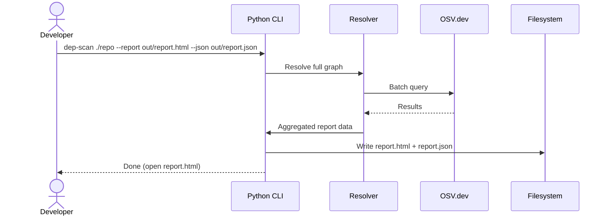

# Finalized Approach & Strategy (1-pager)

**Goal:** a CLI-first tool with an optional local web UI that:

1. **Resolves** full dependency graphs (direct + transitive) deterministically,
2. **Scans** against OSV (and friends) with batching, caching, and backoff,
3. **Reports** findings in **console** and **JSON**, and (bonus) an interactive React dashboard.

## Design principles

* **Lockfile-first** for correctness; fall back to materialized envs when needed.
* **Single source of truth**: the backend produces the canonical JSON report; all UIs render it.
* **Resilience**: dedupe queries, cache results by `(ecosystem, name, version)`, batch OSV calls, retry with jitter.
* **Clarity**: every vulnerable package includes severity, CVEs, summary, advisory link, and a suggested fixed version/range (when available). Each node has a **provenance path** (“why is this here?”).
* **Safety**: isolate temp installs, bind local servers to 127.0.0.1, sanitize inputs.

## Implementation plan (3 milestones)

**M1 (MVP):**

* Python CLI; parse Python `requirements.txt` (+ `poetry.lock`/`Pipfile.lock`) and Node `package-lock.json` / `yarn.lock`.
* OSV `/v1/querybatch` with dedupe + backoff.
* Console + JSON outputs; summary stats.
* Minimal tests + sample fixtures.

**M2 (UX & depth):**

* FastAPI endpoints; serve a built React bundle.
* WebSocket/SSE progress; cache (SQLite).
* Ignore list; severity normalization; provenance paths.

**M3 (bonus polish):**

* Unmaintained flag (last release ≥ X months).
* Static HTML export (CI artifact).
* SBOM export (CycloneDX) — optional.

---

# DepScan – Dependency Vulnerability Scanner (FDE Prompt Solution)

DepScan is a CLI + local web UI that:
- **Resolves** all direct **and transitive** dependencies from manifests/lockfiles
- **Scans** them against public vulnerability databases (OSV.dev)
- **Reports** vulnerabilities with suggested remediations
- **Exports** both **human-readable** and **JSON** reports

> **Resolve** = build the complete dependency graph (direct + transitive).  
> The tool **does not auto-fix**; it identifies known CVEs and proposes versions that remediate them.

---

## ✅ Prompt Coverage (Crosswalk)

- **Correctness & completeness**: lockfile-first resolution; provenance paths; dedupe; cycle-safe graph walk.
- **Edge cases**: missing versions (materialize env), peer/optional deps (npm), markers/extras (Python).
- **Code quality & docs**: typed Pydantic models, clear modules, this README, CLI `--help`.
- **Supply chain awareness**: severity, CVE IDs, summaries, advisory links, fixed ranges; optional stale package flag.
- **API usage & structured output**: FastAPI (OpenAPI), robust OSV batching/backoff, JSON schema.

**Required deliverables**  
- CLI input (e.g. `./scanner.py requirements.txt`) ✔  
- Transitive resolution ✔  
- Uses external OSS packages (`fastapi`, `httpx`, `pipdeptree`, `uvicorn`, etc.) ✔  
- Outputs: console + JSON ✔

**Bonus**  
- Multi-ecosystem (JS + Python) ✔  
- Ignore list ✔  
- Unmaintained flag ✔  
- Simple web UI (React) ✔

---

## ✨ Features

- **Ecosystems**: Python (`requirements.txt`, `poetry.lock`, `Pipfile.lock`), JavaScript (`package.json`, `package-lock.json`, `yarn.lock`)
- **Transitive resolution** with provenance paths (“why is this here?”)
- **OSV batch scanning** with caching + backoff on rate limits
- **Dual outputs**: interactive React report + JSON export (+ optional static HTML)
- **Ignore list** support (suppress specific advisories or packages)
- **Unmaintained flag** (optional: no releases in ≥ X months)

---

## 🧭 User Journeys

### 1) Zero-setup Local Web App (recommended)
- Build React once; serve static files from FastAPI.
- One command starts everything and opens the browser.

```mermaid
sequenceDiagram
    actor Developer
    participant CLI as Python CLI
    participant API as FastAPI Backend
    participant Resolver as Resolver
    participant OSV as OSV.dev (and friends)
    participant UI as React (served statically)

    Developer->>CLI: dep-scan ./repo --open
    CLI->>API: Start server (127.0.0.1)
    CLI-->>Developer: Open browser to /
    UI->>API: POST /scan (manifests or repo path)
    API->>Resolver: Build dependency graph (prefer lockfiles)
    par Batch & Cache
        Resolver->>OSV: POST /v1/querybatch (deduped deps)
        OSV-->>Resolver: Vulnerability results
    and Retry
        Resolver->>OSV: Backoff + retry on 429/5xx
        OSV-->>Resolver: Partial results
    end
    Resolver->>API: Aggregate → Report
    API-->>UI: Stream progress + partials (SSE/WebSocket)
    UI-->>Developer: Interactive report (filter, export JSON/CSV)
````

### 2) UI Upload Flow (no local repo needed)

```mermaid
sequenceDiagram
    actor Developer
    participant UI as React (Upload)
    participant API as FastAPI Backend
    participant Resolver as Resolver
    participant OSV as OSV.dev
    participant Cache as SQLite/Cache

    Developer->>UI: Select package.json + lockfile(s)
    UI->>API: POST /scan (multipart)
    API-->>UI: 202 Accepted {job_id}
    UI->>API: WebSocket /ws/:job_id (subscribe)
    API->>Resolver: Start background scan
    Resolver->>Resolver: Parse manifests → full graph with paths
    Resolver->>Cache: Check (ecosystem,name,version)
    par Cache miss
        Resolver->>OSV: querybatch (batch)
        OSV-->>Resolver: vulns
        Resolver->>Cache: store
    and Cache hit
        Cache-->>Resolver: vulns
    end
    Resolver->>API: Emit partial chunks
    API-->>UI: progress → 100% + final report
```

### 3) Static Report Generation (CI-friendly)



---

## 🏗️ Architecture

```
frontend/                # React (Vite or CRA) – built once, served statically
  src/
    components/
    pages/
    api/

backend/
  app/
    main.py              # FastAPI app + routes + static mount
    models.py            # Pydantic contracts
    resolver/
      python_resolver.py # requirements/poetry/pipenv parsing → graph
      js_resolver.py     # package-lock/yarn.lock/npm ls → graph
    scanner/osv.py       # OSV querybatch client (async + cache)
    report.py            # aggregation & stats
    storage.py           # optional: SQLite cache for OSV responses
    ignore.py            # suppression rules
  cli.py                 # CLI entrypoint (launch server / static mode)
```

**Separation of concerns**

* **resolver** → pure-ish graph with `path` provenance
* **scanner** → vulnerability lookups (batch, cache, retry)
* **reporter** → merge, severity normalize, stats
* **ui** → render report; no business logic

---

## 📦 Installation

Prereqs: Python 3.10+, Node 18+

```bash
# Backend
python -m venv .venv && source .venv/bin/activate
pip install -r backend/requirements.txt

# Frontend (build once)
cd frontend
npm install
npm run build
```

> The React build outputs to `frontend/dist/`. FastAPI serves it from `/`.

---

## 🚀 Quick Start

### Local web app (single command)

```bash
dep-scan ./my-repo --open
# opens http://127.0.0.1:PORT with the dashboard
```

### CLI only (console + JSON)

```bash
dep-scan ./my-repo --json out/report.json
```

### Static artifacts (CI)

```bash
dep-scan ./my-repo --report out/report.html --json out/report.json
```

---

## 🔌 API (FastAPI)

* `POST /scan` – multipart (files) or JSON with `{ "repo": "/path", "options": {...} }` → returns `{ job_id }`
* `GET /status/{job_id}` – progress + partial results (polling)
* `GET /report/{job_id}` – final JSON report
* `GET /export/{job_id}.csv|json` – downloadable artifacts
* `WS /ws/{job_id}` or `GET /stream/{job_id}` (SSE) – live progress/chunks

---

## 🧾 Data Contracts (Pydantic)

```python
from typing import Optional, Literal, List
from pydantic import BaseModel

Ecosystem = Literal["npm","PyPI"]

class Dep(BaseModel):
    name: str
    version: str
    ecosystem: Ecosystem
    path: List[str]  # provenance: parent chain -> ... -> this dep

class Vuln(BaseModel):
    package: str
    version: str
    ecosystem: Ecosystem
    severity: Optional[str]      # normalized (Critical/High/Medium/Low)
    cve_ids: List[str]
    summary: str
    advisory_url: Optional[str]
    fixed_range: Optional[str]   # e.g. ">=4.17.21"
    published: Optional[str]     # ISO date
    modified: Optional[str]      # ISO date

class Report(BaseModel):
    job_id: str
    total_dependencies: int
    vulnerable_count: int
    vulnerable_packages: List[Vuln]
    dependencies: List[Dep]
    suppressed_count: int
    meta: dict   # generated_at, durations, warnings, rate_limit_info
```

---

## 🛠️ Implementation Notes

* **Prefer lockfiles** for determinism

    * Node: parse `package-lock.json` / `yarn.lock` or use `npm ls --all --json`
    * Python: parse `poetry.lock` / `Pipfile.lock`; fallback: temp venv + `pipdeptree --json-tree`
* **Batch OSV queries** with `/v1/querybatch`; dedupe by `(ecosystem,name,version)`
* **Cache** OSV results in SQLite to minimize repeat calls
* **Backoff** with jitter on 429/5xx; split large batches
* **Ignore list**: YAML mapping

  ```yaml
  # .dep-scan-ignore.yml
  CVE-2020-8203: "Known low-impact in our context"
  lodash@4.17.20:
    - "Temporary suppression until 2025-09-01"
  ```

  CLI flags: `--ignore .dep-scan-ignore.yml` and UI toggle “Show suppressed”
* **Unmaintained flag** (optional): `--stale-months 12` → annotate deps with last release date
* **Security**:

    * Bind to `127.0.0.1`
    * Size-limit uploads; sanitize filenames; temp dirs
    * If materializing envs, isolate (venv/container); never execute repo scripts

---

## 🧑‍💻 Dev Mode

```bash
# Terminal A – API with reload
uvicorn app.main:app --reload

# Terminal B – React dev server (HMR)
npm run dev   # defaults to :5173
```

Set `VITE_API_BASE=http://127.0.0.1:8000` in the frontend env.

---

## 🧪 Testing

* **Unit tests**: graph building (fixtures: tiny py/js projects), OSV response parsing, fix range extraction, ignore rules, severity normalization, stats.
* **Integration**: end-to-end against a small sample repo; snapshot JSON report.
* **CLI**: golden-file test for console output.

---

## 🖥️ Example Console Output

```
Found 52 dependencies (12 direct, 40 transitive)
3 vulnerable packages:

1. lodash@4.17.20   severity: HIGH
   CVE: CVE-2020-8203
   Fix: >=4.17.21
   Advisory: https://nvd.nist.gov/vuln/detail/CVE-2020-8203
   Path: my-app -> foo -> lodash

2. minimist@0.0.8   severity: CRITICAL
   CVE: CVE-2020-7598
   Fix: >=1.2.5
   Advisory: https://osv.dev/GHSA-vh95-rmgr-6w4m
   Path: my-app -> bar -> minimist

3. ansi-regex@3.0.0 severity: MODERATE
   CVE: CVE-2021-3807
   Fix: >=5.0.1
   Advisory: https://osv.dev/GHSA-93q8-gq69-wqmw
   Path: my-app -> baz -> ansi-regex

Summary: vulnerable 3 / 52 (6%)  | suppressed 1
```

---

## 🗺️ Roadmap

* Mixed scans (JS + Python in one run) with ecosystem auto-detect
* SBOM export (CycloneDX)
* Proposed upgrades diff output
* Policy rules (min severity thresholds, blocked packages)
* Additional sources (GHSA, NVD mirror) as optional enrichers

---

## 📄 License

MIT License

Copyright (c) 2025 Robert Cole

Permission is hereby granted, free of charge, to any person obtaining a copy
of this software and associated documentation files (the "Software"), to deal
in the Software without restriction, including without limitation the rights
to use, copy, modify, merge, publish, distribute, sublicense, and/or sell
copies of the Software, and to permit persons to whom the Software is
furnished to do so, subject to the following conditions:

The above copyright notice and this permission notice shall be included in all
copies or substantial portions of the Software.

THE SOFTWARE IS PROVIDED "AS IS", WITHOUT WARRANTY OF ANY KIND, EXPRESS OR
IMPLIED, INCLUDING BUT NOT LIMITED TO THE WARRANTIES OF MERCHANTABILITY,
FITNESS FOR A PARTICULAR PURPOSE AND NONINFRINGEMENT. IN NO EVENT SHALL THE
AUTHORS OR COPYRIGHT HOLDERS BE LIABLE FOR ANY CLAIM, DAMAGES OR OTHER
LIABILITY, WHETHER IN AN ACTION OF CONTRACT, TORT OR OTHERWISE, ARISING FROM,
OUT OF OR IN CONNECTION WITH THE SOFTWARE OR THE USE OR OTHER DEALINGS IN THE
SOFTWARE.


