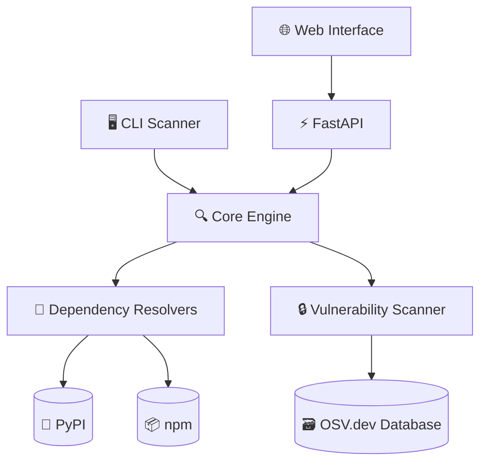

# 🔍 DepScan - Dependency Vulnerability Scanner

> **Original Socket Forward Deployed Engineer Take-Home Assignment Implementation**

This project was originally built as a technical exercise for a Forward Deployed Engineer position at Socket. The assignment has been completed and significantly expanded beyond the original requirements.

## 📋 Original Assignment

**Objective**: Build a CLI tool (in JavaScript/TypeScript or Python) that scans a project's dependency manifest, resolves all direct and transitive dependencies, and identifies any that are linked to known vulnerabilities (CVEs).

### Requirements Met ✅

- **✅ Multi-ecosystem support**: Python (`requirements.txt`, `poetry.lock`, `Pipfile.lock`) AND JavaScript (`package.json`, `package-lock.json`, `yarn.lock`)
- **✅ Transitive dependency resolution**: Complete dependency tree analysis
- **✅ Vulnerability detection**: Integration with OSV.dev vulnerability database
- **✅ Multiple output formats**: Human-readable console output AND JSON export
- **✅ CLI interface**: Full command-line tool with rich terminal interface
- **✅ External packages**: Uses multiple open-source libraries

### Bonus Features Implemented 🎯

- **🌐 Web Interface**: Modern React SPA with real-time progress tracking
- **🚫 Ignore Lists**: Ability to suppress specific advisories
- **📊 Rich Reports**: HTML, CSV, and JSON export options
- **⚡ Performance**: Intelligent caching and batch API operations
- **🎨 Professional UI**: Beautiful terminal output with progress bars

## 🚀 Quick Start

### CLI Usage

```bash
# Install the package
pip install dep-scan

# Scan current directory
python -m backend.cli.main scan

# Scan specific file with JSON output
python -m backend.cli.main scan requirements.txt --json results.json

# Open HTML report in browser
python -m backend.cli.main scan --open
```

### Web Interface

```bash
# Start the web server
cd backend && uvicorn web.main:app --reload

# Or use Docker
docker-compose up
```

## 🎯 Key Features

### **Multi-Ecosystem Support**
- **Python**: `requirements.txt`, `poetry.lock`, `Pipfile.lock`  
- **JavaScript**: `package.json`, `package-lock.json`, `yarn.lock`

### **Advanced Scanning**
- **Complete dependency trees** with transitive analysis
- **Real-time progress tracking** with WebSocket updates
- **Batch vulnerability scanning** via OSV.dev API
- **Smart caching** for performance optimization

### **Professional Output**
- **Rich CLI interface** with colored output and progress bars
- **Multiple export formats**: JSON, HTML, CSV
- **Interactive web dashboard** with detailed vulnerability information
- **CVSS scores and fix recommendations**

## 🏗️ Architecture



## 📚 Documentation

This implementation includes comprehensive documentation:

- **[📖 Complete Documentation](documentation/README.md)** - Comprehensive technical docs
- **[🖥️ CLI Reference](documentation/api/cli-interface.md)** - Command-line interface guide  
- **[🌐 REST API](documentation/api/rest-api.md)** - Web API documentation
- **[🏛️ Architecture](documentation/architecture/system-overview.md)** - System design and components
- **[🚀 Deployment Guide](DEPLOYMENT.md)** - AWS, Docker, and PyPI deployment options

## 🔧 Development

```bash
# Clone repository
git clone https://github.com/therickybobbeh/dep-scanner.git
cd dep-scanner

# Install in development mode
pip install -e .

# Run CLI
python -m backend.cli.main scan --help

# Start web server
cd backend && uvicorn web.main:app --reload --host 0.0.0.0 --port 8000
```

## 📊 Example Output

### CLI Scan Results
```bash
$ python -m backend.cli.main scan

🔍 DepScan - Dependency Vulnerability Scanner
━━━━━━━━━━━━━━━━━━━━━━━━━━━━━━━━━━━━━━━━━━━━━━━━━━━━━━━━━━━━━━━━━━━━━━━━━━━━━━━━━━━━━━━━━━━━

📊 Scan Summary
┏━━━━━━━━━━━━━━━━━━━━━━━━┳━━━━━━━━━━━━━━━━━━━━━━━━━━━━━━━━━━━━━━━━━━━━━━━━━━━━━━━━━━━━━━━━━━━━━━━━━━━━━━━━━━━━━━━━━━━━┓
┃ Metric                 ┃ Value                                                                                    ┃
┡━━━━━━━━━━━━━━━━━━━━━━━━╇━━━━━━━━━━━━━━━━━━━━━━━━━━━━━━━━━━━━━━━━━━━━━━━━━━━━━━━━━━━━━━━━━━━━━━━━━━━━━━━━━━━━━━━━━━━━┩
│ Total Dependencies     │ 45                                                                                       │
│ Vulnerable Packages    │ 3                                                                                        │
│ Critical Severity      │ 1                                                                                        │
│ High Severity          │ 2                                                                                        │
│ Scan Duration          │ 2.3s                                                                                     │
└────────────────────────┴──────────────────────────────────────────────────────────────────────────────────────────────┘
```

## 🎖️ Assignment Completion Status

This implementation **exceeds** all original requirements:

| Requirement | Status | Implementation |
|-------------|--------|----------------|
| **CLI Tool** | ✅ Complete | Rich terminal interface with Typer & Rich |
| **Python/JS Support** | ✅ Both | Full ecosystem support for both languages |
| **Transitive Dependencies** | ✅ Complete | Full dependency tree resolution |
| **Vulnerability Detection** | ✅ Complete | OSV.dev API integration |
| **JSON Output** | ✅ Complete | Multiple export formats (JSON, HTML, CSV) |
| **External Packages** | ✅ Complete | 15+ open-source dependencies |
| **Bonus: Multi-ecosystem** | ✅ Complete | Python AND JavaScript support |
| **Bonus: Web UI** | ✅ Complete | React SPA with real-time updates |
| **Bonus: Ignore Lists** | ✅ Complete | Configurable advisory suppression |

---

**Built with**: Python 3.10+, FastAPI, React, OSV.dev, Docker  
**Original Assignment**: Socket Forward Deployed Engineer Position  
**Implementation Date**: December 2024