# 🛡️ DepScan - Professional Dependency Vulnerability Scanner

<div align="center">

[](https://www.python.org/downloads/)
[](https://www.typescriptlang.org/)
[](https://fastapi.tiangolo.com/)
[](https://reactjs.org/)
[](#security)
[](LICENSE)

**Modern dependency vulnerability scanner with dual CLI and web interfaces**

[🚀 Quick Start](#quick-start) • [📖 Documentation](docs/) • [🎯 Features](#features) • [🏗️ Architecture](#architecture)

</div>

---

## 📖 Overview

DepScan is a comprehensive dependency vulnerability scanner that identifies security risks in Python and JavaScript projects. It provides both command-line and web interfaces, making it suitable for CI/CD pipelines, development workflows, and interactive security analysis.

### ✨ Key Highlights
- **🔍 Multi-Ecosystem Support**: Scans Python (PyPI) and JavaScript (npm) dependencies
- **⚡ Dual Interface**: Command-line tool for automation + web dashboard for exploration
- **🧠 Smart Resolution**: Prioritizes lockfiles for complete dependency trees
- **🛡️ OSV.dev Integration**: Comprehensive vulnerability database powered by Open Source Vulnerabilities
- **🚀 Production Ready**: Security hardened, rate limited, with intelligent caching

---

## 🎯 Features

### 📦 **Ecosystem Support**
| Language | Manifest Files | Lock Files | Transitive Deps | 
|----------|---------------|------------|-----------------|
| **Python** | `requirements.txt`, `pyproject.toml`, `Pipfile` | `poetry.lock`, `Pipfile.lock` | ✅ Full Support |
| **JavaScript** | `package.json` | `package-lock.json` (v1/v2/v3), `yarn.lock` | ✅ Full Support |

### 🔧 **Interface Options**

#### 🖥️ **Command Line Interface (CLI)**
- Rich console output with progress indicators
- Perfect for CI/CD integration and scripting
- Multiple output formats (console, JSON, HTML)
- Exit codes for pipeline integration

#### 🌐 **Web Dashboard**
- Interactive React-based interface
- Real-time scan progress monitoring
- Drag-and-drop file uploads
- Visual vulnerability reports

### 📊 **Vulnerability Analysis**
- **Complete Coverage**: CVE IDs, severity levels, CVSS scores
- **Remediation Guidance**: Version upgrade recommendations
- **Dependency Paths**: Full trace from root to vulnerable package
- **Smart Filtering**: Ignore specific severity levels or development dependencies

---

## 🚀 Quick Start

### 📦 Installation

**Option 1: pip install (Recommended)**
```bash
pip install dep-scan
dep-scan --help
```

**Option 2: Development Setup**
```bash
git clone https://github.com/your-repo/dep-scanner.git
cd dep-scanner
./setup-dev.sh  # Automated setup script
```

**Option 3: Docker Development**
```bash
git clone https://github.com/your-repo/dep-scanner.git
cd dep-scanner
make start-docker-dev  # Starts both CLI and web interface
```

### ⚡ Quick Scan Examples

**CLI Scanning:**
```bash
# Scan current directory
dep-scan scan .

# Scan with JSON export
dep-scan scan /path/to/project --json report.json

# Generate and open HTML report
dep-scan scan . --open

# CI/CD friendly (ignore low severity)
dep-scan scan . --ignore-severity LOW --no-include-dev
```

**Web Interface:**
```bash
# Start development environment
make start-docker-dev

# Access:
# Frontend: http://localhost:3000
# Backend API: http://localhost:8000/docs
```

---

## 🏗️ Architecture

DepScan follows a modular architecture designed for extensibility and performance:

```mermaid
graph TB
    subgraph "User Interfaces"
        CLI[🖥️ CLI Tool<br/>Typer + Rich Console]
        Web[🌐 Web Dashboard<br/>React + TypeScript]
    end

    subgraph "API Layer"
        API[⚡ FastAPI REST API<br/>Async + WebSocket]
    end

    subgraph "Core Services"
        Scanner[🔍 Core Scanner<br/>Orchestration Logic]
        State[📊 App State<br/>Job Management]
    end

    subgraph "Dependency Resolution"
        JSResolver[📄 JavaScript Resolver<br/>package.json, lockfiles]
        PyResolver[🐍 Python Resolver<br/>requirements, poetry, pipenv]
        Factory[🏭 Parser Factory<br/>Format Detection]
    end

    subgraph "Vulnerability Scanning"
        OSV[🛡️ OSV Scanner<br/>OSV.dev Integration]
        Cache[⚡ SQLite Cache<br/>Performance Layer]
    end

    subgraph "External"
        OSVAPI[🌐 OSV.dev API]
    end

    CLI --> Scanner
    Web --> API
    API --> Scanner
    API --> State

    Scanner --> JSResolver
    Scanner --> PyResolver
    Scanner --> OSV

    JSResolver --> Factory
    PyResolver --> Factory

    OSV --> Cache
    OSV --> OSVAPI
```



### 🔄 **Workflow Comparison**

| Aspect | CLI Workflow | Web Workflow |
|--------|-------------|-------------|
| **Input** | File system paths | File uploads via browser |
| **Execution** | Synchronous, direct | Asynchronous via API |
| **Progress** | Rich console output | Real-time web updates |
| **Output** | Console + file exports | Interactive dashboard |
| **Use Case** | CI/CD, scripting | Exploration, collaboration |

---

## 📚 Documentation

### 🎯 **User Guides**
- [🖥️ CLI Usage](docs/user-guides/cli-usage.md) - Complete command reference
- [🌐 Web Interface](docs/user-guides/web-interface.md) - Dashboard walkthrough

### 🏗️ **Architecture**
- [📋 System Overview](docs/architecture/system-overview.md) - High-level design
- [⚖️ CLI vs Web Comparison](docs/architecture/cli-vs-web-comparison.md) - Interface analysis
- [🔧 Component Details](docs/architecture/component-details.md) - Technical deep-dive

### 📊 **Diagrams**
- [🏗️ System Architecture](docs/diagrams/system-architecture.md) - Component relationships
- [🏛️ Class Diagrams](docs/diagrams/class-diagrams.md) - Code structure
- [🔄 Sequence Diagrams](docs/diagrams/sequence-diagrams.md) - Process flows
- [👤 User Journeys](docs/diagrams/user-journeys.md) - Experience flows

### 👨‍💻 **Development**
- [⚙️ Setup Guide](docs/development/setup.md) - Environment configuration
- [🧪 Testing](docs/development/testing.md) - Quality assurance
- [🤝 Contributing](docs/development/contributing.md) - Contribution workflow

---

## 📋 File Format Support

### 🔍 **Smart Detection Logic**

DepScan uses intelligent prioritization for maximum accuracy:

1. **Lockfiles First** → Complete dependency trees with exact versions
2. **Manifest Fallback** → Direct dependencies with version ranges
3. **Multi-format Support** → Handles mixed project setups

### 📄 **Supported Formats**

**JavaScript/Node.js:**
- `package.json` + `package-lock.json` (npm v1, v2, v3)
- `package.json` + `yarn.lock` (Yarn Classic & Berry)
- `package.json` standalone (direct dependencies only)

**Python:**
- `requirements.txt` (pip format)
- `pyproject.toml` (PEP 621 / Poetry format)
- `Pipfile` + `Pipfile.lock` (Pipenv)
- `poetry.lock` (Poetry)

---

## 🛡️ Security

DepScan is built with security-first principles:

### 🔒 **Security Features**
- **OWASP Compliance**: Security headers, input validation
- **Rate Limiting**: API endpoint protection
- **Dependency Safety**: All packages updated to latest secure versions
- **Input Sanitization**: Comprehensive validation for all user inputs

### 🚀 **Production Hardening**
- **Multi-platform Docker**: ARM64 & AMD64 support
- **Environment-based Configuration**: Secure defaults
- **Structured Logging**: Security event tracking
- **Error Handling**: Graceful degradation without information leakage

---

## 🧪 Testing

Comprehensive test coverage ensures reliability:

```bash
# Run complete test suite
pytest backend/tests/ -v --cov=backend

# Integration tests
pytest backend/tests/test_integration.py -v

# End-to-end web tests
cd tests/e2e && npm test
```

**Test Categories:**
- **Unit Tests**: Individual parser classes, utilities, models
- **Integration Tests**: End-to-end scanning workflows
- **Performance Tests**: Large dependency trees, concurrent scans
- **Security Tests**: Input validation, API security

---

## 🔧 Development

### 🛠️ **Development Commands**
```bash
make help                    # Show all available commands
make start-docker-dev       # Start full development environment
make install-dev            # Install development dependencies
make test                   # Run comprehensive test suite
make lint                   # Code quality checks
make format                 # Auto-format code
```

### 🎯 **VS Code Integration**
```bash
code depscan.code-workspace  # Open optimized workspace
```

Includes:
- ✅ Integrated terminal profiles
- ✅ Python debugging configuration
- ✅ Pre-configured tasks and launch configs
- ✅ Recommended extensions
- ✅ Auto-formatting on save

---

## 🤝 Contributing

We welcome contributions! See [Contributing Guide](docs/development/contributing.md) for details.

### 🎯 **Areas for Contribution**
- **🔧 New Parsers**: Additional package manager support
- **🎨 UI/UX**: Enhanced web interface features
- **📊 Reporting**: New visualization and export formats
- **🚀 Performance**: Optimization and scaling improvements
- **🔒 Security**: Enhanced security features

---

## 📄 License

This project is licensed under the MIT License - see the [LICENSE](LICENSE) file for details.

---

<div align="center">

**Built for secure software development 🛡️**

[🚀 Get Started](#quick-start) • [📖 Documentation](docs/) • [🤝 Contribute](#contributing)

</div>
