```mermaid
graph LR
    User[👤 User] --> CLI[🖥️ CLI Tool]
    CLI --> CoreScanner[🔍 Core Scanner]
    CoreScanner --> FileSystem[📁 File System]
    CoreScanner --> OSV[🛡️ OSV Scanner]
    OSV --> Results[📊 Results]
    Results --> Console[🖨️ Console Output]
    Results --> Files[📄 File Exports]
```

```mermaid
graph LR
    User[👤 User] --> Browser[🌐 Browser]
    Browser --> FastAPI[⚡ FastAPI]
    FastAPI --> ScanService[🔍 Scan Service]
    ScanService --> CoreScanner[📊 Core Scanner]
    CoreScanner --> Results[📊 Results]
    Results --> API[📡 API Response]
    API --> Dashboard[📱 Interactive Dashboard]
```

# CLI vs Web Interface Comparison

This document provides a comprehensive comparison between DepScan's Command Line Interface (CLI) and Web Dashboard, helping users choose the right interface for their specific use cases and workflows.

## Quick Comparison Matrix

| Feature | CLI Interface | Web Interface |
|---------|---------------|---------------|
| **Installation** | `pip install dep-scan` | Docker or hosted deployment |
| **Execution Model** | Direct, synchronous | API-based, asynchronous |
| **Input Method** | File system paths | File uploads via browser |
| **Progress Feedback** | Rich console with live updates | Real-time web dashboard |
| **Output Formats** | Console, JSON, HTML | Interactive dashboard, JSON export |
| **Automation** | Excellent (CI/CD ready) | Limited (API automation possible) |
| **Collaboration** | File sharing required | Built-in sharing and links |
| **Performance** | Fast (local execution) | Network dependent |
| **Resource Usage** | Minimal (command execution) | Higher (web stack) |
| **Learning Curve** | Moderate (command syntax) | Low (visual interface) |

## Detailed Interface Analysis

### 🖥️ Command Line Interface (CLI)

#### **Architecture & Execution**


#### **Strengths**
- **🚀 Performance**: Direct execution without network overhead
- **🤖 Automation**: Perfect for CI/CD pipelines and scripting
- **💻 Developer Workflow**: Integrates seamlessly with command-line development
- **📦 Portability**: Single binary, minimal dependencies
- **🔧 Flexibility**: Rich command-line options and configuration
- **⚡ Speed**: Immediate results without web interface overhead

#### **Best Use Cases**
- **CI/CD Pipeline Integration**
  ```bash
  # Example CI/CD usage
  dep-scan scan . --json security-report.json
  if [ $? -ne 0 ]; then
    echo "Security vulnerabilities found!"
    exit 1
  fi
  ```
- **Developer Pre-commit Hooks**
- **Automated Security Scanning**
- **Batch Processing Multiple Projects**
- **Local Development Security Checks**

#### **Sample CLI Workflow**
```bash
# Quick security check
dep-scan scan .

# Detailed analysis with exports
dep-scan scan /path/to/project \
  --json detailed-report.json \
  --open \
  --ignore-severity LOW \
  --verbose

# CI/CD integration
dep-scan scan . \
  --no-include-dev \
  --ignore-severity LOW MEDIUM \
  --json pipeline-report.json
```

### 🌐 Web Interface

#### **Architecture & Execution**


#### **Strengths**
- **👥 Collaboration**: Easy sharing of results and analysis
- **📊 Visualization**: Rich interactive dashboards and charts  
- **🎯 Accessibility**: No installation required, works in any browser
- **📱 User Experience**: Intuitive drag-and-drop interface
- **🔍 Exploration**: Interactive filtering and drill-down capabilities
- **📈 Real-time Updates**: Live progress monitoring with WebSocket

#### **Best Use Cases**
- **Security Team Analysis**
- **Management Reporting and Dashboards**
- **Collaborative Vulnerability Review**
- **Ad-hoc Project Analysis**
- **Training and Demonstration**
- **Non-technical User Access**

#### **Sample Web Workflow**
1. **Upload Files**: Drag and drop dependency files
2. **Configure Options**: Set scan parameters via UI
3. **Monitor Progress**: Watch real-time scanning progress
4. **Explore Results**: Interactive vulnerability dashboard
5. **Share Findings**: Export or share results with team

## Interface-Specific Features

### CLI Exclusive Features

#### **Rich Console Output**
```
🔍 Scanning JavaScript dependencies...
✅ Found 47 dependencies (8 direct, 39 transitive)

🚨 3 vulnerabilities found:

┌─────────────────────────────────────────────────────────────────────┐
│                        Vulnerability Report                         │
├─────────────┬─────────┬──────────────┬──────────┬─────────────────────┤
│ Package     │ Version │ Severity     │ CVE      │ Fix Available       │
├─────────────┼─────────┼──────────────┼──────────┼─────────────────────┤
│ lodash      │ 4.17.20 │ HIGH         │ CVE-2020 │ >=4.17.21          │
│ minimist    │ 0.0.8   │ CRITICAL     │ CVE-2020 │ >=1.2.5            │
│ node-fetch  │ 2.6.0   │ MEDIUM       │ CVE-2022 │ >=2.6.7            │
└─────────────┴─────────┴──────────────┴──────────┴─────────────────────┘
```

#### **Multiple Output Formats**
- **Console**: Rich formatted tables with colors
- **JSON**: Structured data for integration
- **HTML**: Standalone reports that open in browser
- **Exit Codes**: Pipeline-friendly success/failure indication

#### **Advanced CLI Options**
```bash
# Comprehensive option set
dep-scan scan PROJECT_PATH \
  --json FILENAME              # Export JSON report
  --open                       # Generate & open HTML report  
  --output FILENAME            # Custom HTML report name
  --include-dev/--no-include-dev  # Dev dependency control
  --ignore-severity LEVEL      # Filter by severity
  --verbose                    # Detailed progress output
```

### Web Interface Exclusive Features

#### **Interactive Dashboard**
- **Real-time Progress**: Live updates during scanning
- **Visual Charts**: Severity distribution and trends
- **Filterable Tables**: Dynamic sorting and filtering
- **Dependency Tree**: Interactive exploration of dependency paths
- **Drill-down Analysis**: Click-through vulnerability details

#### **Collaboration Features**
- **Shareable Links**: Direct links to scan results
- **Export Options**: Multiple format downloads
- **Team Dashboards**: Centralized security overview
- **Comments & Notes**: Annotate findings for team discussion

#### **User Experience Enhancements**
- **Drag & Drop**: Intuitive file upload
- **Progress Animation**: Visual feedback during processing
- **Responsive Design**: Works on desktop, tablet, and mobile
- **Keyboard Shortcuts**: Power user navigation

## Performance Comparison

### CLI Performance Characteristics


**Performance Profile:**
- **Startup Time**: ~50ms (minimal)
- **Memory Usage**: ~50MB (efficient)
- **CPU Usage**: High during scan, minimal otherwise
- **Network Usage**: Only for OSV.dev API calls
- **Total Time**: 2-30 seconds depending on project size

### Web Interface Performance Characteristics


**Performance Profile:**
- **Upload Time**: 100ms-2s (depends on file size and network)
- **Memory Usage**: ~200MB (web stack overhead)
- **CPU Usage**: Distributed between client and server
- **Network Usage**: File uploads + API calls + real-time updates
- **Total Time**: 3-35 seconds including UI rendering

## Security Considerations

### CLI Security Model

```mermaid
graph TB
    subgraph "CLI Security Boundaries"
        FileSystem[📁 Local File System<br/>• Direct file access<br/>• User permissions<br/>• No network exposure]
        
        Network[🌐 Network Calls<br/>• HTTPS only<br/>• OSV.dev API<br/>• Rate limiting]
        
        Output[📤 Output Security<br/>• Local file writes<br/>• No sensitive data storage<br/>• Temporary file cleanup]
    end
    
    FileSystem --> Network
    Network --> Output
```



**Security Benefits:**
- **No Network Exposure**: Tool runs locally, no web service attack surface
- **Direct File Access**: Uses existing user permissions
- **Minimal Attack Surface**: Simple execution model
- **No Data Persistence**: Results only stored if explicitly requested

### Web Interface Security Model

```mermaid
graph TB
    subgraph "Web Security Layers"
        Frontend[🌐 Frontend Security<br/>• CSP headers<br/>• XSS protection<br/>• Input validation]
        
        API[⚡ API Security<br/>• Rate limiting<br/>• CORS configuration<br/>• Security headers]
        
        Backend[🔒 Backend Security<br/>• Input sanitization<br/>• Temporary file handling<br/>• Memory management]
    end
    
    Frontend --> API
    API --> Backend
```



**Security Measures:**
- **OWASP Compliance**: Security headers and best practices
- **Input Validation**: Comprehensive file and parameter validation
- **Rate Limiting**: Protection against abuse
- **Temporary Storage**: Automatic cleanup of uploaded files
- **No Persistent Storage**: Results stored temporarily in memory only

## Integration Scenarios

### CI/CD Pipeline Integration

#### **CLI Integration**
```yaml
# GitHub Actions Example
- name: Security Scan
  run: |
    pip install dep-scan
    dep-scan scan . --json security-report.json
    
    # Fail pipeline on critical vulnerabilities
    if [ $? -ne 0 ]; then
      echo "Critical vulnerabilities found!"
      exit 1
    fi

- name: Upload Security Report
  uses: actions/upload-artifact@v3
  with:
    name: security-report
    path: security-report.json
```

#### **Web Interface Integration**
```python
# API Integration Example
import requests

def scan_via_api(files):
    # Upload files for scanning
    response = requests.post('/scan', json={
        'manifest_files': files,
        'options': {'include_dev_dependencies': False}
    })
    
    job_id = response.json()['job_id']
    
    # Poll for results
    while True:
        status = requests.get(f'/status/{job_id}').json()
        if status['status'] == 'completed':
            break
        time.sleep(2)
    
    # Get final report
    return requests.get(f'/report/{job_id}').json()
```

### Development Workflow Integration

#### **Pre-commit Hook (CLI)**
```bash
#!/bin/bash
# .git/hooks/pre-commit

echo "Running security scan..."
dep-scan scan . --ignore-severity LOW

if [ $? -ne 0 ]; then
    echo "❌ Security issues found. Commit blocked."
    echo "Run 'dep-scan scan . --open' for detailed analysis"
    exit 1
fi

echo "✅ Security scan passed"
```

#### **Team Review (Web)**
```markdown
## Security Review Process
1. Developer runs local CLI scan before commit
2. Security team reviews results via Web interface
3. Team discusses findings in web dashboard
4. Decisions tracked and exported for compliance
```

## Choosing the Right Interface

### Decision Matrix

```mermaid
flowchart TD
    Start([Which interface<br/>should I use?]) --> Usage{Primary<br/>use case?}
    
    Usage -->|Automation/CI| CLI_Path[🖥️ Use CLI Interface]
    Usage -->|Manual Analysis| Context{Who is the<br/>primary user?}
    Usage -->|Team Review| Web_Path[🌐 Use Web Interface]
    
    Context -->|Developer| Dev_Preference{Comfort with<br/>command line?}
    Context -->|Security Analyst| Web_Path
    Context -->|Manager/Non-technical| Web_Path
    
    Dev_Preference -->|High| CLI_Path
    Dev_Preference -->|Low| Web_Path
    
    CLI_Path --> CLI_Benefits[✅ Fast execution<br/>✅ CI/CD integration<br/>✅ Scriptable<br/>✅ Minimal setup]
    
    Web_Path --> Web_Benefits[✅ Visual analysis<br/>✅ Team collaboration<br/>✅ No installation<br/>✅ Interactive exploration]
    
    style Start fill:#e1f5fe
    style CLI_Benefits fill:#e8f5e8
    style Web_Benefits fill:#e8f5e8
```



### Recommendation Guidelines

#### **Choose CLI when:**
- 🤖 **Automating security scans** in CI/CD pipelines
- ⚡ **Need fastest possible execution** time
- 💻 **Working in command-line heavy workflows**
- 📦 **Processing multiple projects** in batch
- 🔧 **Requiring complex configuration** options
- 📊 **Generating reports** for external tools

#### **Choose Web Interface when:**
- 👥 **Collaborating with team members** on security analysis
- 📊 **Need visual dashboards** and interactive exploration
- 🎯 **Working with non-technical stakeholders**
- 🔍 **Performing ad-hoc security research**
- 📱 **Accessing from various devices** and locations
- 🎓 **Training or demonstrating** security concepts

#### **Use Both when:**
- 🔄 **Developer uses CLI locally**, security team reviews via Web
- 📈 **CI/CD generates data**, stakeholders view via Web dashboard
- 🧪 **Quick CLI checks**, detailed Web analysis for incidents
- 📋 **CLI for automation**, Web for manual verification and reporting

## Migration and Transition Strategies

### From CLI to Web
1. **Familiarization**: Use Web interface to explore CLI scan results
2. **Team Training**: Show visual benefits of Web dashboard
3. **Gradual Adoption**: Start with ad-hoc analysis, expand to regular use
4. **Process Integration**: Incorporate Web reviews into security workflows

### From Web to CLI  
1. **Command Learning**: Start with basic commands, add complexity gradually
2. **Automation Benefits**: Demonstrate time savings and consistency
3. **Integration Value**: Show CI/CD integration benefits
4. **Hybrid Approach**: Maintain Web for analysis, add CLI for automation

## Summary

Both DepScan interfaces are designed to complement each other, offering the same core scanning engine with interface-optimized experiences:

- **CLI**: Optimized for speed, automation, and developer workflows
- **Web**: Optimized for collaboration, visualization, and accessibility

The choice depends on your primary use case, technical comfort level, and workflow requirements. Many successful deployments use both interfaces strategically, leveraging the strengths of each for different scenarios.