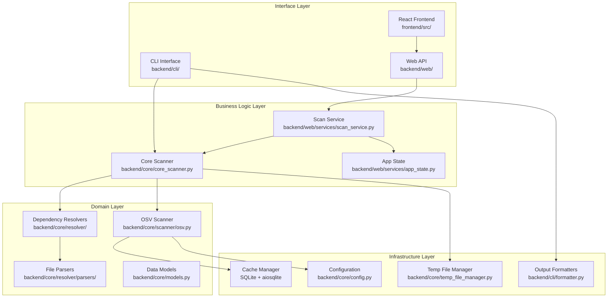
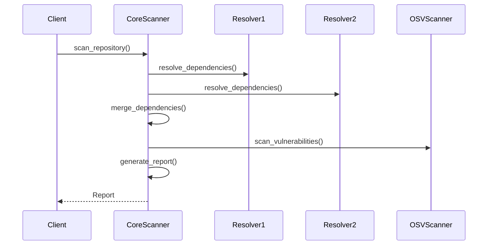
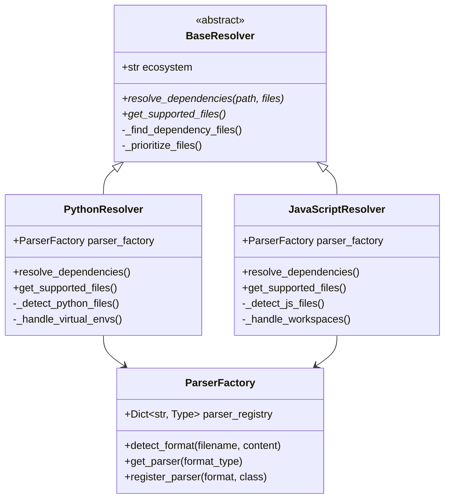
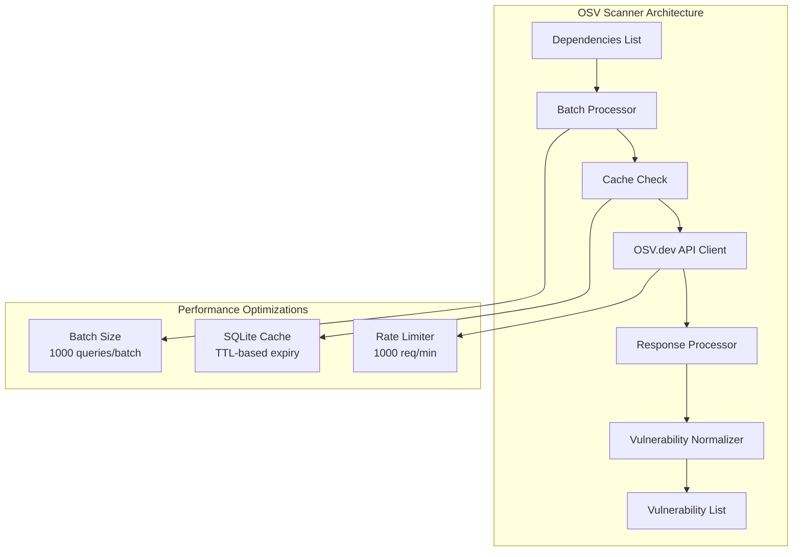

# Component Architecture Details

This document provides an in-depth technical analysis of DepScan's component architecture, including detailed implementation insights, design patterns, data flows, and extension points.

## Core Component Overview



## Core Scanner Component

### Implementation Architecture

**File**: `backend/core/core_scanner.py`

```python
class CoreScanner:
    """
    Central orchestrator for vulnerability scanning operations
    
    Responsibilities:
    - Coordinate dependency resolution across ecosystems
    - Manage vulnerability scanning workflow
    - Handle progress reporting and error management
    - Generate comprehensive scan reports
    """
    
    def __init__(self):
        self.python_resolver = PythonResolver()
        self.js_resolver = JavaScriptResolver() 
        self.osv_scanner = OSVScanner()
        self.npm_lock_generator = NpmLockGenerator()
        self.python_lock_generator = PythonLockGenerator()
```

### Key Design Patterns

#### **Orchestrator Pattern**


#### **Progress Callback Pattern**
```python
async def _scan_dependencies(
    self,
    repo_path: str | None,
    manifest_files: dict[str, str] | None,
    options: ScanOptions,
    progress_callback: Optional[callable] = None
) -> Report:
    """Progress reporting throughout scanning process"""
    
    if progress_callback:
        progress_callback(10, "Starting dependency resolution")
    
    # Resolution phase
    dependencies = await self._resolve_all_dependencies(
        repo_path, manifest_files, progress_callback
    )
    
    if progress_callback:
        progress_callback(60, "Scanning for vulnerabilities")
    
    # Vulnerability scanning
    vulnerabilities = await self._scan_vulnerabilities(
        dependencies, progress_callback
    )
    
    if progress_callback:
        progress_callback(90, "Generating report")
```

## Dependency Resolution Architecture

### Resolver Component Hierarchy



### Smart File Prioritization

**Implementation**: `backend/core/resolver/base.py`

```python
def _prioritize_formats(self, files: List[str]) -> List[str]:
    """
    Intelligent file prioritization for maximum accuracy
    
    Priority Order:
    1. Lock files (exact versions, complete trees)
    2. Manifest files (version ranges, direct deps)
    3. Secondary formats (fallback options)
    """
    priority_map = {
        # JavaScript priorities
        'package-lock.json': 10,  # npm lockfile v1/v2/v3
        'yarn.lock': 9,           # yarn lockfile
        'package.json': 5,        # npm manifest
        
        # Python priorities  
        'poetry.lock': 10,        # poetry lockfile
        'Pipfile.lock': 9,        # pipenv lockfile
        'pyproject.toml': 7,      # modern python config
        'requirements.txt': 5,    # pip requirements
        'Pipfile': 4,            # pipenv manifest
    }
    
    return sorted(files, key=lambda f: priority_map.get(f, 0), reverse=True)
```

## Parser Architecture Deep Dive

### Factory Pattern Implementation

**File**: `backend/core/resolver/factories/base.py`

```python
class ParserFactory:
    """
    Dynamic parser selection based on file format detection
    
    Features:
    - Content-based format detection
    - Extensible parser registration
    - Fallback parser handling
    - Validation and error recovery
    """
    
    def __init__(self):
        self.parser_registry = {}
        self._register_default_parsers()
    
    def detect_format(self, filename: str, content: str) -> str:
        """Multi-stage format detection"""
        
        # Stage 1: File extension analysis
        extension_hints = self._analyze_extension(filename)
        
        # Stage 2: Content structure analysis
        structure_hints = self._analyze_content_structure(content)
        
        # Stage 3: Format signature detection
        signature_hints = self._analyze_format_signatures(content)
        
        # Combine evidence and select most likely format
        return self._select_best_format(
            extension_hints, structure_hints, signature_hints
        )
```

### Parser Implementation Pattern

Each parser follows a consistent interface while implementing format-specific logic:

```python
class BaseParser:
    """Abstract base parser with common functionality"""
    
    def parse(self) -> List[Dep]:
        """Main parsing entry point"""
        if not self.validate_content():
            raise ValueError(f"Invalid {self.format_name} content")
        
        return self._parse_dependencies()
    
    @abstractmethod
    def validate_content(self) -> bool:
        """Format-specific validation"""
        pass
    
    @abstractmethod  
    def _parse_dependencies(self) -> List[Dep]:
        """Format-specific parsing logic"""
        pass
```

### Parser Examples

#### **Package.json Parser**
```python
class PackageJsonParser(BaseParser):
    def validate_content(self) -> bool:
        try:
            self.parsed_json = json.loads(self.content)
            return 'name' in self.parsed_json or 'dependencies' in self.parsed_json
        except json.JSONDecodeError:
            return False
    
    def _parse_dependencies(self) -> List[Dep]:
        deps = []
        
        # Parse production dependencies
        if 'dependencies' in self.parsed_json:
            deps.extend(self._parse_dep_section(
                self.parsed_json['dependencies'], is_dev=False
            ))
        
        # Parse development dependencies
        if 'devDependencies' in self.parsed_json:
            deps.extend(self._parse_dep_section(
                self.parsed_json['devDependencies'], is_dev=True
            ))
            
        return deps
```

#### **Requirements.txt Parser**
```python
class RequirementsParser(BaseParser):
    def validate_content(self) -> bool:
        # Check for requirements.txt patterns
        lines = self.content.strip().split('\n')
        return any(
            line.strip() and not line.strip().startswith('#')
            for line in lines
        )
    
    def _parse_dependencies(self) -> List[Dep]:
        deps = []
        for line in self.content.split('\n'):
            if dep := self._parse_requirement_line(line.strip()):
                deps.append(dep)
        return deps
    
    def _parse_requirement_line(self, line: str) -> Optional[Dep]:
        """Parse individual requirement line with version specifiers"""
        if not line or line.startswith('#'):
            return None
            
        # Handle various requirement formats:
        # package==1.0.0
        # package>=1.0.0,<2.0.0  
        # package[extra]==1.0.0
        # git+https://github.com/user/repo.git#egg=package
        # -e git+https://github.com/user/repo.git#egg=package
        
        return self._extract_package_info(line)
```

## OSV Scanner Component

### Vulnerability Scanning Architecture

**File**: `backend/core/scanner/osv.py`



### Intelligent Caching Strategy

```python
class CacheManager:
    """
    High-performance SQLite-based vulnerability cache
    
    Features:
    - TTL-based cache expiry
    - Batch insert/update operations
    - Query optimization with indexes
    - Automatic cleanup routines
    """
    
    async def get_cached_vulnerabilities(
        self, 
        dependencies: List[Dep]
    ) -> Tuple[List[Vuln], List[Dep]]:
        """
        Separate cached from uncached dependencies
        
        Returns:
            (cached_vulnerabilities, uncached_dependencies)
        """
        cached_vulns = []
        uncached_deps = []
        
        async with aiosqlite.connect(self.db_path) as db:
            for dep in dependencies:
                cache_key = f"{dep.ecosystem}:{dep.name}:{dep.version}"
                
                cursor = await db.execute(
                    "SELECT vulnerability_data, expires_at FROM cache "
                    "WHERE package_key = ? AND expires_at > ?",
                    (cache_key, datetime.utcnow().isoformat())
                )
                
                result = await cursor.fetchone()
                if result:
                    cached_vulns.extend(
                        self._deserialize_vulnerabilities(result[0])
                    )
                else:
                    uncached_deps.append(dep)
        
        return cached_vulns, uncached_deps
```

### OSV.dev API Integration

```python
class OSVAPIClient:
    """
    Professional OSV.dev API client with full feature support
    
    Features:
    - Batch query optimization
    - Rate limit compliance
    - Retry with exponential backoff
    - Comprehensive error handling
    """
    
    async def query_batch(self, queries: List[OSVQuery]) -> List[OSVVulnerability]:
        """Execute batch vulnerability queries"""
        
        # Respect OSV.dev rate limits
        await self._ensure_rate_limit()
        
        # Prepare batch request (max 1000 queries)
        batch_data = OSVBatchQuery(queries=queries[:1000])
        
        async with httpx.AsyncClient() as client:
            try:
                response = await client.post(
                    "https://api.osv.dev/v1/querybatch",
                    json=batch_data.dict(),
                    timeout=30.0
                )
                response.raise_for_status()
                
                # Process and normalize responses
                return self._process_batch_response(response.json())
                
            except httpx.HTTPError as e:
                return await self._handle_api_error(e, queries)
```

## Web API Architecture

### FastAPI Service Layer

**File**: `backend/web/main.py`

```python
@app.post("/scan", response_model=dict[str, str])
async def start_scan(
    scan_request: ScanRequest, 
    scan_service: ScanService = Depends(get_scan_service),
    _: None = Depends(check_rate_limit)
):
    """
    Asynchronous scan initiation with job tracking
    
    Flow:
    1. Validate request and apply rate limiting
    2. Create job in application state
    3. Start background scan task
    4. Return job_id for progress tracking
    """
    try:
        job_id = await scan_service.start_scan(scan_request)
        return {"job_id": job_id}
    except Exception as e:
        raise HTTPException(status_code=400, detail=str(e))
```

### Application State Management

**File**: `backend/web/services/app_state.py`

```python
class AppState:
    """
    Centralized application state management
    
    Features:
    - Job lifecycle management
    - In-memory result storage
    - WebSocket connection management
    - Automatic cleanup routines
    """
    
    def __init__(self):
        self.active_jobs: Dict[str, ScanProgress] = {}
        self.completed_reports: Dict[str, Report] = {}
        self.websocket_connections: Dict[str, WebSocket] = {}
        self.max_concurrent_jobs = 10
        self.job_expiry_hours = 24
    
    def create_job(self, scan_request: ScanRequest) -> str:
        """Create new scan job with unique ID"""
        job_id = str(uuid4())
        
        self.active_jobs[job_id] = ScanProgress(
            job_id=job_id,
            status=JobStatus.PENDING,
            progress_percent=0,
            current_step="Initializing scan",
            started_at=datetime.utcnow()
        )
        
        return job_id
```

## Lock File Generation

### Advanced Dependency Resolution

**File**: `backend/core/lock_generators/npm_generator.py`

```python
class NpmLockGenerator(BaseLockGenerator):
    """
    NPM lock file generation for enhanced accuracy
    
    Process:
    1. Create isolated temporary environment
    2. Write manifest file to temp directory
    3. Execute npm install --package-lock-only
    4. Parse generated package-lock.json
    5. Extract complete dependency tree
    6. Clean up temporary environment
    """
    
    async def generate_lock_file(
        self, 
        package_json_content: str
    ) -> Tuple[str, str]:
        """Generate package-lock.json from package.json"""
        
        with tempfile.TemporaryDirectory() as temp_dir:
            temp_path = Path(temp_dir)
            
            # Write package.json to temp directory
            package_json_path = temp_path / "package.json"
            package_json_path.write_text(package_json_content)
            
            # Run npm install to generate lock file
            process = await asyncio.create_subprocess_exec(
                "npm", "install", "--package-lock-only", "--no-audit",
                cwd=temp_path,
                stdout=asyncio.subprocess.PIPE,
                stderr=asyncio.subprocess.PIPE
            )
            
            stdout, stderr = await process.communicate()
            
            if process.returncode != 0:
                raise RuntimeError(f"npm install failed: {stderr.decode()}")
            
            # Read generated lock file
            lock_file_path = temp_path / "package-lock.json"
            if not lock_file_path.exists():
                raise RuntimeError("package-lock.json not generated")
            
            lock_content = lock_file_path.read_text()
            return "package-lock.json", lock_content
```

## Configuration Management

### Environment-Based Configuration

**File**: `backend/core/config.py`

```python
class Settings(BaseSettings):
    """
    Comprehensive configuration management
    
    Features:
    - Environment variable integration
    - Type validation with Pydantic
    - Default value management
    - Security-first defaults
    """
    
    # Application settings
    APP_NAME: str = "DepScan"
    APP_VERSION: str = "1.0.0"
    DEBUG: bool = False
    
    # Security settings
    ALLOWED_HOSTS: str = "localhost,127.0.0.1"
    CORS_ORIGINS: str = "http://localhost:3000,http://127.0.0.1:3000"
    
    # Performance settings
    MAX_CONCURRENT_SCANS: int = 10
    CACHE_TTL_HOURS: int = 24
    OSV_RATE_LIMIT: int = 1000  # requests per minute
    
    # Database settings
    CACHE_DB_PATH: str = "osv_cache.db"
    
    @property
    def allowed_hosts_list(self) -> List[str]:
        return [host.strip() for host in self.ALLOWED_HOSTS.split(",")]
    
    @property
    def cors_origins_list(self) -> List[str]:
        return [origin.strip() for origin in self.CORS_ORIGINS.split(",")]
    
    class Config:
        env_file = ".env"
        case_sensitive = True
```

## Error Handling Architecture

### Comprehensive Error Management

```python
class ErrorHandler:
    """
    Centralized error handling with recovery strategies
    
    Features:
    - Contextual error classification
    - Recovery strategy selection
    - User-friendly error messages
    - Detailed logging integration
    """
    
    @staticmethod
    def handle_parsing_error(
        error: Exception, 
        context: Dict[str, Any]
    ) -> ErrorRecoveryStrategy:
        """Handle parsing errors with fallback options"""
        
        if isinstance(error, json.JSONDecodeError):
            return ErrorRecoveryStrategy(
                strategy_type="fallback_parser",
                message="JSON parsing failed, trying alternative parser",
                retry_possible=True,
                fallback_options=["yaml_parser", "text_parser"]
            )
        
        elif isinstance(error, FileNotFoundError):
            return ErrorRecoveryStrategy(
                strategy_type="graceful_failure",
                message=f"Dependency file not found: {context.get('filename')}",
                retry_possible=False,
                user_action="Verify file path and permissions"
            )
        
        else:
            return ErrorRecoveryStrategy(
                strategy_type="log_and_continue",
                message="Unknown parsing error, continuing with available data",
                retry_possible=False,
                partial_results=True
            )
```

## Performance Optimizations

### Concurrent Processing

```python
class ConcurrentProcessor:
    """
    Optimized concurrent processing for large dependency sets
    
    Features:
    - Async/await throughout the pipeline
    - Semaphore-based concurrency control
    - Batch processing optimization
    - Memory-efficient streaming
    """
    
    async def process_dependencies_concurrent(
        self,
        dependencies: List[Dep],
        max_concurrency: int = 10
    ) -> List[Vuln]:
        """Process dependencies with controlled concurrency"""
        
        semaphore = asyncio.Semaphore(max_concurrency)
        
        async def process_batch(dep_batch: List[Dep]) -> List[Vuln]:
            async with semaphore:
                return await self.osv_scanner.scan_batch(dep_batch)
        
        # Split into optimal batch sizes
        batches = self._create_batches(dependencies, batch_size=100)
        
        # Process all batches concurrently
        batch_results = await asyncio.gather(*[
            process_batch(batch) for batch in batches
        ])
        
        # Flatten results
        return [vuln for batch in batch_results for vuln in batch]
```

## Extension Points

### Adding New Parsers

```python
# Example: Adding support for new package manager
class CargoTomlParser(BaseParser):
    """Rust Cargo.toml parser implementation"""
    
    format_name = "cargo.toml"
    ecosystem = "crates.io"
    
    def validate_content(self) -> bool:
        try:
            parsed = toml.loads(self.content)
            return 'package' in parsed or 'dependencies' in parsed
        except toml.TomlDecodeError:
            return False
    
    def _parse_dependencies(self) -> List[Dep]:
        parsed = toml.loads(self.content)
        deps = []
        
        # Parse [dependencies] section
        if 'dependencies' in parsed:
            for name, version in parsed['dependencies'].items():
                deps.append(Dep(
                    name=name,
                    version=str(version),
                    ecosystem="crates.io",
                    is_direct=True,
                    path=[name]
                ))
        
        return deps

# Register the new parser
parser_factory.register_parser("cargo.toml", CargoTomlParser)
```

### Adding New Output Formats

```python
class SBOMFormatter:
    """Software Bill of Materials (SBOM) output formatter"""
    
    def format_report(self, report: Report) -> str:
        """Generate SPDX SBOM format"""
        spdx_data = {
            "spdxVersion": "SPDX-2.2",
            "creationInfo": {
                "created": datetime.utcnow().isoformat(),
                "creators": ["Tool: DepScan"]
            },
            "packages": []
        }
        
        for dep in report.dependencies:
            spdx_data["packages"].append({
                "SPDXID": f"SPDXRef-{dep.name}",
                "name": dep.name,
                "versionInfo": dep.version,
                "downloadLocation": f"https://registry.npmjs.org/{dep.name}",
                "filesAnalyzed": False
            })
        
        return json.dumps(spdx_data, indent=2)
```

## Testing Architecture

### Component Testing Strategy

```python
class TestCoreScanner:
    """Comprehensive test suite for core scanner component"""
    
    @pytest.fixture
    def mock_dependencies(self):
        """Mock dependency data for testing"""
        return [
            Dep(name="lodash", version="4.17.20", ecosystem="npm", is_direct=True),
            Dep(name="requests", version="2.28.0", ecosystem="PyPI", is_direct=True)
        ]
    
    @pytest.fixture
    def mock_vulnerabilities(self):
        """Mock vulnerability data for testing"""
        return [
            Vuln(
                package="lodash",
                version="4.17.20", 
                ecosystem="npm",
                vulnerability_id="GHSA-jf85-cpcp-j695",
                severity=SeverityLevel.HIGH,
                summary="Prototype Pollution in lodash"
            )
        ]
    
    async def test_complete_scan_workflow(
        self,
        mock_dependencies,
        mock_vulnerabilities,
        temp_project_dir
    ):
        """Test end-to-end scanning workflow"""
        
        scanner = CoreScanner()
        
        # Mock external dependencies
        with patch.object(scanner.js_resolver, 'resolve_dependencies') as mock_js:
            with patch.object(scanner.osv_scanner, 'scan_dependencies') as mock_osv:
                mock_js.return_value = mock_dependencies
                mock_osv.return_value = mock_vulnerabilities
                
                report = await scanner.scan_repository(
                    temp_project_dir,
                    ScanOptions(include_dev_dependencies=True)
                )
                
                assert report.total_dependencies == len(mock_dependencies)
                assert report.vulnerable_count == len(mock_vulnerabilities)
                assert len(report.vulnerable_packages) == 1
```

This component architecture provides a solid foundation for understanding, maintaining, and extending DepScan's sophisticated vulnerability scanning capabilities while maintaining high performance, reliability, and extensibility.