# Contributing Guide

Welcome to DepScan! This guide provides everything you need to know about contributing to the project, from your first commit to becoming a core maintainer.

## 🎯 Getting Started

### Prerequisites for Contributors

Before contributing, ensure you have:
- ✅ Completed the [Development Setup](setup.md)
- ✅ Read the [Architecture Documentation](../architecture/)
- ✅ Familiarized yourself with the [Testing Guide](testing.md)
- ✅ Reviewed existing [issues and discussions](https://github.com/your-org/dep-scanner/issues)

### Your First Contribution


#### **Finding Your First Issue**
Look for issues labeled:
- 🟢 `good first issue` - Perfect for newcomers
- 🔵 `documentation` - Improve docs and examples
- 🟡 `enhancement` - Add new features or improvements
- 🟠 `bug` - Fix existing problems
- 🟣 `help wanted` - Maintainers need assistance

## 🤝 Code of Conduct

### Our Commitment

We are committed to creating a welcoming, inclusive, and harassment-free environment for everyone, regardless of:
- Background and identity
- Experience level
- Nationality or ethnicity
- Religion or political views
- Gender identity or expression
- Sexual orientation
- Disability status

### Expected Behavior

✅ **Do:**
- Use welcoming and inclusive language
- Respect differing viewpoints and experiences
- Accept constructive criticism gracefully
- Focus on what's best for the community
- Show empathy toward community members

❌ **Don't:**
- Use sexualized language or make unwelcome advances
- Engage in trolling, insulting comments, or personal attacks
- Harass others publicly or privately
- Publish others' private information without permission
- Engage in any conduct that would be inappropriate in a professional setting

### Reporting Issues

If you experience or witness unacceptable behavior, please report it to [conduct@depscan.dev](mailto:conduct@depscan.dev). All reports will be handled confidentially.

## 🛠️ Development Workflow

### Branch Strategy

```mermaid
gitgraph
    commit id: "Initial"
    branch develop
    checkout develop
    commit id: "Dev setup"
    
    branch feature/new-parser
    checkout feature/new-parser
    commit id: "Add parser"
    commit id: "Add tests"
    commit id: "Update docs"
    
    checkout develop
    merge feature/new-parser
    
    checkout main
    merge develop tag: "v1.1.0"
    
    checkout develop
    branch hotfix/critical-fix
    checkout hotfix/critical-fix
    commit id: "Fix security issue"
    
    checkout main
    merge hotfix/critical-fix tag: "v1.0.1"
    
    checkout develop
    merge hotfix/critical-fix
```

#### **Branch Naming Convention**
```bash
# Feature branches
feature/add-cargo-parser
feature/improve-error-handling
feature/web-ui-enhancements

# Bug fix branches  
bugfix/fix-parsing-error
bugfix/resolve-cache-issue
bugfix/handle-edge-case

# Hotfix branches (for critical production issues)
hotfix/security-vulnerability
hotfix/critical-performance-fix

# Documentation branches
docs/update-api-guide
docs/add-deployment-guide
docs/fix-typos
```

### Step-by-Step Contribution Process

#### **1. Fork and Clone**
```bash
# Fork the repository on GitHub
# Then clone your fork
git clone https://github.com/YOUR_USERNAME/dep-scanner.git
cd dep-scanner

# Add upstream remote
git remote add upstream https://github.com/original-org/dep-scanner.git
git remote -v
```

#### **2. Create Development Branch**
```bash
# Start from latest develop branch
git checkout develop
git pull upstream develop

# Create your feature branch
git checkout -b feature/add-rust-support

# Verify branch
git branch -v
```

#### **3. Develop Your Changes**
```bash
# Make your changes
# Write tests for new functionality
# Update documentation as needed

# Run development environment
make start-dev

# Run tests frequently
pytest backend/tests/unit/
npm test  # For frontend changes
```

#### **4. Quality Assurance**
```bash
# Run complete test suite
make test

# Check code formatting
make format

# Run linting
make lint

# Type checking (Python)
mypy backend/

# Type checking (TypeScript)
cd frontend && npm run type-check
```

#### **5. Commit Your Changes**
```bash
# Stage changes
git add .

# Commit with descriptive message (see commit guidelines below)
git commit -m "Add Rust Cargo.toml parser support

- Implement CargoTomlParser class with TOML parsing
- Add Rust ecosystem support to resolver factory
- Include comprehensive test coverage
- Update documentation with Rust examples

Resolves #123

🤖 Generated with [Claude Code](https://claude.ai/code)

Co-Authored-By: Claude <noreply@anthropic.com>"
```

#### **6. Push and Create Pull Request**
```bash
# Push to your fork
git push origin feature/add-rust-support

# Create pull request via GitHub CLI or web interface
gh pr create --title "Add Rust Cargo.toml parser support" --body "..."
```

## 📝 Commit Message Guidelines

### Commit Message Format

```
<type>(<scope>): <subject>

<body>

<footer>
```

#### **Types**
- `feat` - New feature
- `fix` - Bug fix
- `docs` - Documentation changes
- `style` - Code style changes (formatting, etc.)
- `refactor` - Code refactoring without feature changes
- `test` - Adding or updating tests
- `chore` - Maintenance tasks, dependency updates

#### **Examples**
```bash
# Feature addition
feat(parser): add support for Cargo.toml parsing

Implement Rust ecosystem support with CargoTomlParser class.
Includes TOML parsing, dependency extraction, and version handling.

- Add CargoTomlParser to parsers.rust module
- Update ParserFactory for Rust file detection  
- Include comprehensive unit tests
- Update documentation with Rust examples

Resolves #123

# Bug fix
fix(cli): handle empty dependency files gracefully

Previously, scanning empty package.json files would crash with
a KeyError. Now we detect and handle empty dependency sections.

- Add validation for empty/missing dependency sections
- Include informative error messages for users
- Add test cases for edge cases

Fixes #456

# Documentation update
docs(api): update endpoint documentation for v2 API

- Update OpenAPI schema definitions
- Add examples for new request/response formats
- Fix typos in parameter descriptions

# Refactoring
refactor(scanner): extract vulnerability processing logic

Split large scan_dependencies method into smaller, focused methods
for better testability and maintainability.

- Extract _process_vulnerability_batch method
- Improve error handling and logging
- Add type hints throughout
```

## 🧪 Testing Requirements

### Test Coverage Standards

All contributions must maintain our quality standards:

#### **Required Coverage**
- **Unit Tests**: 90%+ line coverage for new code
- **Integration Tests**: All new public APIs must have integration tests
- **E2E Tests**: New user-facing features require end-to-end tests

#### **Testing Checklist**
```markdown
- [ ] Unit tests for all new functions/methods
- [ ] Integration tests for new components
- [ ] Edge case and error condition tests
- [ ] Performance tests for potentially slow operations
- [ ] Mock external dependencies appropriately
- [ ] Tests pass locally and in CI
- [ ] No flaky or intermittent test failures
```

### Test Examples for Common Contributions

#### **Adding New Parser**
```python
# tests/unit/test_cargo_parser.py
class TestCargoParser:
    def test_parse_basic_dependencies(self):
        toml_content = """
        [dependencies]
        serde = "1.0"
        tokio = { version = "1.0", features = ["full"] }
        """
        
        parser = CargoTomlParser(toml_content)
        deps = parser.parse()
        
        assert len(deps) == 2
        serde_dep = next(d for d in deps if d.name == "serde")
        assert serde_dep.version == "1.0"
        assert serde_dep.ecosystem == "crates.io"
    
    def test_invalid_toml_handling(self):
        invalid_toml = "[dependencies\nserde = "  # Invalid TOML
        
        parser = CargoTomlParser(invalid_toml)
        with pytest.raises(ValueError, match="Invalid TOML"):
            parser.validate_content()
```

#### **Adding CLI Feature**
```python
# tests/integration/test_new_cli_feature.py
def test_new_export_format(self, temp_project):
    """Test new SARIF export format"""
    result = subprocess.run([
        "python", "-m", "backend.cli.main",
        "scan", temp_project,
        "--format", "sarif",
        "--output", "report.sarif"
    ], capture_output=True, text=True)
    
    assert result.returncode == 0
    assert Path("report.sarif").exists()
    
    # Validate SARIF format
    with open("report.sarif") as f:
        sarif_data = json.load(f)
    
    assert sarif_data["version"] == "2.1.0"
    assert "runs" in sarif_data
```

## 📚 Documentation Requirements

### Documentation Standards

All contributions should include appropriate documentation updates:

#### **Required Documentation**
- **Code Comments**: Docstrings for all public functions/classes
- **API Documentation**: Update OpenAPI schemas for API changes
- **User Guides**: Update CLI/web guides for user-facing changes
- **Architecture Docs**: Update for significant architectural changes

#### **Documentation Examples**

**Python Docstrings:**
```python
class CargoTomlParser(BaseParser):
    """
    Parser for Rust Cargo.toml dependency files.
    
    Handles parsing of Cargo.toml files including:
    - Standard dependencies section
    - Dev dependencies
    - Build dependencies
    - Feature-conditional dependencies
    
    Examples:
        >>> parser = CargoTomlParser(cargo_content)
        >>> dependencies = parser.parse()
        >>> assert len(dependencies) > 0
    
    Attributes:
        format_name: The format identifier for this parser
        ecosystem: The package ecosystem (crates.io)
    """
    
    def parse(self) -> List[Dep]:
        """
        Parse Cargo.toml content into dependency objects.
        
        Returns:
            List of Dep objects representing project dependencies
            
        Raises:
            ValueError: If TOML content is invalid or malformed
            TomlDecodeError: If TOML parsing fails
            
        Examples:
            >>> parser = CargoTomlParser('[dependencies]\\nserde = "1.0"')
            >>> deps = parser.parse()
            >>> assert deps[0].name == "serde"
        """
```

**TypeScript Documentation:**
```typescript
/**
 * Component for displaying vulnerability scan results
 * 
 * @param props - Component properties
 * @param props.vulnerabilities - Array of vulnerability objects to display
 * @param props.onVulnerabilitySelect - Callback when user selects a vulnerability
 * @param props.filters - Current filter settings
 * 
 * @example
 * ```tsx
 * <VulnerabilityTable 
 *   vulnerabilities={scanResults.vulnerabilities}
 *   onVulnerabilitySelect={handleSelection}
 *   filters={{ severity: ['HIGH', 'CRITICAL'] }}
 * />
 * ```
 */
export const VulnerabilityTable: React.FC<VulnerabilityTableProps> = ({
  vulnerabilities,
  onVulnerabilitySelect,
  filters
}) => {
  // Component implementation
};
```

## 🔍 Pull Request Guidelines

### Pull Request Template

When creating a pull request, use this template:

```markdown
## Description
Brief description of changes and motivation.

## Type of Change
- [ ] Bug fix (non-breaking change that fixes an issue)
- [ ] New feature (non-breaking change that adds functionality)
- [ ] Breaking change (fix or feature that would cause existing functionality to not work as expected)
- [ ] Documentation update
- [ ] Performance improvement
- [ ] Code refactoring

## Testing
- [ ] Unit tests pass locally
- [ ] Integration tests pass locally  
- [ ] Added new tests for new functionality
- [ ] Manual testing completed

## Documentation
- [ ] Updated relevant documentation
- [ ] Added/updated code comments
- [ ] Updated API documentation if applicable

## Screenshots (if applicable)
Add screenshots for UI changes.

## Checklist
- [ ] My code follows the project's coding standards
- [ ] I have performed a self-review of my code
- [ ] I have commented my code, particularly in hard-to-understand areas
- [ ] My changes generate no new warnings
- [ ] New and existing unit tests pass locally
- [ ] Any dependent changes have been merged and published
```

### Review Process

```mermaid
graph TB
    PR[📝 Pull Request Created] --> AutoCheck[🤖 Automated Checks]
    AutoCheck --> CheckPass{Checks Pass?}
    
    CheckPass -->|Yes| Review[👥 Code Review]
    CheckPass -->|No| FixIssues[🔧 Fix Issues]
    FixIssues --> AutoCheck
    
    Review --> ReviewPass{Review Approved?}
    ReviewPass -->|Changes Requested| AddressReview[📝 Address Feedback]
    AddressReview --> Review
    
    ReviewPass -->|Approved| FinalCheck[✅ Final Checks]
    FinalCheck --> Merge[🎉 Merge to Main]
    
    style PR fill:#e3f2fd
    style Merge fill:#e8f5e8
    style FixIssues fill:#fff3e0
    style AddressReview fill:#fff3e0
```



#### **Automated Checks**
- ✅ All tests pass (unit, integration, e2e)
- ✅ Code coverage meets thresholds
- ✅ Linting and formatting checks pass
- ✅ Type checking passes
- ✅ Security scans pass
- ✅ Performance regressions checked

#### **Manual Review Focus Areas**
- **Code Quality**: Readability, maintainability, adherence to patterns
- **Architecture**: Consistency with existing design
- **Testing**: Adequate test coverage and quality
- **Documentation**: Clear and complete documentation
- **Security**: No security vulnerabilities introduced
- **Performance**: No significant performance regressions

## 🎯 Contribution Areas

### High-Priority Areas

#### **Parser Development**

```mermaid
graph LR
    subgraph "Parser Ecosystem Expansion"
        Rust[🦀 Rust<br/>Cargo.toml<br/>Cargo.lock]
        Go[🐹 Go<br/>go.mod<br/>go.sum]
        Java[☕ Java<br/>pom.xml<br/>build.gradle]
        Ruby[💎 Ruby<br/>Gemfile<br/>Gemfile.lock]
    end
    
    Current[📦 Current Support<br/>Python + JavaScript] --> Rust
    Current --> Go
    Current --> Java
    Current --> Ruby
    
    style Current fill:#e8f5e8
    style Rust fill:#e3f2fd
    style Go fill:#e3f2fd
    style Java fill:#e3f2fd
    style Ruby fill:#e3f2fd
```


**Example: Adding Go Support**
1. Create `backend/core/resolver/parsers/go/` directory
2. Implement `GoModParser` and `GoSumParser` classes
3. Add Go support to `GoResolver`
4. Update `ParserFactory` registration
5. Add comprehensive tests
6. Update documentation

#### **Output Format Extensions**
- **SARIF (Static Analysis Results Interchange Format)**
- **SPDX (Software Package Data Exchange)**
- **CycloneDX SBOM**
- **SWID (Software Identification) Tags**
- **Custom Enterprise Formats**

#### **Integration Enhancements**
- **IDE Plugins** (VS Code, IntelliJ, Vim)
- **CI/CD Templates** (GitHub Actions, GitLab CI, Jenkins)
- **Container Scanning** (Docker, Kubernetes)
- **Git Hooks** (pre-commit, pre-push)

#### **Web Interface Improvements**
- **Advanced Visualizations** (dependency trees, trend graphs)
- **Team Collaboration** (comments, assignments, workflows)
- **Dashboard Customization** (widgets, layouts, themes)
- **Mobile Responsiveness** (tablet, phone optimization)

### Medium-Priority Areas

#### **Performance Optimizations**
- **Parallel Processing** improvements
- **Memory Usage** optimization
- **Cache Efficiency** enhancements
- **Database Performance** tuning

#### **Security Enhancements**
- **Additional Vulnerability Sources** (GitHub Advisory, NVD)
- **Custom Vulnerability Databases** 
- **Risk Scoring** algorithms
- **Threat Intelligence** integration

#### **Developer Experience**
- **Better Error Messages** with actionable guidance
- **Progress Indicators** improvements
- **Debugging Tools** and diagnostics
- **Configuration Validation**

### Getting Started Examples

#### **Adding a New Parser (Beginner-Friendly)**

**Step 1: Create Parser Structure**
```python
# backend/core/resolver/parsers/rust/cargo_toml.py
from typing import List
import toml
from ..base import BaseParser
from backend.core.models import Dep

class CargoTomlParser(BaseParser):
    format_name = "cargo.toml"
    
    def validate_content(self) -> bool:
        try:
            parsed = toml.loads(self.content)
            return 'dependencies' in parsed or 'package' in parsed
        except toml.TomlDecodeError:
            return False
    
    def _parse_dependencies(self) -> List[Dep]:
        parsed = toml.loads(self.content)
        deps = []
        
        if 'dependencies' in parsed:
            for name, spec in parsed['dependencies'].items():
                version = self._extract_version(spec)
                deps.append(Dep(
                    name=name,
                    version=version,
                    ecosystem="crates.io",
                    is_direct=True,
                    path=[name]
                ))
        
        return deps
    
    def _extract_version(self, spec) -> str:
        if isinstance(spec, str):
            return spec
        elif isinstance(spec, dict):
            return spec.get('version', 'latest')
        return 'latest'
```

**Step 2: Register Parser**
```python
# backend/core/resolver/factories/rust_factory.py
from .base import ParserFactory
from ..parsers.rust.cargo_toml import CargoTomlParser

class RustParserFactory(ParserFactory):
    def __init__(self):
        super().__init__()
        self.register_parser("cargo.toml", CargoTomlParser)
```

**Step 3: Add Tests**
```python
# tests/unit/test_cargo_parser.py
import pytest
from backend.core.resolver.parsers.rust.cargo_toml import CargoTomlParser

class TestCargoTomlParser:
    def test_parse_basic_dependencies(self):
        content = """
        [dependencies]
        serde = "1.0"
        tokio = "1.0"
        """
        
        parser = CargoTomlParser(content)
        deps = parser.parse()
        
        assert len(deps) == 2
        assert any(d.name == "serde" for d in deps)
        assert any(d.name == "tokio" for d in deps)
```

## 🏆 Recognition and Rewards

### Contributor Recognition

#### **Contribution Levels**
- 🥉 **Contributor**: First merged PR
- 🥈 **Regular Contributor**: 5+ merged PRs
- 🥇 **Core Contributor**: 20+ merged PRs + significant features
- 💎 **Maintainer**: Trusted with repository access and releases

#### **Recognition Methods**
- **Contributors File**: Listed in CONTRIBUTORS.md
- **Release Notes**: Featured in changelog for major contributions
- **Badge System**: GitHub profile badges for contribution levels
- **Annual Awards**: Recognition for outstanding contributions

### Benefits for Contributors

#### **Learning Opportunities**
- **Code Review Feedback** from experienced developers
- **Architecture Discussions** on design decisions
- **Technology Exposure** to modern development practices
- **Open Source Experience** for portfolio building

#### **Career Benefits**
- **Portfolio Projects** demonstrating real-world skills
- **Professional References** from maintainers
- **Conference Opportunities** to present work
- **Network Building** with security professionals

## 📞 Getting Help

### Communication Channels

#### **Real-time Support**
- **Discord Server**: [Link to Discord]
- **Slack Workspace**: [Link to Slack]
- **Office Hours**: Weekly maintainer availability

#### **Async Support**
- **GitHub Discussions**: For feature discussions and Q&A
- **GitHub Issues**: For bug reports and feature requests
- **Email**: [contributors@depscan.dev](mailto:contributors@depscan.dev)

#### **Documentation Resources**
- **Architecture Guide**: Understanding system design
- **Development Setup**: Getting your environment ready
- **Testing Guide**: Writing and running tests
- **API Documentation**: Understanding interfaces

### Common Questions

#### **Q: How do I choose what to work on?**
A: Start with `good first issue` labels, then explore areas that interest you. Ask maintainers for guidance on larger features.

#### **Q: How long do PR reviews take?**
A: Initial response within 2-3 business days, complete review within 1 week for most PRs.

#### **Q: Can I work on multiple issues simultaneously?**
A: Yes, but focus on completing one before starting another to avoid conflicts.

#### **Q: What if my PR needs major changes?**
A: Don't worry! This is part of the learning process. Maintainers will provide guidance to help you succeed.

#### **Q: How do I handle merge conflicts?**
A: Rebase your branch on the latest develop branch and resolve conflicts. Ask for help if needed.

```bash
# Resolving merge conflicts
git checkout your-feature-branch
git fetch upstream
git rebase upstream/develop

# Resolve conflicts in your editor
git add .
git rebase --continue
git push --force-with-lease origin your-feature-branch
```

## 🎉 Thank You!

Contributing to DepScan helps make software more secure for everyone. Whether you're fixing a typo, adding a new parser, or proposing architectural improvements, your contributions are valued and appreciated.

**Every contribution matters**, from:
- 📝 Improving documentation
- 🐛 Reporting and fixing bugs  
- ✨ Adding new features
- 🧪 Writing tests
- 💡 Suggesting improvements
- 🤝 Helping other contributors

Join our community of security-focused developers working to make dependency vulnerability scanning accessible, accurate, and actionable for everyone.

**Happy coding, and thank you for making DepScan better! 🛡️**