# Development Setup Guide

This guide provides comprehensive instructions for setting up a DepScan development environment, from basic requirements to advanced configuration options.

## Prerequisites

### System Requirements

#### **Operating System Support**
```
✅ macOS 10.15+ (Catalina or newer)
✅ Ubuntu 20.04+ / Debian 11+
✅ Windows 10+ with WSL2
✅ CentOS 8+ / RHEL 8+
✅ Fedora 35+
```

#### **Core Dependencies**
```bash
# Required versions
Python 3.10+         # Backend development
Node.js 18+          # Frontend development  
npm 8+ or yarn 1.22+ # Package management
Git 2.30+            # Version control
Docker 20.10+        # Containerization (optional)
Docker Compose 2.0+  # Multi-container development (optional)
```

#### **Development Tools (Recommended)**
```bash
# Code editors
VS Code 1.70+        # Recommended (with workspace config)
PyCharm Professional # Alternative Python IDE
WebStorm            # Alternative TypeScript IDE

# Database tools
SQLite Browser      # For cache inspection
curl or httpie      # API testing
jq                  # JSON processing
```

## Quick Setup (Automated)

### Using Setup Script

```bash
# Clone repository
git clone https://github.com/your-org/dep-scanner.git
cd dep-scanner

# Run automated setup (macOS/Linux)
./setup-dev.sh

# Or on Windows
setup-dev.bat

# Verify setup
make help
```

The automated setup script performs:
- ✅ System requirement verification
- ✅ Virtual environment creation
- ✅ Dependency installation (Python + Node.js)
- ✅ Environment configuration
- ✅ Database initialization
- ✅ Development server validation

## Manual Setup (Step-by-Step)

### 1. Repository Setup

```bash
# Clone the repository
git clone https://github.com/your-org/dep-scanner.git
cd dep-scanner

# Verify repository structure
ls -la
# Should show: backend/ frontend/ docs/ tests/ etc.
```

### 2. Python Backend Setup

#### **Virtual Environment Creation**
```bash
# Create virtual environment
cd backend
python -m venv .venv

# Activate virtual environment
# On macOS/Linux:
source .venv/bin/activate

# On Windows:
.venv\Scripts\activate

# Upgrade pip
pip install --upgrade pip setuptools wheel
```

#### **Backend Dependencies**
```bash
# Install production dependencies
pip install -r requirements.txt

# Install development dependencies (recommended)
pip install -r requirements-dev.txt

# Or install in development mode
pip install -e .

# Verify installation
python -c "from backend.core.models import Dep; print('Backend setup successful')"
```

#### **Environment Configuration**
```bash
# Copy environment template
cp .env.example .env

# Edit configuration (important settings)
nano .env
```

**Key Environment Variables:**
```bash
# .env file contents
DEBUG=true                    # Enable debug mode
LOG_LEVEL=INFO               # Logging level
ALLOWED_HOSTS=localhost,127.0.0.1,0.0.0.0
CORS_ORIGINS=http://localhost:3000,http://127.0.0.1:3000

# Cache settings
CACHE_DB_PATH=osv_cache.db
CACHE_TTL_HOURS=24

# OSV.dev API settings  
OSV_RATE_LIMIT=1000         # Requests per minute
```

### 3. Frontend Setup

```bash
# Navigate to frontend directory
cd frontend

# Install Node.js dependencies
npm install
# or with yarn:
yarn install

# Copy frontend environment template
cp .env.example .env

# Edit frontend configuration
nano .env
```

**Frontend Environment Variables:**
```bash
# frontend/.env
VITE_API_URL=http://localhost:8000
VITE_WEBSOCKET_URL=ws://localhost:8000
VITE_APP_NAME=DepScan
VITE_DEBUG=true
```

#### **Verify Frontend Setup**
```bash
# Run type checking
npm run type-check

# Run linting
npm run lint

# Test build process
npm run build

# Should see: dist/ directory created
```

### 4. Database Initialization

```bash
# From project root directory
cd backend

# Initialize SQLite cache database
python -c "
from backend.core.scanner.osv import CacheManager
cache = CacheManager('osv_cache.db')
print('Cache database initialized')
"

# Verify database creation
ls -la osv_cache.db
```

## Development Environment Validation

### Backend Validation

```bash
# Test CLI functionality
cd backend
python -m backend.cli.main --help

# Test core components
python -c "
from backend.core.core_scanner import CoreScanner
scanner = CoreScanner()
print('✅ Core scanner initialized successfully')
"

# Test web API
python -m uvicorn backend.web.main:app --reload --port 8000 &
sleep 2
curl http://localhost:8000/health
# Should return: {"status": "healthy", "timestamp": "..."}
```

### Frontend Validation

```bash
# Test development server
cd frontend
npm run dev &
sleep 5
curl http://localhost:3000
# Should return HTML content

# Test API connectivity
curl http://localhost:3000/api/health
# Should proxy to backend
```

### Integration Validation

```bash
# Test full-stack integration
cd frontend
npm run dev &
cd ../backend  
python -m uvicorn backend.web.main:app --reload --port 8000 &

# Wait for servers to start
sleep 10

# Test API communication
curl -X POST http://localhost:8000/scan \
  -H "Content-Type: application/json" \
  -d '{
    "manifest_files": {
      "package.json": "{\"name\":\"test\",\"dependencies\":{}}"
    },
    "options": {
      "include_dev_dependencies": true,
      "ignore_severities": []
    }
  }'
```

## Docker Development Setup

### Using Docker Compose

#### **Development Environment**
```bash
# Start development environment
docker-compose -f docker-compose.dev.yml up --build

# Services started:
# - Backend: http://localhost:8000
# - Frontend: http://localhost:3000  
# - Volumes: Mounted for hot reload
```

#### **Production-like Environment**
```bash
# Start staging environment
docker-compose -f docker-compose.staging.yml up --build

# Services started:
# - Combined app: http://localhost:8000
# - Production build with optimizations
```

### Custom Docker Development

#### **Backend Container**
```dockerfile
# Dockerfile.dev (backend)
FROM python:3.11-slim

WORKDIR /app
COPY backend/ .
COPY requirements*.txt .

RUN pip install -r requirements-dev.txt
EXPOSE 8000

CMD ["uvicorn", "web.main:app", "--reload", "--host", "0.0.0.0"]
```

#### **Frontend Container**
```dockerfile
# Dockerfile.dev (frontend)  
FROM node:18-alpine

WORKDIR /app
COPY frontend/package*.json .
RUN npm install

COPY frontend/ .
EXPOSE 3000

CMD ["npm", "run", "dev", "--", "--host", "0.0.0.0"]
```

## IDE Configuration

### VS Code Setup

#### **Workspace Configuration**
```bash
# Open VS Code workspace
code depscan.code-workspace
```

The workspace includes:
- ✅ Multi-root workspace (backend + frontend)
- ✅ Python interpreter configuration
- ✅ TypeScript settings
- ✅ Debugging configurations
- ✅ Recommended extensions
- ✅ Code formatting settings

#### **Recommended Extensions**
```json
{
  "recommendations": [
    "ms-python.python",
    "ms-python.black-formatter", 
    "ms-python.isort",
    "ms-python.mypy-type-checker",
    "bradlc.vscode-tailwindcss",
    "esbenp.prettier-vscode",
    "ms-typescript.vscode-typescript-next",
    "ms-vscode.vscode-json",
    "redhat.vscode-yaml",
    "github.vscode-pull-request-github"
  ]
}
```

#### **Debug Configuration**
```json
// .vscode/launch.json
{
  "version": "0.2.0",
  "configurations": [
    {
      "name": "Python: FastAPI",
      "type": "python",
      "request": "launch",
      "program": "${workspaceFolder}/backend",
      "module": "uvicorn",
      "args": ["web.main:app", "--reload"],
      "jinja": true,
      "justMyCode": false
    },
    {
      "name": "Python: CLI Scan",
      "type": "python", 
      "request": "launch",
      "program": "${workspaceFolder}/backend/cli/main.py",
      "args": ["scan", "."],
      "console": "integratedTerminal"
    }
  ]
}
```

### PyCharm Setup

#### **Project Configuration**
1. **Open Project**: Open the `backend/` directory as a PyCharm project
2. **Interpreter**: Configure Python interpreter to use the virtual environment
3. **Code Style**: Import code style from `pyproject.toml`
4. **Run Configurations**: Create run configurations for FastAPI and CLI

#### **Run Configurations**
```python
# FastAPI Development Server
# Script path: uvicorn  
# Parameters: web.main:app --reload --host 0.0.0.0 --port 8000
# Working directory: /path/to/backend/

# CLI Scanner
# Script path: /path/to/backend/cli/main.py
# Parameters: scan .
# Working directory: /path/to/test/project/
```

## Development Workflow

### Git Workflow

#### **Branch Strategy**

```mermaid
graph LR
    Main[🌟 main<br/>Production ready<br/>Stable releases] --> Feature[🔧 feature/xyz<br/>New features<br/>Development work]
    
    Feature --> PR[📋 Pull Request<br/>Code review<br/>Testing]
    
    PR --> Main
    
    Main --> Hotfix[🚨 hotfix/xyz<br/>Critical fixes<br/>Emergency patches]
    
    Hotfix --> PR
    
    style Main fill:#e8f5e8
    style Feature fill:#e3f2fd
    style Hotfix fill:#ffebee
```


#### **Development Process**
```bash
# 1. Create feature branch
git checkout -b feature/new-parser-support

# 2. Develop and commit changes
git add .
git commit -m "Add Cargo.toml parser support

- Implement CargoTomlParser class
- Add Rust ecosystem support
- Update parser factory registration
- Add comprehensive tests

🤖 Generated with [Claude Code](https://claude.ai/code)

Co-Authored-By: Claude <noreply@anthropic.com>"

# 3. Push and create pull request
git push -u origin feature/new-parser-support
gh pr create --title "Add Cargo.toml parser support" --body "..."

# 4. Code review and merge
# (Handled via GitHub/GitLab interface)
```

### Code Quality Tools

#### **Python Code Quality**
```bash
# Format code with Black
black backend/

# Sort imports with isort  
isort backend/

# Type checking with mypy
mypy backend/

# Linting with flake8
flake8 backend/

# Security scanning with bandit
bandit -r backend/

# All-in-one quality check
make lint-python
```

#### **TypeScript Code Quality**
```bash
# Format with Prettier
npm run format

# Lint with ESLint
npm run lint

# Type checking
npm run type-check

# All-in-one quality check
npm run quality-check
```

#### **Pre-commit Hooks**
```bash
# Install pre-commit hooks
pip install pre-commit
pre-commit install

# Run hooks manually
pre-commit run --all-files

# Skip hooks (emergency only)
git commit --no-verify -m "Emergency commit"
```

### Testing Workflow

#### **Test Structure**
```
tests/
├── unit/              # Unit tests
│   ├── test_models.py
│   ├── test_parsers.py
│   └── test_scanner.py
├── integration/       # Integration tests  
│   ├── test_cli.py
│   └── test_api.py
├── e2e/              # End-to-end tests
│   └── test_workflows.py
└── fixtures/         # Test data
    ├── package.json
    ├── requirements.txt
    └── sample_projects/
```

#### **Running Tests**
```bash
# Run all tests
pytest

# Run specific test categories
pytest tests/unit/           # Unit tests only
pytest tests/integration/    # Integration tests only
pytest tests/e2e/           # End-to-end tests only

# Run with coverage
pytest --cov=backend --cov-report=html

# Run tests in parallel
pytest -n auto

# Watch mode for development
ptw backend/ tests/
```

## Troubleshooting Setup Issues

### Common Problems

#### **Python Environment Issues**
```bash
# Problem: ImportError or module not found
# Solution: Verify virtual environment activation
which python
# Should point to: /path/to/project/backend/.venv/bin/python

# Problem: Package installation fails
# Solution: Upgrade pip and setuptools
pip install --upgrade pip setuptools wheel

# Problem: Permission errors
# Solution: Use user installation or fix permissions
pip install --user dep-scan
```

#### **Node.js Environment Issues**
```bash
# Problem: npm install fails
# Solution: Clear cache and retry
npm cache clean --force
rm -rf node_modules package-lock.json
npm install

# Problem: Port conflicts
# Solution: Use different ports
npm run dev -- --port 3001
```

#### **Docker Issues**
```bash
# Problem: Docker build fails
# Solution: Clean Docker cache
docker system prune -a
docker-compose down -v

# Problem: Port conflicts
# Solution: Stop conflicting services
lsof -i :8000
kill -9 <PID>
```

### Performance Optimization

#### **Development Performance**
```bash
# Python development optimizations
export PYTHONDONTWRITEBYTECODE=1  # Skip .pyc files
export PYTHONUNBUFFERED=1         # Immediate output

# Node.js development optimizations
export NODE_ENV=development
export NODE_OPTIONS="--max-old-space-size=4096"

# IDE performance
# Exclude large directories from indexing:
# - node_modules/
# - .venv/
# - dist/
# - build/
# - __pycache__/
```

## Next Steps

After completing the setup:

1. **📚 Read Documentation**: Review architecture and API documentation
2. **🧪 Run Tests**: Execute the test suite to verify everything works
3. **🔍 Explore Codebase**: Familiarize yourself with the code structure
4. **🐛 Pick First Issue**: Find a good first issue to work on
5. **🤝 Join Community**: Connect with other contributors

### Useful Development Commands

```bash
# Quick development commands
make help                    # Show all available commands
make install-dev            # Install all development dependencies
make test                   # Run comprehensive test suite  
make lint                   # Run code quality checks
make format                 # Auto-format all code
make clean                  # Clean build artifacts
make start-dev             # Start development servers
make docs                  # Generate documentation
```

### Development Resources

- **📖 Architecture Documentation**: `docs/architecture/`
- **🧪 Testing Guide**: `docs/development/testing.md`
- **🤝 Contributing Guide**: `docs/development/contributing.md`
- **🔧 API Documentation**: `http://localhost:8000/docs` (when running)
- **💬 Community Chat**: [Link to Discord/Slack]
- **🐛 Issue Tracker**: [Link to GitHub Issues]

This setup guide should get you up and running with a complete DepScan development environment. If you encounter any issues not covered here, please check the troubleshooting section or reach out to the development community for assistance.