# Testing Guide

This comprehensive guide covers DepScan's testing strategy, test execution, writing new tests, and maintaining high code quality through automated testing.

## Testing Philosophy

### Testing Pyramid Strategy

```mermaid
graph TB
    subgraph "DepScan Testing Pyramid"
        E2E[🌐 End-to-End Tests<br/>5-10% of tests<br/>Full user workflows<br/>Browser automation]
        
        Integration[🔗 Integration Tests<br/>15-20% of tests<br/>Component interaction<br/>API endpoints<br/>Database operations]
        
        Unit[🧪 Unit Tests<br/>70-80% of tests<br/>Individual functions<br/>Class methods<br/>Business logic]
    end
    
    E2E --> Integration
    Integration --> Unit
    
    style E2E fill:#ffebee
    style Integration fill:#e3f2fd
    style Unit fill:#e8f5e8
```



### Core Testing Principles

#### **Fast Feedback Loop**
- **Unit Tests**: Execute in milliseconds, run on every change
- **Integration Tests**: Complete in seconds, run before commits
- **E2E Tests**: Run in minutes, execute in CI/CD pipeline

#### **Comprehensive Coverage**
- **Code Coverage**: Target 90%+ coverage across all components
- **Branch Coverage**: Test all conditional logic paths
- **Error Path Coverage**: Validate error handling and edge cases

#### **Realistic Testing**
- **Real Dependencies**: Use actual OSV.dev API in integration tests
- **Real Files**: Test with actual package.json, requirements.txt files
- **Real Scenarios**: Simulate authentic user workflows

## Test Structure and Organization

### Directory Layout

```
backend/tests/
├── unit/                    # Unit tests (fast, isolated)
│   ├── test_models.py      # Data model tests
│   ├── test_parsers.py     # Parser functionality
│   ├── test_resolvers.py   # Dependency resolution
│   ├── test_scanner.py     # OSV scanning logic
│   └── test_formatters.py  # Output formatting
│
├── integration/             # Integration tests (moderate speed)
│   ├── test_cli_service.py # CLI integration
│   ├── test_web_api.py     # Web API endpoints
│   ├── test_scan_workflows.py # Complete scan workflows
│   └── test_cache_operations.py # Database operations
│
├── e2e/                    # End-to-end tests (slow, comprehensive)
│   ├── test_cli_workflows.py # Complete CLI user journeys
│   └── test_web_workflows.py # Complete web user journeys
│
├── fixtures/               # Test data and mock files
│   ├── sample_projects/    # Complete project examples
│   │   ├── javascript/
│   │   │   ├── simple-npm/
│   │   │   ├── complex-workspace/
│   │   │   └── yarn-project/
│   │   └── python/
│   │       ├── simple-pip/
│   │       ├── poetry-project/
│   │       └── pipenv-project/
│   ├── manifest_files/     # Individual dependency files
│   │   ├── package.json
│   │   ├── requirements.txt
│   │   ├── pyproject.toml
│   │   └── poetry.lock
│   └── vulnerability_data/ # Mock OSV responses
│       ├── mock_responses.json
│       └── sample_vulnerabilities.json
│
└── conftest.py             # Shared fixtures and configuration
```

### Frontend Testing

```
frontend/tests/
├── unit/                   # Component unit tests
│   ├── components/
│   │   ├── Header.test.tsx
│   │   ├── ScanPage.test.tsx
│   │   └── ReportPage.test.tsx
│   └── utils/
│       ├── api.test.ts
│       └── format.test.ts
│
├── integration/            # Integration tests
│   ├── api-integration.test.ts
│   └── component-integration.test.ts
│
├── e2e/                   # End-to-end browser tests
│   ├── scan-workflow.spec.ts
│   ├── report-analysis.spec.ts
│   └── error-handling.spec.ts
│
└── setup/                 # Test configuration
    ├── jest.config.js
    ├── playwright.config.ts
    └── test-utils.tsx
```

## Running Tests

### Backend Testing

#### **Quick Test Commands**
```bash
# Run all tests
pytest

# Run specific test categories
pytest tests/unit/           # Fast unit tests only
pytest tests/integration/    # Integration tests only  
pytest tests/e2e/           # Comprehensive e2e tests

# Run tests with coverage
pytest --cov=backend --cov-report=html --cov-report=term-missing

# Run specific test files
pytest tests/unit/test_models.py
pytest tests/integration/test_web_api.py

# Run specific test methods
pytest tests/unit/test_parsers.py::TestPackageJsonParser::test_parse_dependencies
```

#### **Advanced Test Options**
```bash
# Parallel test execution (faster)
pytest -n auto

# Verbose output with details
pytest -v

# Stop on first failure
pytest -x

# Show local variables in failures
pytest -l

# Run only failed tests from last run
pytest --lf

# Watch mode for development
ptw backend/ tests/ --runner "pytest -x"
```

#### **Performance Testing**
```bash
# Run tests with performance profiling
pytest --durations=10

# Memory usage monitoring
pytest --memray

# Benchmark specific components
pytest tests/performance/test_scanner_benchmarks.py
```

### Frontend Testing

#### **Jest Unit Tests**
```bash
# Run all frontend tests
cd frontend
npm test

# Run tests in watch mode
npm run test:watch

# Run tests with coverage
npm run test:coverage

# Run specific test files
npm test -- Header.test.tsx
npm test -- --testNamePattern="API integration"
```

#### **Playwright E2E Tests**
```bash
# Install Playwright browsers (first time)
npx playwright install

# Run all e2e tests
npm run test:e2e

# Run tests in specific browser
npx playwright test --project=chromium
npx playwright test --project=firefox

# Run tests in headed mode (visible browser)
npx playwright test --headed

# Debug specific test
npx playwright test --debug scan-workflow.spec.ts
```

## Test Categories and Examples

### Unit Tests

#### **Data Model Testing**
```python
# tests/unit/test_models.py
import pytest
from datetime import datetime
from backend.core.models import Dep, Vuln, SeverityLevel, Report

class TestDependencyModel:
    """Test the Dep (Dependency) data model"""
    
    def test_dependency_creation(self):
        """Test basic dependency object creation"""
        dep = Dep(
            name="lodash",
            version="4.17.20",
            ecosystem="npm",
            path=["root", "lodash"],
            is_direct=True,
            is_dev=False
        )
        
        assert dep.name == "lodash"
        assert dep.version == "4.17.20"
        assert dep.ecosystem == "npm"
        assert dep.is_direct is True
        assert dep.is_dev is False
        assert dep.path == ["root", "lodash"]
    
    def test_dependency_serialization(self):
        """Test JSON serialization/deserialization"""
        dep = Dep(
            name="requests",
            version="2.28.0",
            ecosystem="PyPI",
            path=["root", "requests"],
            is_direct=True
        )
        
        # Test serialization
        dep_dict = dep.dict()
        assert dep_dict["name"] == "requests"
        assert dep_dict["ecosystem"] == "PyPI"
        
        # Test deserialization
        recreated_dep = Dep(**dep_dict)
        assert recreated_dep == dep

class TestVulnerabilityModel:
    """Test the Vuln (Vulnerability) data model"""
    
    @pytest.fixture
    def sample_vulnerability(self):
        return Vuln(
            package="lodash",
            version="4.17.20",
            ecosystem="npm",
            vulnerability_id="GHSA-jf85-cpcp-j695",
            severity=SeverityLevel.HIGH,
            cvss_score=7.4,
            cve_ids=["CVE-2020-8203"],
            summary="Prototype Pollution in lodash",
            fixed_range=">=4.17.19"
        )
    
    def test_vulnerability_severity_methods(self, sample_vulnerability):
        """Test severity classification methods"""
        assert sample_vulnerability.severity == SeverityLevel.HIGH
        assert not sample_vulnerability.is_critical()
        assert sample_vulnerability.is_high()
        assert sample_vulnerability.is_fixable()
    
    def test_vulnerability_with_no_fix(self):
        """Test vulnerability without available fix"""
        vuln = Vuln(
            package="vulnerable-package",
            version="1.0.0",
            ecosystem="npm",
            vulnerability_id="TEST-001",
            severity=SeverityLevel.MEDIUM,
            summary="Test vulnerability",
            fixed_range=None  # No fix available
        )
        
        assert not vuln.is_fixable()
```

#### **Parser Testing**
```python
# tests/unit/test_parsers.py
import pytest
import json
from backend.core.resolver.parsers.javascript.package_json import PackageJsonParser

class TestPackageJsonParser:
    """Test package.json parsing functionality"""
    
    @pytest.fixture
    def simple_package_json(self):
        return json.dumps({
            "name": "test-project",
            "version": "1.0.0",
            "dependencies": {
                "lodash": "^4.17.20",
                "axios": "~0.21.0"
            },
            "devDependencies": {
                "jest": "^27.0.0",
                "prettier": "^2.3.0"
            }
        })
    
    def test_parse_dependencies(self, simple_package_json):
        """Test parsing of production dependencies"""
        parser = PackageJsonParser(simple_package_json)
        dependencies = parser.parse()
        
        # Find lodash dependency
        lodash_dep = next(d for d in dependencies if d.name == "lodash")
        assert lodash_dep.version == "^4.17.20"
        assert lodash_dep.ecosystem == "npm"
        assert lodash_dep.is_direct is True
        assert lodash_dep.is_dev is False
    
    def test_parse_dev_dependencies(self, simple_package_json):
        """Test parsing of development dependencies"""
        parser = PackageJsonParser(simple_package_json)
        dependencies = parser.parse()
        
        # Find jest dependency
        jest_dep = next(d for d in dependencies if d.name == "jest")
        assert jest_dep.version == "^27.0.0"
        assert jest_dep.is_dev is True
    
    def test_invalid_json_handling(self):
        """Test handling of malformed JSON"""
        invalid_json = '{"name": "test", "dependencies": {'  # Incomplete JSON
        
        parser = PackageJsonParser(invalid_json)
        with pytest.raises(ValueError, match="Invalid package.json content"):
            parser.validate_content()
    
    @pytest.mark.parametrize("version_spec,expected", [
        ("^4.17.20", "4.17.20"),
        ("~2.3.1", "2.3.1"), 
        (">=1.0.0", "1.0.0"),
        ("1.2.3", "1.2.3"),
        ("latest", "latest")
    ])
    def test_version_parsing(self, version_spec, expected):
        """Test various npm version specifier formats"""
        package_json = json.dumps({
            "dependencies": {"test-package": version_spec}
        })
        
        parser = PackageJsonParser(package_json)
        dependencies = parser.parse()
        
        test_dep = dependencies[0]
        assert test_dep.version == expected
```

### Integration Tests

#### **CLI Integration Testing**
```python
# tests/integration/test_cli_service.py
import pytest
import tempfile
import json
from pathlib import Path
from backend.cli.scanner import DepScanner
from backend.core.models import ScanOptions

class TestCLIIntegration:
    """Test CLI integration with real dependency files"""
    
    @pytest.fixture
    def temp_project_dir(self):
        """Create temporary project directory with test files"""
        with tempfile.TemporaryDirectory() as temp_dir:
            project_path = Path(temp_dir)
            
            # Create package.json
            package_json = {
                "name": "test-project",
                "dependencies": {
                    "lodash": "4.17.20",  # Known vulnerable version
                    "axios": "1.6.0"      # Safe version
                }
            }
            (project_path / "package.json").write_text(json.dumps(package_json))
            
            yield str(project_path)
    
    @pytest.mark.asyncio
    async def test_complete_scan_workflow(self, temp_project_dir):
        """Test complete CLI scanning workflow"""
        scanner = DepScanner(verbose=False)
        options = ScanOptions(
            include_dev_dependencies=False,
            ignore_severities=[]
        )
        
        # Execute scan
        report = await scanner.scan_path(temp_project_dir, options)
        
        # Verify results
        assert report.total_dependencies >= 2  # At least lodash and axios
        assert report.status.value == "completed"
        
        # Check for lodash vulnerability (known vulnerable version)
        lodash_vulns = [v for v in report.vulnerable_packages if v.package == "lodash"]
        assert len(lodash_vulns) > 0, "Should find vulnerabilities in lodash 4.17.20"
        
        # Verify metadata
        assert "npm" in report.meta.get("ecosystems", [])
        assert isinstance(report.meta.get("scan_duration"), (int, float))
    
    @pytest.mark.asyncio
    async def test_scan_with_filtering(self, temp_project_dir):
        """Test scanning with severity filtering"""
        scanner = DepScanner(verbose=False)
        options = ScanOptions(
            include_dev_dependencies=True,
            ignore_severities=["LOW", "MEDIUM"]  # Only show HIGH and CRITICAL
        )
        
        report = await scanner.scan_path(temp_project_dir, options)
        
        # Verify filtering applied
        for vuln in report.vulnerable_packages:
            assert vuln.severity.value not in ["LOW", "MEDIUM"]
    
    @pytest.mark.integration
    @pytest.mark.slow
    async def test_large_project_scanning(self):
        """Test scanning of large project with many dependencies"""
        # This test requires internet connection for OSV.dev API
        # Skip if in offline mode
        pytest.importorskip("httpx")
        
        # Create large project structure
        with tempfile.TemporaryDirectory() as temp_dir:
            project_path = Path(temp_dir)
            
            # Create complex package.json with many dependencies
            large_package_json = {
                "name": "large-test-project",
                "dependencies": {
                    "express": "4.18.0",
                    "lodash": "4.17.20", 
                    "axios": "1.6.0",
                    "moment": "2.29.0",
                    "underscore": "1.13.0",
                    "jquery": "3.6.0",
                    "bootstrap": "5.2.0"
                },
                "devDependencies": {
                    "jest": "29.0.0",
                    "webpack": "5.74.0",
                    "babel-core": "6.26.3"
                }
            }
            (project_path / "package.json").write_text(json.dumps(large_package_json))
            
            scanner = DepScanner(verbose=True)
            options = ScanOptions(include_dev_dependencies=True)
            
            # This should complete within reasonable time (< 30 seconds)
            report = await scanner.scan_path(str(project_path), options)
            
            assert report.total_dependencies >= 10
            assert report.status.value == "completed"
```

#### **Web API Testing**
```python
# tests/integration/test_web_api.py
import pytest
import json
from httpx import AsyncClient
from backend.web.main import app

@pytest.mark.asyncio
class TestWebAPI:
    """Test web API endpoints with real requests"""
    
    async def test_health_endpoint(self):
        """Test health check endpoint"""
        async with AsyncClient(app=app, base_url="http://test") as client:
            response = await client.get("/health")
            
        assert response.status_code == 200
        data = response.json()
        assert data["status"] == "healthy"
        assert "timestamp" in data
    
    async def test_scan_endpoint_with_valid_files(self):
        """Test scan endpoint with valid dependency files"""
        scan_request = {
            "manifest_files": {
                "package.json": json.dumps({
                    "name": "test",
                    "dependencies": {"lodash": "4.17.20"}
                })
            },
            "options": {
                "include_dev_dependencies": true,
                "ignore_severities": []
            }
        }
        
        async with AsyncClient(app=app, base_url="http://test") as client:
            response = await client.post("/scan", json=scan_request)
            
        assert response.status_code == 200
        data = response.json()
        assert "job_id" in data
        
        job_id = data["job_id"]
        
        # Poll for completion
        for _ in range(30):  # Max 30 seconds
            status_response = await client.get(f"/status/{job_id}")
            status_data = status_response.json()
            
            if status_data["status"] == "completed":
                break
            elif status_data["status"] == "failed":
                pytest.fail(f"Scan failed: {status_data.get('error_message')}")
                
            await asyncio.sleep(1)
        
        # Get final report
        report_response = await client.get(f"/report/{job_id}")
        assert report_response.status_code == 200
        
        report_data = report_response.json()
        assert report_data["total_dependencies"] > 0
        assert "vulnerable_packages" in report_data
    
    async def test_rate_limiting(self):
        """Test API rate limiting functionality"""
        async with AsyncClient(app=app, base_url="http://test") as client:
            # Make multiple rapid requests
            tasks = []
            for i in range(20):  # Exceed rate limit
                task = client.get("/health")
                tasks.append(task)
            
            responses = await asyncio.gather(*tasks, return_exceptions=True)
            
            # Some requests should be rate limited (429 status)
            rate_limited = [r for r in responses if hasattr(r, 'status_code') and r.status_code == 429]
            assert len(rate_limited) > 0, "Rate limiting should kick in"
```

### End-to-End Tests

#### **Complete User Workflows**
```python
# tests/e2e/test_complete_workflows.py
import pytest
import tempfile
import subprocess
from pathlib import Path

class TestE2EWorkflows:
    """Test complete user workflows from start to finish"""
    
    @pytest.fixture
    def sample_project(self):
        """Create a complete sample project for testing"""
        with tempfile.TemporaryDirectory() as temp_dir:
            project_path = Path(temp_dir)
            
            # JavaScript project files
            (project_path / "package.json").write_text(json.dumps({
                "name": "sample-project",
                "version": "1.0.0",
                "dependencies": {
                    "lodash": "4.17.20",
                    "express": "4.18.0"
                },
                "devDependencies": {
                    "jest": "29.0.0"
                }
            }))
            
            # Python project files
            (project_path / "requirements.txt").write_text(
                "requests==2.25.1\n"
                "urllib3==1.26.0\n"
                "certifi==2021.5.30\n"
            )
            
            yield str(project_path)
    
    def test_cli_full_workflow(self, sample_project):
        """Test complete CLI workflow: scan -> analyze -> export"""
        # Test basic scan
        result = subprocess.run([
            "python", "-m", "backend.cli.main", 
            "scan", sample_project
        ], capture_output=True, text=True)
        
        assert result.returncode == 1  # Vulnerabilities found
        assert "vulnerabilities found" in result.stdout.lower()
        
        # Test JSON export
        json_output = Path(sample_project) / "security-report.json"
        result = subprocess.run([
            "python", "-m", "backend.cli.main",
            "scan", sample_project,
            "--json", str(json_output)
        ], capture_output=True, text=True)
        
        assert json_output.exists()
        
        # Validate JSON structure
        with open(json_output) as f:
            report_data = json.load(f)
        
        assert "total_dependencies" in report_data
        assert "vulnerable_packages" in report_data
        assert report_data["total_dependencies"] > 0
        
        # Test filtering
        result = subprocess.run([
            "python", "-m", "backend.cli.main",
            "scan", sample_project,
            "--ignore-severity", "LOW",
            "--ignore-severity", "MEDIUM"
        ], capture_output=True, text=True)
        
        # Should still have some vulnerabilities (HIGH/CRITICAL)
        assert "vulnerabilities found" in result.stdout.lower()
```

#### **Frontend E2E Tests**
```typescript
// tests/e2e/scan-workflow.spec.ts
import { test, expect } from '@playwright/test';

test.describe('Complete Scan Workflow', () => {
  test('should complete a full vulnerability scan', async ({ page }) => {
    // Navigate to application
    await page.goto('/');
    
    // Verify landing page
    await expect(page).toHaveTitle(/DepScan/);
    await expect(page.locator('h1')).toContainText('DepScan');
    
    // Upload test files
    const fileInput = page.locator('input[type="file"]');
    await fileInput.setInputFiles([
      'tests/fixtures/package.json',
      'tests/fixtures/requirements.txt'
    ]);
    
    // Verify files are uploaded
    await expect(page.locator('.uploaded-files')).toContainText('package.json');
    await expect(page.locator('.uploaded-files')).toContainText('requirements.txt');
    
    // Configure scan options
    await page.check('#include-dev-dependencies');
    await page.selectOption('#severity-filter', 'MEDIUM');
    
    // Start scan
    await page.click('button:has-text("Start Scan")');
    
    // Wait for progress page
    await expect(page.locator('.progress-container')).toBeVisible();
    await expect(page.locator('.progress-bar')).toBeVisible();
    
    // Monitor progress updates
    await page.waitForFunction(() => {
      const progressText = document.querySelector('.progress-text')?.textContent;
      return progressText?.includes('Scanning for vulnerabilities');
    }, { timeout: 30000 });
    
    // Wait for completion
    await page.waitForFunction(() => {
      const progressBar = document.querySelector('.progress-bar') as HTMLElement;
      return progressBar?.style.width === '100%';
    }, { timeout: 60000 });
    
    // Verify results page
    await expect(page.locator('.results-dashboard')).toBeVisible();
    await expect(page.locator('.vulnerability-summary')).toBeVisible();
    
    // Check summary cards
    const totalDepsCard = page.locator('[data-testid="total-dependencies"]');
    await expect(totalDepsCard).toContainText(/\d+ packages/);
    
    const vulnCard = page.locator('[data-testid="vulnerabilities-found"]');
    await expect(vulnCard).toContainText(/\d+ vulnerable/);
    
    // Interact with vulnerability table
    if (await page.locator('.vulnerability-table tbody tr').count() > 0) {
      // Click first vulnerability for details
      await page.click('.vulnerability-table tbody tr:first-child');
      
      // Verify detail panel opens
      await expect(page.locator('.vulnerability-detail-panel')).toBeVisible();
      await expect(page.locator('.vulnerability-detail-panel h3')).toBeVisible();
    }
    
    // Test export functionality
    await page.click('button:has-text("Export JSON")');
    
    // Verify download initiated
    const downloadPromise = page.waitForEvent('download');
    const download = await downloadPromise;
    expect(download.suggestedFilename()).toMatch(/.*\.json$/);
  });
  
  test('should handle scan errors gracefully', async ({ page }) => {
    await page.goto('/');
    
    // Upload invalid file
    await page.setInputFiles('input[type="file"]', 'tests/fixtures/invalid.txt');
    
    // Attempt to start scan
    await page.click('button:has-text("Start Scan")');
    
    // Verify error handling
    await expect(page.locator('.error-message')).toBeVisible();
    await expect(page.locator('.error-message')).toContainText('Unsupported file type');
    
    // Verify user can recover
    await page.click('button:has-text("Try Again")');
    await expect(page.locator('.upload-area')).toBeVisible();
  });
});
```

## Test Data Management

### Fixture Management

#### **Static Test Data**
```python
# tests/conftest.py
import pytest
import json
from pathlib import Path

@pytest.fixture(scope="session")
def test_fixtures_dir():
    """Get path to test fixtures directory"""
    return Path(__file__).parent / "fixtures"

@pytest.fixture
def sample_package_json(test_fixtures_dir):
    """Load sample package.json content"""
    with open(test_fixtures_dir / "manifest_files" / "package.json") as f:
        return f.read()

@pytest.fixture  
def sample_vulnerabilities(test_fixtures_dir):
    """Load sample vulnerability data for mocking"""
    with open(test_fixtures_dir / "vulnerability_data" / "sample_vulnerabilities.json") as f:
        return json.load(f)

@pytest.fixture
def mock_osv_api_responses(sample_vulnerabilities):
    """Mock OSV API responses for testing"""
    def mock_response(queries):
        # Return relevant vulnerabilities based on queries
        results = []
        for query in queries:
            package_name = query.package.get("name")
            # Find matching vulnerabilities in sample data
            matching_vulns = [
                v for v in sample_vulnerabilities 
                if v["package"] == package_name
            ]
            results.extend(matching_vulns)
        return results
    
    return mock_response
```

#### **Dynamic Test Data Generation**
```python
# tests/factories.py
import factory
from datetime import datetime
from backend.core.models import Dep, Vuln, SeverityLevel

class DependencyFactory(factory.Factory):
    class Meta:
        model = Dep
    
    name = factory.Sequence(lambda n: f"package-{n}")
    version = factory.Faker('random_element', elements=('1.0.0', '2.1.3', '0.5.2'))
    ecosystem = factory.Faker('random_element', elements=('npm', 'PyPI'))
    path = factory.LazyAttribute(lambda obj: ['root', obj.name])
    is_direct = factory.Faker('boolean', chance_of_getting_true=70)
    is_dev = factory.Faker('boolean', chance_of_getting_true=30)

class VulnerabilityFactory(factory.Factory):
    class Meta:
        model = Vuln
    
    package = factory.Faker('word')
    version = factory.Faker('random_element', elements=('1.0.0', '2.1.3', '0.5.2'))
    ecosystem = factory.Faker('random_element', elements=('npm', 'PyPI'))
    vulnerability_id = factory.Sequence(lambda n: f"GHSA-{n:04d}-{n:04d}-{n:04d}")
    severity = factory.Faker('random_element', elements=list(SeverityLevel))
    cvss_score = factory.Faker('pyfloat', left_digits=1, right_digits=1, min_value=0, max_value=10)
    summary = factory.Faker('sentence', nb_words=8)
    fixed_range = factory.LazyAttribute(lambda obj: f">={obj.version}")

# Usage in tests
def test_with_factory_data():
    deps = DependencyFactory.build_batch(10)
    vulns = VulnerabilityFactory.build_batch(5)
    
    assert len(deps) == 10
    assert len(vulns) == 5
```

## Performance Testing

### Benchmark Tests

```python
# tests/performance/test_benchmarks.py
import pytest
import time
from backend.core.core_scanner import CoreScanner
from backend.core.models import ScanOptions

class TestPerformanceBenchmarks:
    """Performance benchmark tests"""
    
    @pytest.mark.benchmark
    def test_parser_performance(self, benchmark, large_package_json):
        """Benchmark parser performance"""
        from backend.core.resolver.parsers.javascript.package_json import PackageJsonParser
        
        def parse_large_file():
            parser = PackageJsonParser(large_package_json)
            return parser.parse()
        
        result = benchmark(parse_large_file)
        assert len(result) > 100  # Should parse many dependencies
    
    @pytest.mark.benchmark  
    @pytest.mark.asyncio
    async def test_scan_performance(self, benchmark_async, temp_large_project):
        """Benchmark complete scan performance"""
        scanner = CoreScanner()
        options = ScanOptions(include_dev_dependencies=True)
        
        async def run_scan():
            return await scanner.scan_repository(temp_large_project, options)
        
        result = await benchmark_async(run_scan)
        assert result.total_dependencies > 50
        assert result.status.value == "completed"
    
    @pytest.mark.performance
    def test_memory_usage(self, memory_profiler):
        """Test memory usage during scanning"""
        scanner = CoreScanner()
        
        initial_memory = memory_profiler.current_usage()
        
        # Perform memory-intensive operation
        result = scanner.scan_repository("tests/fixtures/large_project", ScanOptions())
        
        peak_memory = memory_profiler.peak_usage()
        final_memory = memory_profiler.current_usage()
        
        # Memory should be released after scan
        memory_increase = final_memory - initial_memory
        assert memory_increase < 100 * 1024 * 1024  # Less than 100MB increase
```

## Continuous Integration

### GitHub Actions Test Configuration

```yaml
# .github/workflows/tests.yml
name: Comprehensive Test Suite

on:
  push:
    branches: [ main, develop ]
  pull_request:
    branches: [ main ]

jobs:
  unit-tests:
    runs-on: ubuntu-latest
    strategy:
      matrix:
        python-version: [3.10, 3.11, 3.12]
    
    steps:
    - uses: actions/checkout@v3
    
    - name: Set up Python ${{ matrix.python-version }}
      uses: actions/setup-python@v4
      with:
        python-version: ${{ matrix.python-version }}
    
    - name: Install dependencies
      run: |
        pip install -r backend/requirements.txt
        pip install -r backend/requirements-dev.txt
    
    - name: Run unit tests with coverage
      run: |
        pytest backend/tests/unit/ \
          --cov=backend \
          --cov-report=xml \
          --cov-report=html \
          --junit-xml=unit-test-results.xml
    
    - name: Upload coverage to Codecov
      uses: codecov/codecov-action@v3
      with:
        file: ./coverage.xml
        name: unit-tests-${{ matrix.python-version }}

  integration-tests:
    runs-on: ubuntu-latest
    needs: unit-tests
    
    steps:
    - uses: actions/checkout@v3
    - uses: actions/setup-python@v4
      with:
        python-version: '3.11'
    
    - name: Install dependencies
      run: |
        pip install -r backend/requirements.txt
        pip install -r backend/requirements-dev.txt
    
    - name: Run integration tests
      run: |
        pytest backend/tests/integration/ \
          --junit-xml=integration-test-results.xml
    
    - name: Upload test results
      uses: actions/upload-artifact@v3
      with:
        name: integration-test-results
        path: integration-test-results.xml

  e2e-tests:
    runs-on: ubuntu-latest
    needs: [unit-tests, integration-tests]
    
    steps:
    - uses: actions/checkout@v3
    - uses: actions/setup-python@v4
      with:
        python-version: '3.11'
    - uses: actions/setup-node@v3
      with:
        node-version: '18'
    
    - name: Install backend dependencies
      run: |
        pip install -r backend/requirements.txt
        pip install -r backend/requirements-dev.txt
    
    - name: Install frontend dependencies  
      run: |
        cd frontend
        npm ci
    
    - name: Install Playwright
      run: |
        cd frontend
        npx playwright install --with-deps
    
    - name: Start backend server
      run: |
        cd backend
        python -m uvicorn web.main:app --host 0.0.0.0 --port 8000 &
        sleep 10
    
    - name: Start frontend server
      run: |
        cd frontend
        npm run build
        npm run preview --port 3000 &
        sleep 5
    
    - name: Run E2E tests
      run: |
        cd frontend
        npx playwright test
    
    - name: Upload E2E test results
      uses: actions/upload-artifact@v3
      if: always()
      with:
        name: e2e-test-results
        path: |
          frontend/test-results/
          frontend/playwright-report/
```

## Test Maintenance

### Keeping Tests Up to Date

#### **Regular Test Review**
```bash
# Monthly test health check
pytest --collect-only | grep -E "(FAILED|ERROR|WARNINGS)"

# Identify slow tests
pytest --durations=20

# Check test coverage trends
pytest --cov=backend --cov-report=term-missing | grep "TOTAL"

# Find flaky tests
pytest --count=10 tests/integration/  # Run 10 times
```

#### **Test Cleanup Practices**
- **Remove Obsolete Tests**: Delete tests for removed features
- **Update Test Data**: Keep fixture data current and realistic
- **Refactor Duplicates**: Consolidate similar test scenarios
- **Performance Monitoring**: Track and improve slow tests

This comprehensive testing guide ensures DepScan maintains high quality through rigorous automated testing at all levels, from individual functions to complete user workflows.