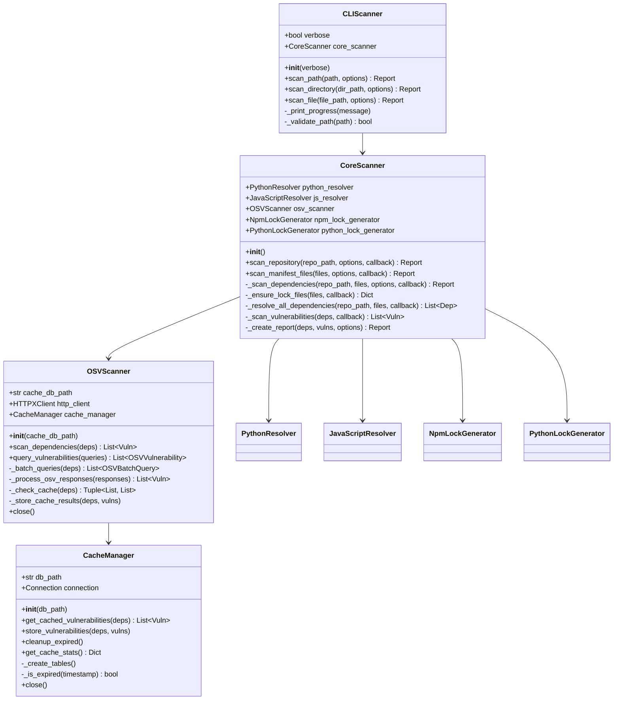
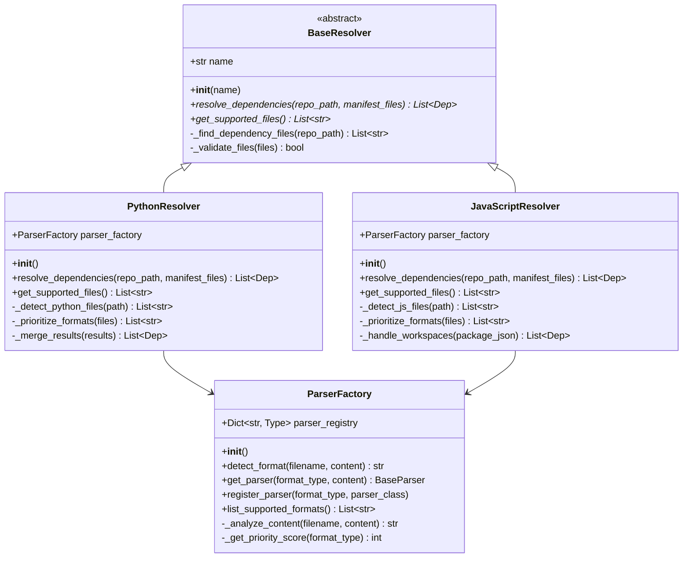
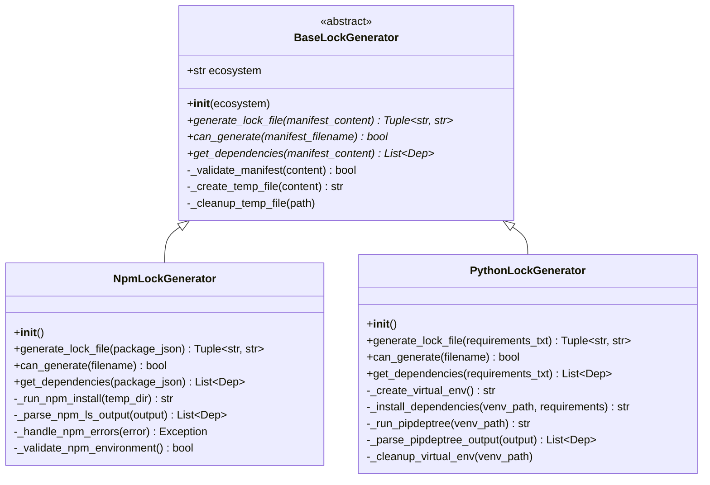
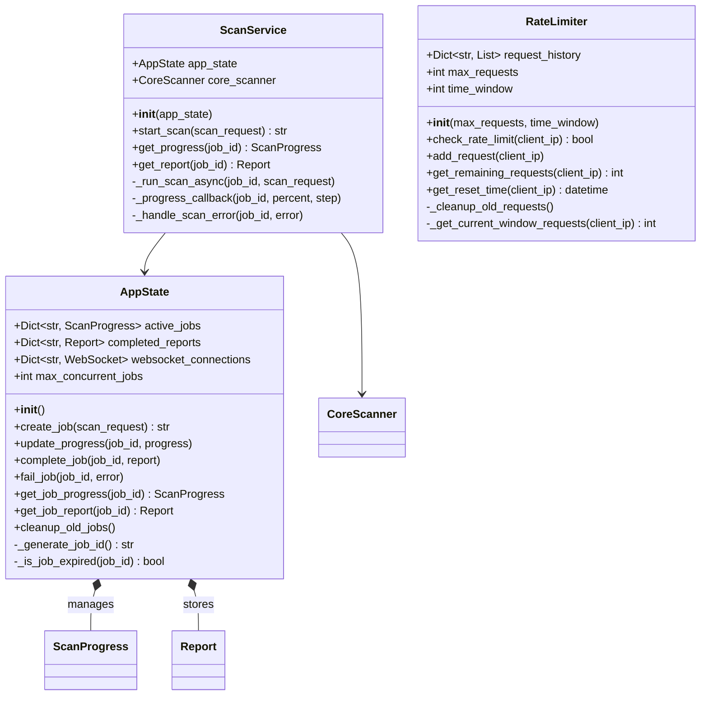

# Class Diagrams

This document provides detailed class diagrams for DepScan, illustrating the relationships between core models, parsers, scanners, and other key components.

## Core Data Models

```mermaid
classDiagram
    class Dep {
        +str name
        +str version
        +Ecosystem ecosystem
        +List~str~ path
        +bool is_direct
        +bool is_dev
        +__init__(name, version, ecosystem, path, is_direct, is_dev)
        +__str__() str
        +__repr__() str
    }
    
    class Vuln {
        +str package
        +str version
        +Ecosystem ecosystem
        +str vulnerability_id
        +SeverityLevel severity
        +float cvss_score
        +List~str~ cve_ids
        +str summary
        +str details
        +str advisory_url
        +str fixed_range
        +datetime published
        +datetime modified
        +List~str~ aliases
        +__init__(...)
        +is_critical() bool
        +is_high() bool
        +is_fixable() bool
    }
    
    class Report {
        +str job_id
        +JobStatus status
        +int total_dependencies
        +int vulnerable_count
        +List~Vuln~ vulnerable_packages
        +List~Dep~ dependencies
        +int suppressed_count
        +Dict~str, Any~ meta
        +__init__(...)
        +get_severity_counts() Dict
        +get_ecosystems() List~str~
        +get_scan_duration() float
    }
    
    class ScanOptions {
        +bool include_dev_dependencies
        +List~SeverityLevel~ ignore_severities
        +__init__(...)
        +should_ignore_severity(severity) bool
        +should_include_dev() bool
    }
    
    class ScanRequest {
        +str repo_path
        +Dict~str, str~ manifest_files
        +ScanOptions options
        +__init__(...)
        +has_repo_path() bool
        +has_manifest_files() bool
        +validate() bool
    }
    
    class ScanProgress {
        +str job_id
        +JobStatus status
        +float progress_percent
        +str current_step
        +int total_dependencies
        +int scanned_dependencies
        +int vulnerabilities_found
        +datetime started_at
        +datetime completed_at
        +str error_message
        +__init__(...)
        +update_progress(percent, step)
        +mark_completed()
        +mark_failed(error)
    }

    Report *-- Vuln : contains many
    Report *-- Dep : contains many
    Report *-- ScanOptions : configured by
    ScanRequest *-- ScanOptions : includes
    
    <<enumeration>> SeverityLevel
    SeverityLevel : CRITICAL
    SeverityLevel : HIGH
    SeverityLevel : MEDIUM
    SeverityLevel : LOW
    SeverityLevel : UNKNOWN
    
    <<enumeration>> JobStatus
    JobStatus : PENDING
    JobStatus : RUNNING
    JobStatus : COMPLETED
    JobStatus : FAILED
    
    <<type>> Ecosystem
    Ecosystem : npm
    Ecosystem : PyPI
    
    Dep --> Ecosystem
    Vuln --> Ecosystem
    Vuln --> SeverityLevel
    Report --> JobStatus
    ScanProgress --> JobStatus
```

## Core Scanner Architecture



## Dependency Resolution Architecture



## Parser Class Hierarchy

```mermaid
classDiagram
    class BaseParser {
        <<abstract>>
        +str format_name
        +str content
        +__init__(content)
        +parse() List~Dep~*
        +validate_content() bool*
        +get_metadata() Dict*
        -_parse_version(version_str) str
        -_normalize_name(name) str
        -_create_dependency(name, version, **kwargs) Dep
    }
    
    class PackageJsonParser {
        +Dict parsed_json
        +__init__(content)
        +parse() List~Dep~
        +validate_content() bool
        +get_metadata() Dict
        -_parse_dependencies(deps_dict, is_dev) List~Dep~
        -_handle_workspace_dependencies(deps) List~Dep~
        -_resolve_version_range(range_str) str
    }
    
    class PackageLockV2Parser {
        +Dict parsed_json
        +Dict packages
        +__init__(content)
        +parse() List~Dep~
        +validate_content() bool
        +get_metadata() Dict
        -_parse_packages_section() List~Dep~
        -_build_dependency_tree() Dict
        -_extract_transitive_deps(package_info) List~Dep~
    }
    
    class YarnLockParser {
        +str content
        +Dict parsed_entries
        +__init__(content)
        +parse() List~Dep~
        +validate_content() bool
        +get_metadata() Dict
        -_parse_yarn_format() Dict
        -_resolve_yarn_entry(entry) Dep
        -_handle_yarn_patterns(patterns) List~str~
    }
    
    class RequirementsParser {
        +List~str~ lines
        +__init__(content)
        +parse() List~Dep~
        +validate_content() bool
        +get_metadata() Dict
        -_parse_requirement_line(line) Dep
        -_handle_constraints(line) str
        -_parse_version_specifier(spec) str
    }
    
    class PoetryLockParser {
        +Dict parsed_toml
        +__init__(content)
        +parse() List~Dep~
        +validate_content() bool
        +get_metadata() Dict
        -_parse_package_entries() List~Dep~
        -_build_poetry_dependency_tree() Dict
        -_extract_poetry_metadata(package) Dict
    }
    
    class PyprojectParser {
        +Dict parsed_toml
        +__init__(content)
        +parse() List~Dep~
        +validate_content() bool
        +get_metadata() Dict
        -_parse_dependencies_section() List~Dep~
        -_parse_optional_dependencies() List~Dep~
        -_handle_pep621_format() Dict
    }

    BaseParser <|-- PackageJsonParser
    BaseParser <|-- PackageLockV2Parser
    BaseParser <|-- YarnLockParser
    BaseParser <|-- RequirementsParser
    BaseParser <|-- PoetryLockParser
    BaseParser <|-- PyprojectParser
    
    PackageJsonParser : +JavaScript/NPM
    PackageLockV2Parser : +JavaScript/NPM
    YarnLockParser : +JavaScript/NPM
    RequirementsParser : +Python/PyPI
    PoetryLockParser : +Python/PyPI
    PyprojectParser : +Python/PyPI
```



## Lock File Generator Architecture



## Web API Models



## Key Design Patterns

### 🏭 **Factory Pattern**
- **ParserFactory**: Dynamically creates appropriate parsers based on file format detection
- **Centralized Logic**: Single point of control for parser selection and instantiation
- **Extensibility**: Easy to add new parsers without modifying existing code

### 📦 **Strategy Pattern** 
- **BaseResolver**: Different resolution strategies for Python vs JavaScript ecosystems
- **BaseParser**: Different parsing strategies for various file formats
- **BaseLockGenerator**: Different lock file generation strategies per ecosystem

### 🔍 **Observer Pattern**
- **Progress Callbacks**: CoreScanner notifies UI components of scan progress
- **WebSocket Updates**: Real-time progress updates for web interface
- **Event-driven Architecture**: Loose coupling between components

### 💾 **Repository Pattern**
- **CacheManager**: Abstracts database operations for vulnerability caching
- **AppState**: Manages in-memory storage of job states and results
- **Consistent Interface**: Uniform data access patterns across the application

### 🛡️ **Decorator Pattern**
- **Rate Limiting**: Middleware decorates API endpoints with rate limiting logic
- **Security Headers**: Middleware adds security headers to all responses
- **Input Validation**: Decorates request handlers with validation logic

## Class Relationship Summary

1. **Data Flow**: `ScanRequest` → `CoreScanner` → `Resolvers` → `Parsers` → `OSVScanner` → `Report`
2. **Dependency Injection**: Services depend on abstractions, not concrete implementations
3. **Single Responsibility**: Each class has a focused, well-defined purpose
4. **Composition over Inheritance**: Prefer object composition for flexibility
5. **Interface Segregation**: Small, focused interfaces rather than monolithic ones

This architecture promotes maintainability, testability, and extensibility while following established design patterns and SOLID principles.