# Sequence Diagrams

This document provides detailed sequence diagrams for DepScan, illustrating the process flows for CLI operations, web interface interactions, vulnerability scanning, and other key workflows.

## CLI Scanning Workflow

```mermaid
sequenceDiagram
    participant User
    participant CLI as CLI Main
    participant CLIScanner as CLI Scanner
    participant CoreScanner as Core Scanner
    participant JSResolver as JavaScript Resolver
    participant PyResolver as Python Resolver
    participant Factory as Parser Factory
    participant Parser as File Parser
    participant OSVScanner as OSV Scanner
    participant Cache as Cache Manager
    participant OSVApi as OSV.dev API
    participant Formatter as CLI Formatter
    participant FileSystem as File System

    Note over User, FileSystem: CLI Scan Initialization
    User->>+CLI: dep-scan scan /path/to/project
    CLI->>+CLIScanner: scan_path(path, options)
    CLIScanner->>+CoreScanner: scan_repository(path, options, callback)
    
    Note over User, FileSystem: Dependency Resolution Phase
    CoreScanner->>+JSResolver: resolve_dependencies(repo_path)
    JSResolver->>FileSystem: find JavaScript files
    FileSystem-->>JSResolver: [package.json, package-lock.json]
    
    JSResolver->>+Factory: detect_format([files])
    Factory->>Factory: analyze file priorities
    Factory-->>-JSResolver: "package-lock.json"
    
    JSResolver->>+Factory: get_parser("package-lock.json", content)
    Factory->>+Parser: create PackageLockV2Parser()
    Factory-->>-JSResolver: parser instance
    
    JSResolver->>+Parser: parse()
    Parser->>Parser: extract dependencies recursively
    Parser-->>-JSResolver: List[Dep] with transitive deps
    JSResolver-->>-CoreScanner: JavaScript dependencies
    
    CoreScanner->>+PyResolver: resolve_dependencies(repo_path)
    PyResolver->>FileSystem: find Python files
    FileSystem-->>PyResolver: [requirements.txt, pyproject.toml]
    
    PyResolver->>+Factory: detect_format([files])
    Factory-->>-PyResolver: "pyproject.toml"
    
    PyResolver->>+Factory: get_parser("pyproject.toml", content)
    Factory->>+Parser: create PyprojectParser()
    Factory-->>-PyResolver: parser instance
    
    PyResolver->>+Parser: parse()
    Parser->>Parser: parse TOML and extract deps
    Parser-->>-PyResolver: List[Dep] direct dependencies
    PyResolver-->>-CoreScanner: Python dependencies
    
    CoreScanner->>CoreScanner: merge and deduplicate dependencies
    
    Note over User, FileSystem: Vulnerability Scanning Phase
    CoreScanner->>+OSVScanner: scan_dependencies(all_deps)
    
    OSVScanner->>+Cache: check_cache(dependencies)
    Cache-->>-OSVScanner: (cached_vulns, uncached_deps)
    
    alt Uncached dependencies exist
        OSVScanner->>OSVScanner: batch uncached dependencies
        
        loop For each batch (max 1000)
            OSVScanner->>+OSVApi: POST /v1/querybatch
            OSVApi-->>-OSVScanner: vulnerability data
            
            OSVScanner->>+Cache: store_results(batch_results)
            Cache-->>-OSVScanner: stored successfully
        end
    end
    
    OSVScanner->>OSVScanner: merge cached + fresh results
    OSVScanner-->>-CoreScanner: List[Vuln]
    
    Note over User, FileSystem: Report Generation Phase
    CoreScanner->>CoreScanner: create Report(deps, vulns, metadata)
    CoreScanner-->>-CLIScanner: Report
    CLIScanner-->>-CLI: Report
    
    Note over User, FileSystem: Output Generation Phase
    CLI->>+Formatter: print_scan_summary(report)
    Formatter->>User: display progress summary
    Formatter-->>-CLI: formatted
    
    CLI->>+Formatter: create_vulnerability_table(report)
    Formatter->>Formatter: build rich console table
    Formatter-->>-CLI: formatted table
    CLI->>User: display vulnerability table
    
    alt JSON output requested
        CLI->>FileSystem: write JSON report
        CLI->>User: "Report saved to file.json"
    end
    
    alt HTML report requested
        CLI->>FileSystem: generate HTML report
        CLI->>User: open browser with report
    end
    
    CLI-->>-User: scan completed (exit code)

    Note over User, OSVApi: Key Benefits<br/>✅ Fast local execution<br/>✅ Complete transitive resolution<br/>✅ Intelligent caching<br/>✅ Rich console output
```



## Web Interface Workflow


## Vulnerability Scanning Process

```mermaid
sequenceDiagram
    participant Scanner as OSV Scanner
    participant Cache as Cache Manager
    participant BatchProcessor as Batch Processor
    participant OSVApi as OSV.dev API
    participant RateLimit as Rate Limiter
    participant Database as SQLite Cache

    Note over Scanner, Database: Vulnerability Scanning Initialization
    Scanner->>+Cache: check_cache(dependencies)
    Cache->>+Database: SELECT vulnerabilities WHERE package IN (...)
    Database-->>-Cache: cached vulnerability records
    
    Cache->>Cache: filter expired records
    Cache-->>-Scanner: (cached_vulns, uncached_deps)
    
    Note over Scanner, Database: Batch Processing for Uncached Dependencies
    alt Uncached dependencies exist
        Scanner->>+BatchProcessor: create_batches(uncached_deps, max_size=1000)
        BatchProcessor->>BatchProcessor: group by ecosystem
        BatchProcessor->>BatchProcessor: split into OSV API limits
        BatchProcessor-->>-Scanner: List[OSVBatchQuery]
        
        loop For each batch
            Scanner->>+RateLimit: check_osv_rate_limit()
            RateLimit-->>-Scanner: rate limit OK
            
            Scanner->>Scanner: prepare batch query
            Scanner->>+OSVApi: POST /v1/querybatch
            Note right of OSVApi: Max 1000 queries per batch<br/>Rate limit: 1000 requests/min
            OSVApi-->>-Scanner: List[OSVVulnerability]
            
            Scanner->>Scanner: process and normalize responses
            Scanner->>+Cache: store_vulnerability_batch(batch_results)
            Cache->>+Database: INSERT/UPDATE vulnerability records
            Database-->>-Cache: storage confirmed
            Cache-->>-Scanner: batch cached
            
            Scanner->>Scanner: add to scan results
        end
    end
    
    Note over Scanner, Database: Result Processing and Cleanup
    Scanner->>Scanner: merge cached + fresh results
    Scanner->>Scanner: filter by severity and options
    Scanner->>Scanner: build final vulnerability list
    
    Scanner->>+Cache: cleanup_expired_cache()
    Cache->>+Database: DELETE FROM vulnerabilities WHERE expires_at < NOW()
    Database-->>-Cache: cleanup completed
    Cache-->>-Scanner: cache maintenance done
    
    Scanner->>Scanner: return List[Vuln]

    Note over Scanner, Database: Caching Strategy Benefits<br/>✅ Reduced API calls (TTL-based)<br/>✅ Faster subsequent scans<br/>✅ OSV.dev rate limit compliance<br/>✅ Offline capability for cached data
```



## Parser Selection Workflow

```mermaid
sequenceDiagram
    participant Resolver as Base Resolver
    participant Factory as Parser Factory
    participant Detector as Format Detector
    participant FileSystem as File System
    participant Parser1 as Primary Parser
    participant Parser2 as Fallback Parser

    Note over Resolver, Parser2: Smart Parser Selection Process
    Resolver->>+Factory: detect_format(filename, content)
    
    Factory->>+Detector: analyze_file_signature(filename, content)
    Detector->>Detector: check file extension
    Detector->>Detector: analyze content structure
    Detector->>Detector: validate format markers
    Detector-->>-Factory: format confidence scores
    
    Factory->>Factory: rank formats by priority
    Note right of Factory: Priority Order:<br/>1. Lockfiles (exact versions)<br/>2. Manifests (version ranges)<br/>3. Fallback parsers
    
    Factory-->>-Resolver: primary_format, fallback_formats
    
    Resolver->>+Factory: get_parser(primary_format, content)
    Factory->>+Parser1: create primary parser
    Parser1->>Parser1: validate content format
    
    alt Primary parser validation successful
        Factory-->>-Resolver: primary parser instance
        Resolver->>+Parser1: parse()
        Parser1->>Parser1: extract dependencies
        Parser1-->>-Resolver: List[Dep]
    else Primary parser fails validation
        Factory-->>-Resolver: validation error
        
        loop For each fallback format
            Resolver->>+Factory: get_parser(fallback_format, content)
            Factory->>+Parser2: create fallback parser
            Parser2->>Parser2: validate content format
            
            alt Fallback parser validation successful
                Factory-->>-Resolver: fallback parser instance
                Resolver->>+Parser2: parse()
                Parser2->>Parser2: extract dependencies (limited)
                Parser2-->>-Resolver: List[Dep]
            else Fallback parser fails
                Parser2-->>Factory: validation error
                Factory-->>-Resolver: try next fallback
            end
        end
    end

    Note over Resolver, Parser2: Parser Selection Benefits<br/>✅ Graceful degradation<br/>✅ Maximum data extraction<br/>✅ Format-specific optimizations<br/>✅ Error resilience
```

## Lock File Generation Process

```mermaid
sequenceDiagram
    participant CoreScanner as Core Scanner
    participant Generator as Lock Generator
    participant TempManager as Temp File Manager
    participant NPM as npm/yarn
    participant PipTools as pip/pipdeptree
    participant FileSystem as File System
    participant Parser as Generated Lock Parser

    Note over CoreScanner, Parser: Lock File Generation for Consistency
    CoreScanner->>+Generator: generate_lock_file(manifest_content)
    Generator->>+TempManager: create_temp_directory()
    TempManager-->>-Generator: temp_path
    
    Generator->>+FileSystem: write manifest to temp directory
    FileSystem-->>-Generator: manifest written
    
    alt JavaScript/NPM Generation
        Generator->>Generator: validate npm environment
        Generator->>+NPM: npm install --package-lock-only
        NPM->>NPM: resolve dependency tree
        NPM-->>-Generator: package-lock.json generated
        
        Generator->>+FileSystem: read generated package-lock.json
        FileSystem-->>-Generator: lock file content
        
    else Python Generation  
        Generator->>Generator: create virtual environment
        Generator->>+PipTools: pip install -r requirements.txt
        PipTools->>PipTools: install dependencies
        PipTools-->>-Generator: installation complete
        
        Generator->>+PipTools: pipdeptree --json
        PipTools->>PipTools: analyze installed packages
        PipTools-->>-Generator: dependency tree JSON
        
        Generator->>Generator: convert to lock file format
    end
    
    Generator->>+Parser: validate generated lock file
    Parser->>Parser: parse and verify structure
    Parser-->>-Generator: validation result
    
    Generator->>+TempManager: cleanup_temp_directory()
    TempManager-->>-Generator: cleanup complete
    
    Generator-->>-CoreScanner: (lock_filename, lock_content)
    
    CoreScanner->>CoreScanner: use generated lock file for scanning

    Note over CoreScanner, Parser: Lock Generation Benefits<br/>✅ Exact version resolution<br/>✅ Complete transitive deps<br/>✅ Consistency verification<br/>✅ Enhanced accuracy
```



## Error Handling and Recovery

```mermaid
sequenceDiagram
    participant Client
    participant API as FastAPI
    participant Service as Scan Service
    participant Scanner as Core Scanner
    participant ErrorHandler as Error Handler
    participant Logger as Structured Logger

    Note over Client, Logger: Error Handling Workflow
    Client->>+API: scan request
    API->>+Service: start_scan(request)
    Service->>+Scanner: scan_repository()
    
    Scanner->>Scanner: attempt dependency resolution
    
    alt Parsing error occurs
        Scanner->>+ErrorHandler: handle_parsing_error(error, context)
        ErrorHandler->>+Logger: log_error("parsing_failed", error, context)
        Logger-->>-ErrorHandler: logged
        
        ErrorHandler->>ErrorHandler: determine recovery strategy
        
        alt Fallback parser available
            ErrorHandler-->>-Scanner: try_fallback_parser
            Scanner->>Scanner: attempt with fallback parser
            Scanner->>Scanner: continue with partial results
        else No fallback available
            ErrorHandler-->>-Scanner: graceful_failure(error_details)
            Scanner-->>Service: PartialReport(error=error_details)
        end
        
    else Network error occurs
        Scanner->>+ErrorHandler: handle_network_error(error, context)
        ErrorHandler->>+Logger: log_error("network_failed", error, context)
        Logger-->>-ErrorHandler: logged
        
        ErrorHandler->>ErrorHandler: check retry strategy
        
        alt Retryable error
            ErrorHandler-->>-Scanner: retry_with_backoff
            Scanner->>Scanner: wait exponential backoff
            Scanner->>Scanner: retry operation
        else Non-retryable error
            ErrorHandler-->>-Scanner: fail_gracefully
            Scanner-->>Service: ErrorReport(network_error=details)
        end
        
    else Validation error occurs
        Scanner->>+ErrorHandler: handle_validation_error(error, context)
        ErrorHandler->>+Logger: log_error("validation_failed", error, context)
        Logger-->>-ErrorHandler: logged
        
        ErrorHandler->>ErrorHandler: sanitize error message
        ErrorHandler-->>-Scanner: user_friendly_error
        Scanner-->>Service: ValidationError(message=sanitized)
    end
    
    Service->>Service: process final result
    Service-->>-API: response with error handling
    API-->>-Client: structured error response

    Note over Client, Logger: Error Handling Benefits<br/>✅ Graceful degradation<br/>✅ Detailed logging<br/>✅ User-friendly messages<br/>✅ Recovery strategies
```

## Key Sequence Benefits

### 🔄 **Process Flow Clarity**
- **Clear Steps**: Each workflow broken down into logical phases
- **Actor Responsibilities**: Well-defined roles for each component
- **Decision Points**: Alternative flows clearly illustrated
- **Error Paths**: Recovery and fallback strategies documented

### ⚡ **Performance Optimization**
- **Batch Processing**: Efficient OSV.dev API usage
- **Intelligent Caching**: Reduced redundant operations
- **Parallel Operations**: Concurrent dependency resolution
- **Progress Feedback**: Real-time user updates

### 🛡️ **Error Resilience**
- **Graceful Degradation**: Fallback strategies at each level
- **Comprehensive Logging**: Detailed error tracking
- **User-friendly Messages**: Sanitized error communication
- **Recovery Mechanisms**: Automatic retry with backoff

### 🎯 **Interface Optimization**
- **CLI**: Optimized for automation and direct execution
- **Web**: Optimized for interactivity and real-time updates
- **API**: Optimized for asynchronous operations and scalability
- **Caching**: Optimized for performance and resource efficiency

These sequence diagrams provide a comprehensive view of how DepScan processes work from initiation to completion, highlighting the sophisticated error handling, caching strategies, and performance optimizations built into the system.