# System Architecture

This document provides comprehensive system architecture diagrams for DepScan, illustrating the relationships between components, data flow, and deployment architecture.

## High-Level System Architecture

```mermaid
graph TB
    subgraph "👥 User Interfaces"
        CLI["🖥️ CLI Tool<br/>• Typer + Rich console<br/>• Direct file system access<br/>• Progress indicators<br/>• Multiple output formats"]
        WebUI["🌐 Web Dashboard<br/>• React + TypeScript<br/>• File upload/drag-drop<br/>• Real-time progress<br/>• Interactive reports"]
    end
    
    subgraph "⚡ API Layer"
        FastAPI["🚀 FastAPI REST API<br/>• Async request handling<br/>• Rate limiting middleware<br/>• Security headers<br/>• CORS configuration<br/>• OpenAPI documentation"]
    end
    
    subgraph "🎯 Core Services"
        CoreScanner["🔍 Core Scanner<br/>• Orchestrates scanning workflow<br/>• Coordinates resolvers<br/>• Manages progress callbacks<br/>• Generates final reports"]
        
        AppState["📊 Application State<br/>• Job management<br/>• Progress tracking<br/>• Result storage<br/>• WebSocket connections"]
        
        CLIScanner["🖥️ CLI Scanner<br/>• CLI-specific logic<br/>• Console formatting<br/>• File system operations<br/>• Exit code management"]
    end
    
    subgraph "📦 Dependency Resolution"
        JSResolver["📄 JavaScript Resolver<br/>• package.json parsing<br/>• package-lock.json (v1/v2/v3)<br/>• yarn.lock support<br/>• Transitive dependency resolution"]
        
        PyResolver["🐍 Python Resolver<br/>• requirements.txt<br/>• pyproject.toml<br/>• poetry.lock parsing<br/>• Pipfile/Pipfile.lock<br/>• pipdeptree integration"]
        
        ParserFactory["🏭 Parser Factory<br/>• File format detection<br/>• Parser selection logic<br/>• Priority-based resolution<br/>• Error handling"]
    end
    
    subgraph "🔍 File Parsers"
        NPMParsers["📄 NPM Parsers<br/>• PackageJsonParser<br/>• PackageLockV1Parser<br/>• PackageLockV2Parser<br/>• YarnLockParser"]
        
        PythonParsers["🐍 Python Parsers<br/>• RequirementsParser<br/>• PyprojectParser<br/>• PoetryLockParser<br/>• PipfileParser"]
    end
    
    subgraph "🛡️ Vulnerability Scanning"
        OSVScanner["🔍 OSV Scanner<br/>• OSV.dev API client<br/>• Batch query optimization<br/>• Rate limiting compliance<br/>• Result processing"]
        
        CacheLayer["⚡ Cache Layer<br/>• SQLite storage<br/>• TTL management<br/>• Query optimization<br/>• Performance monitoring"]
    end
    
    subgraph "🔧 Lock File Generation"
        NpmGenerator["📄 NPM Lock Generator<br/>• npm ls integration<br/>• Version resolution<br/>• Dependency tree building"]
        
        PythonGenerator["🐍 Python Lock Generator<br/>• pipdeptree integration<br/>• Virtual environment handling<br/>• Transitive resolution"]
    end
    
    subgraph "🌐 External Services"
        OSVApi["🔗 OSV.dev API<br/>• Vulnerability database<br/>• Batch query endpoint<br/>• REST API interface<br/>• Rate limiting (1000/min)"]
        
        PackageRegistries["📦 Package Registries<br/>• npm registry<br/>• PyPI<br/>• Version metadata"]
    end
    
    subgraph "💾 Storage & Output"
        SQLiteDB["🗃️ SQLite Database<br/>• Vulnerability cache<br/>• Query result storage<br/>• Performance indexes<br/>• TTL management"]
        
        FileSystem["📁 File System<br/>• Dependency file reading<br/>• Report output<br/>• Temporary file handling<br/>• Configuration storage"]
        
        Reports["📊 Report Formats<br/>• Rich console output<br/>• JSON export<br/>• HTML reports<br/>• CSV export"]
    end

    %% User Interface Connections
    CLI --> CLIScanner
    CLI --> CoreScanner
    WebUI --> FastAPI
    
    %% API Layer Connections
    FastAPI --> CoreScanner
    FastAPI --> AppState
    
    %% Core Service Connections
    CoreScanner --> JSResolver
    CoreScanner --> PyResolver
    CoreScanner --> OSVScanner
    CLIScanner --> CoreScanner
    
    %% Resolver Connections
    JSResolver --> ParserFactory
    PyResolver --> ParserFactory
    JSResolver --> NpmGenerator
    PyResolver --> PythonGenerator
    
    %% Parser Factory Connections
    ParserFactory --> NPMParsers
    ParserFactory --> PythonParsers
    
    %% Scanner Connections
    OSVScanner --> CacheLayer
    OSVScanner --> OSVApi
    
    %% Storage Connections
    CacheLayer --> SQLiteDB
    JSResolver --> FileSystem
    PyResolver --> FileSystem
    CoreScanner --> Reports
    Reports --> FileSystem
    
    %% External Connections
    NpmGenerator --> PackageRegistries
    PythonGenerator --> PackageRegistries

    %% Styling
    classDef userInterface fill:#E3F2FD,stroke:#1976D2,stroke-width:2px,color:#000
    classDef apiLayer fill:#E8F5E8,stroke:#388E3C,stroke-width:2px,color:#000
    classDef coreService fill:#FFF3E0,stroke:#F57C00,stroke-width:2px,color:#000
    classDef resolverLayer fill:#F3E5F5,stroke:#7B1FA2,stroke-width:2px,color:#000
    classDef parserLayer fill:#FCE4EC,stroke:#C2185B,stroke-width:2px,color:#000
    classDef scannerLayer fill:#FFEBEE,stroke:#D32F2F,stroke-width:2px,color:#000
    classDef generatorLayer fill:#E0F2F1,stroke:#00695C,stroke-width:2px,color:#000
    classDef external fill:#ECEFF1,stroke:#546E7A,stroke-width:2px,color:#000
    classDef storage fill:#FFF8E1,stroke:#FF8F00,stroke-width:2px,color:#000

    class CLI,WebUI userInterface
    class FastAPI apiLayer
    class CoreScanner,AppState,CLIScanner coreService
    class JSResolver,PyResolver,ParserFactory resolverLayer
    class NPMParsers,PythonParsers parserLayer
    class OSVScanner,CacheLayer scannerLayer
    class NpmGenerator,PythonGenerator generatorLayer
    class OSVApi,PackageRegistries external
    class SQLiteDB,FileSystem,Reports storage
```

## Component Layer Architecture

## Data Flow Architecture

## Deployment Architecture

## Security Architecture

```mermaid
graph TB
    subgraph "Security Layers"
        Input_Validation[Input Validation<br/>• File type checks<br/>• Size limits<br/>• Content sanitization]
        
        Rate_Limiting[Rate Limiting<br/>• API endpoint limits<br/>• OSV.dev compliance<br/>• User-based throttling]
        
        Security_Headers[Security Headers<br/>• OWASP compliance<br/>• CSP policies<br/>• XSS protection]
        
        Data_Protection[Data Protection<br/>• No sensitive data storage<br/>• Temporary file cleanup<br/>• Memory management]
    end
    
    subgraph "External Security"
        TLS_Encryption[TLS Encryption<br/>• HTTPS only<br/>• Certificate validation]
        
        API_Authentication[API Security<br/>• Rate limit compliance<br/>• Request signing]
    end

    Input_Validation --> Rate_Limiting
    Rate_Limiting --> Security_Headers
    Security_Headers --> Data_Protection
    Data_Protection --> TLS_Encryption
    TLS_Encryption --> API_Authentication
```

## Key Architecture Benefits

### 🏗️ **Modularity**
- **Separation of Concerns**: Clear boundaries between UI, business logic, and infrastructure
- **Plugin Architecture**: Easy to add new parsers and output formats
- **Factory Patterns**: Dynamic component selection based on runtime conditions

### ⚡ **Performance**
- **Intelligent Caching**: SQLite-based cache with TTL management
- **Batch Processing**: Optimized OSV.dev API usage
- **Async Operations**: Non-blocking web interface operations
- **Smart Resolution**: Lockfile prioritization for efficiency

### 🛡️ **Security**
- **Input Validation**: Comprehensive sanitization and validation
- **Rate Limiting**: Protection against abuse and API compliance
- **No Sensitive Data**: No storage of user credentials or sensitive information
- **OWASP Compliance**: Security headers and best practices

### 🔧 **Maintainability**
- **Clean Architecture**: Well-defined layers and dependencies
- **Comprehensive Testing**: Unit, integration, and e2e test coverage
- **Documentation**: Self-documenting code with type hints
- **Monitoring**: Structured logging and error handling

This architecture supports both current functionality and future extensibility while maintaining security, performance, and maintainability standards.