# System Architecture

```mermaid
flowchart TB
    %% User Interfaces
    subgraph UI ["👥 User Interfaces"]
        CLI["💻 CLI Tool<br/>• Rich console output<br/>• Progress indicators<br/>• Multiple output formats<br/>• Error handling"]
        WebUI["🌐 Web Dashboard<br/>• React frontend<br/>• Real-time updates<br/>• Interactive reports<br/>• File upload/drag-drop"]
    end

    %% API Layer
    subgraph API ["⚡ API Layer"]
        FastAPI["🚀 FastAPI REST API<br/>• Async request handling<br/>• WebSocket support<br/>• Static file serving<br/>• CORS middleware<br/>• Auto-generated OpenAPI"]
    end

    %% Core Business Logic
    subgraph Core ["🎯 Core Business Logic"]
        ScanService["🔍 Scan Service<br/>• Orchestrates scanning<br/>• Progress tracking<br/>• Report generation<br/>• Error handling"]
        AppState["📊 Application State<br/>• Scan job management<br/>• Result storage<br/>• WebSocket connections<br/>• Memory management"]
    end

    %% Dependency Resolution
    subgraph Resolvers ["📦 Dependency Resolution"]
        JSResolver["📄 JavaScript Resolver<br/>• package.json parsing<br/>• package-lock.json v1/v2<br/>• yarn.lock support<br/>• npm ls integration"]
        PyResolver["🐍 Python Resolver<br/>• requirements.txt<br/>• poetry.lock parsing<br/>• pyproject.toml<br/>• Pipfile support"]
        ParserFactory["🏭 Parser Factory<br/>• Format detection<br/>• Parser selection<br/>• Priority ordering<br/>• Error handling"]
    end

    %% Vulnerability Scanning
    subgraph Scanner ["🛡️ Vulnerability Scanning"]
        OSVScanner["🔍 OSV Scanner<br/>• OSV.dev API client<br/>• Batch processing<br/>• Rate limiting<br/>• Vulnerability matching"]
        CacheLayer["⚡ Cache Layer<br/>• SQLite storage<br/>• TTL management<br/>• Query optimization<br/>• Cleanup routines"]
    end

    %% External Services
    subgraph External ["🌐 External Services"]
        OSVApi["🔗 OSV.dev API<br/>• Vulnerability database<br/>• Batch query support<br/>• Rate limits<br/>• JSON responses"]
    end

    %% Storage
    subgraph Storage ["💾 Storage"]
        SQLiteCache["🗃️ SQLite Cache<br/>• Vulnerability cache<br/>• Query results<br/>• Metadata storage<br/>• Performance indexes"]
        FileSystem["📁 File System<br/>• Dependency files<br/>• Report outputs<br/>• Temporary files<br/>• Configuration"]
    end

    %% User Interface Connections
    CLI -->|HTTP Requests| FastAPI
    WebUI -->|HTTP/WebSocket| FastAPI

    %% API Layer Connections
    FastAPI -->|Business Logic| ScanService
    FastAPI -->|State Management| AppState

    %% Core Logic Connections
    ScanService -->|Resolve JS Dependencies| JSResolver
    ScanService -->|Resolve Python Dependencies| PyResolver
    ScanService -->|Scan Vulnerabilities| OSVScanner

    %% Resolver Connections
    JSResolver -->|Get Parser| ParserFactory
    PyResolver -->|Get Parser| ParserFactory

    %% Scanner Connections
    OSVScanner -->|Cache Management| CacheLayer
    OSVScanner -->|API Queries| OSVApi
    CacheLayer -->|Data Storage| SQLiteCache

    %% Storage Connections
    JSResolver -->|Read Dependency Files| FileSystem
    PyResolver -->|Read Dependency Files| FileSystem
    ScanService -->|Write Reports| FileSystem

    %% Styling
    classDef userInterface fill:#E3F2FD,stroke:#1976D2,stroke-width:2px,color:#000
    classDef apiLayer fill:#E8F5E8,stroke:#388E3C,stroke-width:2px,color:#000
    classDef coreLogic fill:#FFF3E0,stroke:#F57C00,stroke-width:2px,color:#000
    classDef resolverLayer fill:#F3E5F5,stroke:#7B1FA2,stroke-width:2px,color:#000
    classDef scannerLayer fill:#FFEBEE,stroke:#D32F2F,stroke-width:2px,color:#000
    classDef external fill:#ECEFF1,stroke:#546E7A,stroke-width:2px,color:#000
    classDef storage fill:#FFF8E1,stroke:#FF8F00,stroke-width:2px,color:#000

    class CLI,WebUI userInterface
    class FastAPI apiLayer
    class ScanService,AppState coreLogic
    class JSResolver,PyResolver,ParserFactory resolverLayer
    class OSVScanner,CacheLayer scannerLayer
    class OSVApi external
    class SQLiteCache,FileSystem storage
```

## Architecture Notes

### **User Interfaces**
- **CLI**: Command-line tool for programmatic usage and CI/CD integration
- **Web Dashboard**: Interactive interface for non-technical users and visual exploration
- Both interfaces support the same core scanning features

### **Core Features**
- **Multi-language Support**: JavaScript and Python ecosystems
- **Transitive Dependencies**: Full dependency tree resolution when possible
- **Real-time Updates**: WebSocket-powered progress tracking
- **Multiple Output Formats**: JSON, CSV, and SBOM export options
- **Intelligent Caching**: SQLite-based performance optimization

### **External Dependencies**
- **OSV.dev API**: Primary vulnerability database
- **Package Registries**: npm, PyPI for metadata lookup
- **Rate Limiting**: Compliant with external service limits

### **Storage Strategy**
- **SQLite**: High-performance caching for vulnerability data
- **File System**: Flexible storage for dependency files and reports
- **Automatic Cleanup**: TTL-based cache management