# CLI User Journey

```mermaid
flowchart TD
    Start([User discovers DepScan]) --> Step1[🔍 Clone repository]
    
    Step1 --> Setup[⚙️ Setup environment<br/>• Create virtual env<br/>• Install dependencies<br/>• Activate environment]
    
    Setup --> Verify{✅ Verify installation<br/>python cli.py --help}
    
    Verify -->|Success| Navigate[📁 Navigate to target project]
    Verify -->|Failed| Troubleshoot[❌ Troubleshoot issues<br/>• Check Python version<br/>• Review error messages<br/>• Verify dependencies]
    
    Navigate --> Examine[🔎 Examine project structure<br/>Look for dependency files]
    
    Examine --> HasFiles{📄 Has dependency files?}
    
    HasFiles -->|Yes| BasicScan[🚀 Run basic scan<br/>python cli.py scan .]
    HasFiles -->|No| TryDifferent[⚠️ Try different project]
    
    TryDifferent --> Navigate
    
    BasicScan --> Progress[⏳ Watch progress output<br/>• Scanning dependencies<br/>• Checking vulnerabilities<br/>• Real-time feedback]
    
    Progress --> Results{📊 Review scan results}
    
    Results -->|Vulnerabilities found| VulnFound[⚠️ View detailed table<br/>• Package details<br/>• Severity levels<br/>• Fix recommendations]
    Results -->|No vulnerabilities| Success[✅ No vulnerabilities found<br/>Project is secure]
    
    VulnFound --> RiskAssess{🎯 Assess risk level}
    
    RiskAssess -->|Critical| Critical[🚨 Critical vulnerabilities<br/>• Immediate action required<br/>• Plan security updates]
    RiskAssess -->|Medium/Low| Schedule[📅 Schedule updates<br/>• Plan for next sprint<br/>• Monitor for patches]
    
    Success --> Export
    Critical --> Export
    Schedule --> Export
    
    Export{📤 Export detailed report?}
    
    Export -->|Yes| ExportJSON[📄 Export JSON report<br/>python cli.py scan . --json report.json<br/>• Share with team<br/>• Archive for compliance]
    Export -->|No| Advanced
    
    ExportJSON --> Advanced[🔧 Advanced usage exploration<br/>• Include dev dependencies<br/>• Severity filtering<br/>• Multiple projects]
    
    Advanced --> CICD{🔄 Using CI/CD?}
    
    CICD -->|Yes| Integration[⚡ CI/CD Integration<br/>• Add to pipeline<br/>• Automated scanning<br/>• Exit codes for failures]
    CICD -->|No| Manual[📅 Manual periodic scans<br/>• Set reminders<br/>• Regular checks]
    
    Integration --> Ongoing
    Manual --> Ongoing
    
    Ongoing[🔄 Ongoing Usage<br/>• Weekly/monthly scans<br/>• Before releases<br/>• After dependency updates<br/>• Team collaboration]
    
    Ongoing --> Advocate[🎖️ User becomes advocate<br/>• Recommends to colleagues<br/>• Contributes documentation<br/>• Reports bugs & features]
    
    Advocate --> End([✅ Success])

    %% Styling
    classDef successStyle fill:#d4edda,stroke:#28a745,stroke-width:2px
    classDef warningStyle fill:#fff3cd,stroke:#ffc107,stroke-width:2px
    classDef errorStyle fill:#f8d7da,stroke:#dc3545,stroke-width:2px
    classDef processStyle fill:#e3f2fd,stroke:#2196f3,stroke-width:2px
    classDef decisionStyle fill:#f3e5f5,stroke:#9c27b0,stroke-width:2px

    class Success,Integration,Advocate,End successStyle
    class TryDifferent,VulnFound,Schedule warningStyle
    class Troubleshoot,Critical errorStyle
    class Step1,Setup,Navigate,Examine,BasicScan,Progress,ExportJSON,Advanced,Manual,Ongoing processStyle
    class Verify,HasFiles,Results,RiskAssess,Export,CICD decisionStyle
```

## CLI User Journey Overview

### **Phase 1: Discovery & Setup**
**Discovery Points:**
- GitHub repository browsing
- Documentation site exploration
- Team recommendations
- Security blog posts and tutorials

**Setup Process:**
- Repository cloning
- Python virtual environment creation
- Dependency installation
- Installation verification

### **Phase 2: First Scan Experience**
**Project Navigation:**
- User identifies target project
- Examines project structure for dependency files
- Recognizes supported formats (package.json, requirements.txt, etc.)

**Initial Scan:**
- Executes basic scan command
- Watches real-time progress feedback
- Reviews comprehensive scan results

### **Phase 3: Results Analysis**
**Vulnerability Assessment:**
- **No Vulnerabilities**: Project confirmed secure, user gains confidence
- **Vulnerabilities Found**: Detailed analysis of severity levels
- **Critical Issues**: Immediate action planning and security updates
- **Medium/Low Issues**: Scheduled updates and monitoring

### **Phase 4: Advanced Usage**
**Feature Exploration:**
- Development dependency inclusion
- Severity-based filtering
- Multiple project scanning
- JSON export for team collaboration

**Automation Integration:**
- CI/CD pipeline integration
- Automated security scanning
- Exit code handling for build failures
- Scheduled periodic scans

### **Phase 5: Ongoing Adoption**
**Regular Usage Patterns:**
- Weekly or monthly security scans
- Pre-release security validation
- Post-dependency update verification
- Team-wide security workflow adoption

**Community Engagement:**
- Tool advocacy within organization
- Documentation contributions
- Bug reporting and feature requests
- Security best practice sharing

## User Characteristics

### **Primary CLI Users**
- **DevOps Engineers**: Automation and pipeline integration focus
- **Security Engineers**: Comprehensive vulnerability analysis
- **Backend Developers**: Regular security validation workflow
- **CI/CD Pipeline Managers**: Build process integration

### **CLI Journey Strengths**
- **Performance**: Fast setup and execution without UI overhead
- **Automation**: Perfect for CI/CD pipeline integration
- **Flexibility**: Works in any environment with Python
- **Scripting**: Easy integration with existing tools and workflows
- **Reliability**: Consistent results across different environments

### **Success Metrics**
- ✅ **Security Improved**: Vulnerabilities identified and remediated
- ✅ **Process Integrated**: Regular scanning becomes part of workflow
- ✅ **Team Adoption**: Multiple developers actively using the tool
- ✅ **Automation Success**: CI/CD integration preventing vulnerable deployments