# User Journey Diagrams

This document provides comprehensive user journey diagrams for DepScan, illustrating the experience flows for both CLI and web interfaces, from initial setup through advanced usage scenarios.

## CLI User Journey - First Time User

## CLI User Journey - Power User Workflow

```mermaid
flowchart TD
    Start([👤 Developer starts work day]) --> Check{New commits<br/>to scan?}
    
    Check -->|Yes| QuickScan[🔍 dep-scan scan .]
    Check -->|No| RegularWork[💻 Continue development]
    
    QuickScan --> Results{Vulnerabilities<br/>found?}
    
    Results -->|None| GreenLight[✅ All clear - continue work]
    Results -->|Critical/High| Investigate[🔎 dep-scan scan . --verbose]
    Results -->|Low/Medium| Decision{Time to fix<br/>now?}
    
    Decision -->|Yes| Investigate
    Decision -->|No| Document[📝 Add to backlog]
    
    Investigate --> DetailedReport[📊 dep-scan scan . --open]
    DetailedReport --> Analysis[📈 Analyze dependency paths]
    Analysis --> FixAttempt[🔧 Update vulnerable packages]
    
    FixAttempt --> Verify[🧪 dep-scan scan . --json results.json]
    Verify --> Resolved{Issues<br/>resolved?}
    
    Resolved -->|Yes| CommitChanges[✅ Commit security updates]
    Resolved -->|No| EscalateIssue[⚠️ Escalate to security team]
    
    CommitChanges --> CIIntegration[🤖 CI runs dep-scan automatically]
    CIIntegration --> GreenLight
    
    GreenLight --> RegularWork
    Document --> RegularWork
    EscalateIssue --> RegularWork
    RegularWork --> EndDay([📋 End of day security summary])
    
    style Start fill:#e1f5fe
    style GreenLight fill:#e8f5e8
    style EscalateIssue fill:#ffebee
    style CommitChanges fill:#e8f5e8
    style EndDay fill:#f3e5f5
```

## Web Interface User Journey - Security Analyst

## Web Interface User Journey - Interactive Flow

```mermaid
flowchart TD
    Landing([🌐 User opens web dashboard]) --> Welcome[👋 Welcome screen with examples]
    
    Welcome --> UploadChoice{Upload method<br/>preference?}
    
    UploadChoice -->|Drag & Drop| DragDrop[📁 Drag files to upload area]
    UploadChoice -->|Browse| FileDialog[📂 Click to browse files]
    
    DragDrop --> ValidateFiles[✅ Client-side file validation]
    FileDialog --> ValidateFiles
    
    ValidateFiles --> FilePreview[👁️ Preview uploaded files]
    FilePreview --> ScanOptions[⚙️ Configure scan options]
    
    ScanOptions --> OptionsChoice{Advanced<br/>options?}
    
    OptionsChoice -->|Basic| StartScan[🚀 Start scan with defaults]
    OptionsChoice -->|Advanced| AdvancedConfig[🔧 Configure severity filters<br/>📦 Include/exclude dev deps<br/>🎯 Custom scan parameters]
    
    AdvancedConfig --> StartScan
    
    StartScan --> ProgressPage[📊 Real-time progress dashboard]
    
    ProgressPage --> ProgressLoop{Scan in<br/>progress?}
    ProgressLoop -->|Yes| ProgressUpdates[⏱️ Live progress updates<br/>📈 Dependency count updates<br/>🔍 Current scanning phase]
    ProgressUpdates --> ProgressLoop
    
    ProgressLoop -->|Completed| ResultsPage[📋 Interactive results dashboard]
    ProgressLoop -->|Error| ErrorPage[❌ Error details with retry option]
    
    ResultsPage --> ResultsExploration[🔍 Explore vulnerabilities]
    ResultsExploration --> FilterSort[🎛️ Filter & sort vulnerabilities<br/>📊 View severity distribution<br/>🔗 Explore dependency paths]
    
    FilterSort --> ActionChoice{Next action?}
    
    ActionChoice -->|Export| ExportOptions[💾 Download JSON report<br/>📊 Export filtered results<br/>📧 Share results via link]
    ActionChoice -->|New Scan| Welcome
    ActionChoice -->|Deep Dive| VulnDetails[🔬 Detailed vulnerability analysis<br/>💡 Remediation suggestions<br/>🔗 External references]
    
    VulnDetails --> ActionChoice
    ExportOptions --> Done([✅ Analysis complete])
    ErrorPage --> Welcome
    
    style Landing fill:#e1f5fe
    style ResultsPage fill:#e8f5e8
    style ErrorPage fill:#ffebee
    style Done fill:#f3e5f5
    style ProgressUpdates fill:#fff3e0
```

## Developer Integration Journey

```mermaid
flowchart LR
    subgraph "Local Development"
        LocalScan[🖥️ Local CLI Scanning<br/>• Quick feedback<br/>• Pre-commit checks<br/>• IDE integration]
    end
    
    subgraph "Team Collaboration"
        WebReview[🌐 Web Interface Review<br/>• Shared analysis<br/>• Team discussions<br/>• Visual reporting]
    end
    
    subgraph "CI/CD Pipeline"
        AutoScan[🤖 Automated Scanning<br/>• Pipeline integration<br/>• Security gates<br/>• Compliance checks]
    end
    
    subgraph "Security Governance"
        Monitoring[📊 Continuous Monitoring<br/>• Trend analysis<br/>• Policy enforcement<br/>• Audit trails]
    end

    LocalScan -->|Share findings| WebReview
    LocalScan -->|Commit triggers| AutoScan
    WebReview -->|Define policies| AutoScan
    AutoScan -->|Feed data to| Monitoring
    Monitoring -->|Inform practices| LocalScan
    
    style LocalScan fill:#e3f2fd
    style WebReview fill:#e8f5e8
    style AutoScan fill:#fff3e0
    style Monitoring fill:#f3e5f5
```

## Error Recovery User Journeys

### CLI Error Recovery

```mermaid
flowchart TD
    CLIError[❌ CLI scan encounters error] --> ErrorType{Error type?}
    
    ErrorType -->|File not found| FileError[📁 Check file paths and permissions]
    ErrorType -->|Network issues| NetworkError[🌐 Check internet connection]
    ErrorType -->|Parsing errors| ParseError[📄 Validate file formats]
    
    FileError --> FileRecovery[🔧 Fix file paths<br/>✅ Verify permissions<br/>📍 Check working directory]
    NetworkError --> NetworkRecovery[🔄 Retry with --verbose<br/>⏱️ Check network connectivity<br/>🌐 Verify OSV.dev access]
    ParseError --> ParseRecovery[📝 Check file syntax<br/>🔍 Try with --verbose<br/>📋 Review error details]
    
    FileRecovery --> RetrySuccess{Retry<br/>successful?}
    NetworkRecovery --> RetrySuccess
    ParseRecovery --> RetrySuccess
    
    RetrySuccess -->|Yes| Success[✅ Scan completed successfully]
    RetrySuccess -->|No| Support[💬 Consult documentation<br/>🐛 Report issue on GitHub<br/>👥 Ask community for help]
    
    style CLIError fill:#ffebee
    style Success fill:#e8f5e8
    style Support fill:#fff3e0
```

### Web Interface Error Recovery

```mermaid
flowchart TD
    WebError[❌ Web scan encounters error] --> ErrorDisplay[📱 User-friendly error message]
    
    ErrorDisplay --> ErrorAction{User action?}
    
    ErrorAction -->|Retry| RetryUpload[🔄 Retry upload with same files]
    ErrorAction -->|Modify| ModifyFiles[📝 Adjust files or options]
    ErrorAction -->|Help| GetHelp[❓ View help documentation<br/>💡 Check troubleshooting guide]
    
    RetryUpload --> RetryResult{Retry<br/>successful?}
    ModifyFiles --> NewScan[🚀 Start new scan attempt]
    GetHelp --> ErrorAction
    
    RetryResult -->|Yes| WebSuccess[✅ Scan completed successfully]
    RetryResult -->|No| Escalate[⚠️ Technical issue<br/>📧 Contact support<br/>🐛 Report bug]
    
    NewScan --> ScanResult{Scan<br/>successful?}
    ScanResult -->|Yes| WebSuccess
    ScanResult -->|No| ErrorDisplay
    
    style WebError fill:#ffebee
    style WebSuccess fill:#e8f5e8
    style Escalate fill:#fff3e0
```

## Advanced Use Case Journeys

### Enterprise Security Workflow

### DevOps Integration Journey

## Key User Experience Insights

### 🎯 **Interface Optimization**
- **CLI**: Optimized for speed, automation, and developer workflows
- **Web**: Optimized for exploration, collaboration, and detailed analysis
- **Both**: Consistent data and complementary strengths

### 🔄 **Journey Continuity**
- **Seamless Transitions**: Easy to move between CLI and web interfaces
- **Shared Context**: Consistent vulnerability data across interfaces
- **Progressive Enhancement**: Basic features accessible, advanced features discoverable

### 🛡️ **Error Resilience**
- **Graceful Failures**: Clear error messages with actionable guidance
- **Recovery Paths**: Multiple options to resolve issues and retry
- **Help Integration**: Built-in guidance and external support channels

### 📈 **Workflow Integration**
- **Development Integration**: Natural fit into existing developer workflows
- **Team Collaboration**: Supports both individual and team security practices
- **Enterprise Scale**: Handles complex organizational security requirements

These user journeys demonstrate how DepScan supports various personas and use cases, from individual developers to enterprise security teams, with clear paths for both success scenarios and error recovery.