# CLI Usage Guide

This comprehensive guide covers all aspects of using DepScan's command-line interface, from basic scanning to advanced automation and integration scenarios.

## Quick Start

### Installation

```bash
# Install from PyPI (recommended)
pip install dep-scan

# Verify installation
dep-scan --help

# Check version
dep-scan version
```

### Your First Scan

```bash
# Scan current directory
dep-scan scan .

# Scan specific project directory
dep-scan scan /path/to/your/project

# Scan with verbose output
dep-scan scan . --verbose
```

## Complete Command Reference

### Main Commands

```bash
dep-scan [OPTIONS] COMMAND [ARGS]...
```

#### `scan` - Primary Scanning Command

```bash
dep-scan scan [OPTIONS] PATH
```

**Arguments:**
- `PATH` - Directory or file to scan (default: current directory)

**Options:**
- `--json FILENAME` - Export results as JSON file
- `--include-dev/--no-include-dev` - Include development dependencies (default: True)
- `--ignore-severity LEVEL` - Ignore vulnerabilities of specified severity
- `--open` - Generate and open HTML report in browser
- `--output FILENAME` - Custom HTML report filename  
- `--verbose` - Show detailed scanning progress

#### `version` - Version Information

```bash
dep-scan version
```

Shows version information, data source details, and debug information if enabled.

## Scanning Examples

### Basic Usage

#### **Simple Directory Scan**
```bash
dep-scan scan .
```

**Sample Output:**
```
🔍 Scanning JavaScript dependencies...
✅ Found 47 dependencies (8 direct, 39 transitive)

🔍 Scanning Python dependencies...
✅ Found 23 dependencies (12 direct, 11 transitive)

🚨 3 vulnerabilities found:

┌─────────────────────────────────────────────────────────────────────┐
│                        Vulnerability Report                         │
├─────────────┬─────────┬──────────────┬──────────┬─────────────────────┤
│ Package     │ Version │ Severity     │ CVE      │ Fix Available       │
├─────────────┼─────────┼──────────────┼──────────┼─────────────────────┤
│ lodash      │ 4.17.20 │ HIGH         │ CVE-2020 │ >=4.17.21          │
│ minimist    │ 0.0.8   │ CRITICAL     │ CVE-2020 │ >=1.2.5            │
│ requests    │ 2.25.1  │ MEDIUM       │ CVE-2022 │ >=2.31.0           │
└─────────────┴─────────┴──────────────┴──────────┴─────────────────────┘

📈 Summary: 3 vulnerable / 70 total (4.3% vulnerable)

🔧 Remediation Suggestions:
  • Update lodash to version 4.17.21 or higher
  • Update minimist to version 1.2.5 or higher  
  • Update requests to version 2.31.0 or higher
```

#### **Specific Project Scan**
```bash
dep-scan scan /home/user/my-project
```

### Output Formats

#### **JSON Export**
```bash
# Export to JSON file
dep-scan scan . --json security-report.json

# View JSON structure
cat security-report.json | jq .
```

**JSON Structure:**
```json
{
  "job_id": "cli-scan-1234567890",
  "status": "completed",
  "total_dependencies": 70,
  "vulnerable_count": 3,
  "vulnerable_packages": [
    {
      "package": "lodash",
      "version": "4.17.20",
      "ecosystem": "npm",
      "vulnerability_id": "GHSA-jf85-cpcp-j695",
      "severity": "HIGH",
      "cvss_score": 7.5,
      "cve_ids": ["CVE-2020-8203"],
      "summary": "Prototype Pollution in lodash",
      "fixed_range": ">=4.17.19",
      "advisory_url": "https://github.com/advisories/GHSA-jf85-cpcp-j695"
    }
  ],
  "dependencies": [...],
  "meta": {
    "generated_at": "2024-01-15T10:35:22Z",
    "scan_duration": 12.5,
    "ecosystems": ["npm", "PyPI"],
    "scan_options": {
      "include_dev_dependencies": true,
      "ignore_severities": []
    }
  }
}
```

#### **HTML Report**
```bash
# Generate and open HTML report
dep-scan scan . --open

# Generate HTML with custom filename
dep-scan scan . --output my-security-report.html

# Generate HTML without opening
dep-scan scan . --output report.html
```

### Filtering Options

#### **Severity Filtering**
```bash
# Ignore low severity vulnerabilities
dep-scan scan . --ignore-severity LOW

# Ignore multiple severity levels
dep-scan scan . --ignore-severity LOW --ignore-severity MEDIUM

# Only show critical and high severity
dep-scan scan . --ignore-severity LOW --ignore-severity MEDIUM
```

**Severity Levels:**
- `CRITICAL` - Immediate action required
- `HIGH` - High priority fix needed
- `MEDIUM` - Moderate risk, plan remediation
- `LOW` - Low risk, consider fixing when convenient
- `UNKNOWN` - Severity not determined

#### **Dependency Type Filtering**
```bash
# Exclude development dependencies
dep-scan scan . --no-include-dev

# Include all dependencies (default)
dep-scan scan . --include-dev
```

### Advanced Usage

#### **Verbose Mode**
```bash
dep-scan scan . --verbose
```

**Verbose Output Shows:**
- File detection and prioritization
- Parser selection process
- Dependency resolution details
- Vulnerability scanning progress
- Cache hit/miss statistics
- API call details

#### **Complex Filtering Example**
```bash
# Production scan: no dev deps, ignore low/medium severity
dep-scan scan . \
  --no-include-dev \
  --ignore-severity LOW \
  --ignore-severity MEDIUM \
  --json production-security-report.json
```

## File Format Support

### Supported File Types

#### **JavaScript/Node.js**

```bash
# These files are automatically detected and prioritized:
```

**Lock Files (Highest Priority):**
- `package-lock.json` (npm v1, v2, v3)
- `yarn.lock` (Yarn Classic & Berry)

**Manifest Files:**
- `package.json` (with or without lock file)

**Detection Logic:**
```bash
# DepScan will automatically:
# 1. Look for lock files first (complete dependency tree)
# 2. Fall back to package.json (direct dependencies only)
# 3. Handle workspace configurations
```

#### **Python**

**Lock Files (Highest Priority):**
- `poetry.lock` (Poetry projects)
- `Pipfile.lock` (Pipenv projects)

**Manifest Files:**
- `pyproject.toml` (Modern Python projects, Poetry, PEP 621)
- `requirements.txt` (pip format)
- `Pipfile` (Pipenv manifest)

**Detection Logic:**
```bash
# DepScan will automatically:
# 1. Prioritize lock files for exact versions
# 2. Parse manifest files for direct dependencies
# 3. Generate lock files when needed for accuracy
```

### File Prioritization

```mermaid
graph TB
    subgraph "File Priority Logic"
        LockFiles[🔒 Lock Files<br/>Priority: 10<br/>• Complete dependency trees<br/>• Exact versions<br/>• Transitive dependencies]
        
        Manifests[📄 Manifest Files<br/>Priority: 5-7<br/>• Direct dependencies<br/>• Version ranges<br/>• Basic metadata]
        
        Generated[⚙️ Generated Lock Files<br/>Priority: 8<br/>• Created on-demand<br/>• Resolve version ranges<br/>• Improve accuracy]
    end
    
    LockFiles --> Results[📊 Dependency Analysis]
    Manifests --> Generated
    Generated --> Results
    
    style LockFiles fill:#e8f5e8
    style Manifests fill:#e3f2fd
    style Generated fill:#fff3e0
```



## CI/CD Integration

### Exit Codes

DepScan uses standard exit codes for automation:

```bash
# Exit codes
0   # Success - no vulnerabilities found
1   # Vulnerabilities found (severity depends on filters)
2   # Error occurred during scanning
```

### CI/CD Examples

#### **GitHub Actions**
```yaml
name: Security Scan
on: [push, pull_request]

jobs:
  security-scan:
    runs-on: ubuntu-latest
    steps:
      - uses: actions/checkout@v3
      
      - name: Set up Python
        uses: actions/setup-python@v4
        with:
          python-version: '3.10'
      
      - name: Install DepScan
        run: pip install dep-scan
      
      - name: Run Security Scan
        run: |
          dep-scan scan . \
            --json security-report.json \
            --ignore-severity LOW
      
      - name: Upload Security Report
        uses: actions/upload-artifact@v3
        with:
          name: security-report
          path: security-report.json
        if: always()  # Upload even if scan fails
```

#### **GitLab CI**
```yaml
security_scan:
  image: python:3.10
  stage: test
  before_script:
    - pip install dep-scan
  script:
    - dep-scan scan . --json security-report.json --ignore-severity LOW
  artifacts:
    reports:
      # GitLab can parse the JSON report
      security: security-report.json
    paths:
      - security-report.json
    when: always
```

#### **Jenkins Pipeline**
```groovy
pipeline {
    agent any
    stages {
        stage('Security Scan') {
            steps {
                sh '''
                    pip install dep-scan
                    dep-scan scan . \
                        --json security-report.json \
                        --ignore-severity LOW MEDIUM
                '''
            }
            post {
                always {
                    archiveArtifacts artifacts: 'security-report.json'
                }
            }
        }
    }
}
```

### Pre-commit Hooks

#### **Simple Pre-commit Hook**
```bash
#!/bin/bash
# .git/hooks/pre-commit

echo "🔍 Running security scan..."
dep-scan scan . --ignore-severity LOW

if [ $? -ne 0 ]; then
    echo "❌ Security vulnerabilities found!"
    echo "Run 'dep-scan scan . --open' for detailed analysis"
    echo "Use 'git commit --no-verify' to bypass (not recommended)"
    exit 1
fi

echo "✅ Security scan passed"
```

#### **Advanced Pre-commit Hook**
```bash
#!/bin/bash
# .git/hooks/pre-commit

# Configuration
REPORT_FILE="/tmp/pre-commit-security-report.json"
MAX_CRITICAL=0
MAX_HIGH=2

echo "🔍 Running comprehensive security scan..."

# Run scan and capture exit code
dep-scan scan . --json "$REPORT_FILE" --ignore-severity LOW MEDIUM
SCAN_EXIT_CODE=$?

if [ $SCAN_EXIT_CODE -eq 0 ]; then
    echo "✅ No vulnerabilities found"
    exit 0
fi

if [ $SCAN_EXIT_CODE -eq 2 ]; then
    echo "❌ Scan error occurred"
    exit 1
fi

# Parse results for detailed analysis
if command -v jq >/dev/null 2>&1; then
    CRITICAL_COUNT=$(jq '[.vulnerable_packages[] | select(.severity=="CRITICAL")] | length' "$REPORT_FILE")
    HIGH_COUNT=$(jq '[.vulnerable_packages[] | select(.severity=="HIGH")] | length' "$REPORT_FILE")
    
    echo "📊 Found vulnerabilities:"
    echo "  Critical: $CRITICAL_COUNT (max allowed: $MAX_CRITICAL)"
    echo "  High: $HIGH_COUNT (max allowed: $MAX_HIGH)"
    
    if [ "$CRITICAL_COUNT" -gt "$MAX_CRITICAL" ] || [ "$HIGH_COUNT" -gt "$MAX_HIGH" ]; then
        echo "❌ Vulnerability threshold exceeded!"
        echo "Run 'dep-scan scan . --open' for detailed analysis"
        exit 1
    fi
fi

echo "✅ Security scan passed with acceptable risk level"
```

## Automation Patterns

### Scripted Workflows

#### **Multi-Project Scanner**
```bash
#!/bin/bash
# scan-all-projects.sh

PROJECTS_DIR="/home/user/projects"
REPORTS_DIR="/home/user/security-reports"
DATE=$(date +%Y%m%d)

mkdir -p "$REPORTS_DIR"

for project in "$PROJECTS_DIR"/*; do
    if [ -d "$project" ]; then
        project_name=$(basename "$project")
        echo "🔍 Scanning $project_name..."
        
        dep-scan scan "$project" \
            --json "$REPORTS_DIR/${project_name}-${DATE}.json" \
            --ignore-severity LOW
            
        if [ $? -ne 0 ]; then
            echo "⚠️  Vulnerabilities found in $project_name"
        else
            echo "✅ $project_name is secure"
        fi
    fi
done

echo "📊 All scans complete. Reports in $REPORTS_DIR"
```

#### **Vulnerability Tracking**
```bash
#!/bin/bash
# track-vulnerabilities.sh

PROJECT_PATH="$1"
TRACKING_FILE="vulnerability-history.json"

if [ -z "$PROJECT_PATH" ]; then
    echo "Usage: $0 <project-path>"
    exit 1
fi

# Run current scan
TIMESTAMP=$(date -u +"%Y-%m-%dT%H:%M:%SZ")
TEMP_REPORT="/tmp/current-scan.json"

dep-scan scan "$PROJECT_PATH" --json "$TEMP_REPORT"

# Extract key metrics
TOTAL_DEPS=$(jq '.total_dependencies' "$TEMP_REPORT")
VULNERABLE_COUNT=$(jq '.vulnerable_count' "$TEMP_REPORT")

# Append to history
jq -n \
  --arg timestamp "$TIMESTAMP" \
  --argjson total_deps "$TOTAL_DEPS" \
  --argjson vulnerable_count "$VULNERABLE_COUNT" \
  --slurpfile current_report "$TEMP_REPORT" \
  '{
    timestamp: $timestamp,
    total_dependencies: $total_deps,
    vulnerable_count: $vulnerable_count,
    report: $current_report[0]
  }' >> "$TRACKING_FILE"

echo "📈 Vulnerability tracking updated"
```

### Error Handling Patterns

#### **Robust CI/CD Scanner**
```bash
#!/bin/bash
# robust-scan.sh

set -euo pipefail  # Exit on error, undefined vars, pipe failures

PROJECT_PATH="${1:-.}"
OUTPUT_DIR="${2:-./security-reports}"
MAX_RETRIES=3
RETRY_DELAY=5

mkdir -p "$OUTPUT_DIR"

# Function to run scan with retries
run_scan_with_retry() {
    local attempt=1
    local report_file="$OUTPUT_DIR/security-report-$(date +%s).json"
    
    while [ $attempt -le $MAX_RETRIES ]; do
        echo "🔍 Attempt $attempt: Running security scan..."
        
        if dep-scan scan "$PROJECT_PATH" \
            --json "$report_file" \
            --ignore-severity LOW 2>/dev/null; then
            
            echo "✅ Scan completed successfully"
            echo "📄 Report: $report_file"
            
            # Validate JSON output
            if jq . "$report_file" >/dev/null 2>&1; then
                return 0
            else
                echo "⚠️  Invalid JSON output, retrying..."
            fi
        else
            echo "❌ Scan failed on attempt $attempt"
        fi
        
        if [ $attempt -lt $MAX_RETRIES ]; then
            echo "⏱️  Waiting ${RETRY_DELAY}s before retry..."
            sleep $RETRY_DELAY
        fi
        
        ((attempt++))
    done
    
    echo "❌ All scan attempts failed"
    return 1
}

# Main execution
if run_scan_with_retry; then
    echo "🎉 Security scan completed successfully"
    exit 0
else
    echo "💥 Security scan failed after $MAX_RETRIES attempts"
    exit 2
fi
```

## Troubleshooting

### Common Issues

#### **Installation Issues**
```bash
# Error: command not found
# Solution: Ensure pip installation was successful
pip install --upgrade dep-scan

# Error: Permission denied
# Solution: Use user installation
pip install --user dep-scan

# Error: Python version incompatible
# Solution: Check Python version (requires 3.10+)
python --version
```

#### **Scanning Issues**
```bash
# Error: No supported dependency files found
# Solution: Check your project structure
ls -la package.json requirements.txt pyproject.toml

# Error: Network timeout
# Solution: Check internet connectivity to OSV.dev
curl -I https://api.osv.dev/v1/

# Error: Permission denied reading files
# Solution: Check file permissions
chmod +r package.json requirements.txt
```

#### **Performance Issues**
```bash
# Slow scanning
# Solution: Check cache status and network
dep-scan scan . --verbose | grep -i cache

# High memory usage
# Solution: Scan smaller directories or use filtering
dep-scan scan ./src --no-include-dev
```

### Debug Mode

```bash
# Enable debug logging (if available in .env)
DEBUG=true dep-scan scan . --verbose

# Check cache statistics
dep-scan scan . --verbose | grep -i cache

# Verify file detection
dep-scan scan . --verbose | grep -i "detected\|found"
```

## Best Practices

### Development Workflow

1. **Local Development**
   ```bash
   # Quick check before commit
   dep-scan scan . --ignore-severity LOW
   ```

2. **Pre-commit Integration**
   ```bash
   # Install pre-commit hook
   cp scripts/pre-commit-security.sh .git/hooks/pre-commit
   chmod +x .git/hooks/pre-commit
   ```

3. **Regular Security Reviews**
   ```bash
   # Weekly comprehensive scan
   dep-scan scan . --open --json weekly-security-$(date +%Y%m%d).json
   ```

### CI/CD Best Practices

1. **Fail Fast**: Configure scans to fail builds on critical vulnerabilities
2. **Report Storage**: Always store scan results as artifacts
3. **Trend Tracking**: Maintain historical vulnerability data
4. **Notification**: Alert security teams on new vulnerabilities
5. **Automated Updates**: Consider automatic dependency updates for security fixes

This comprehensive CLI guide should help users leverage all of DepScan's command-line capabilities effectively, from basic usage to advanced automation and integration scenarios.