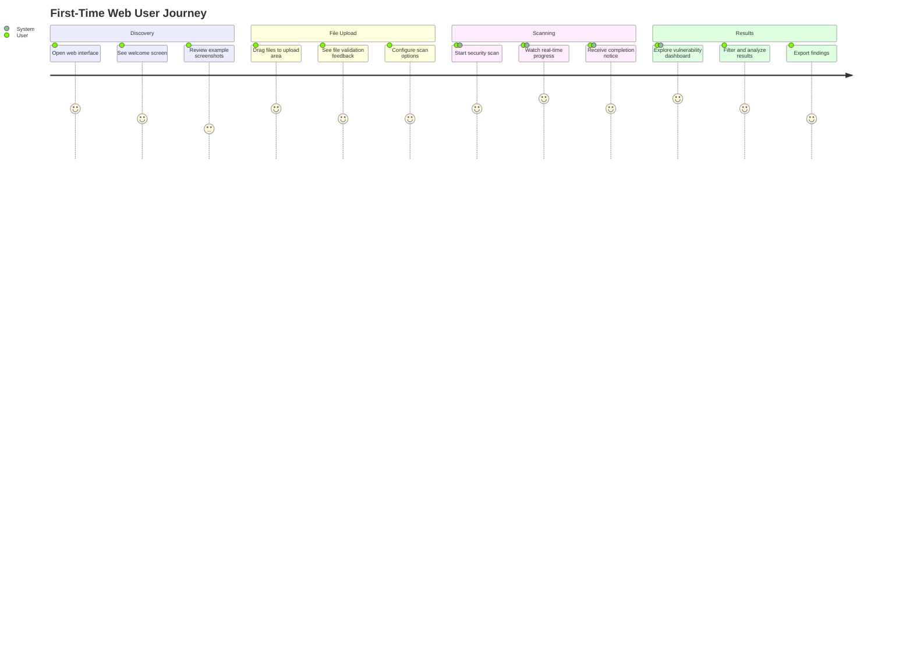
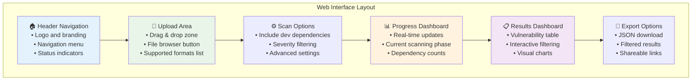
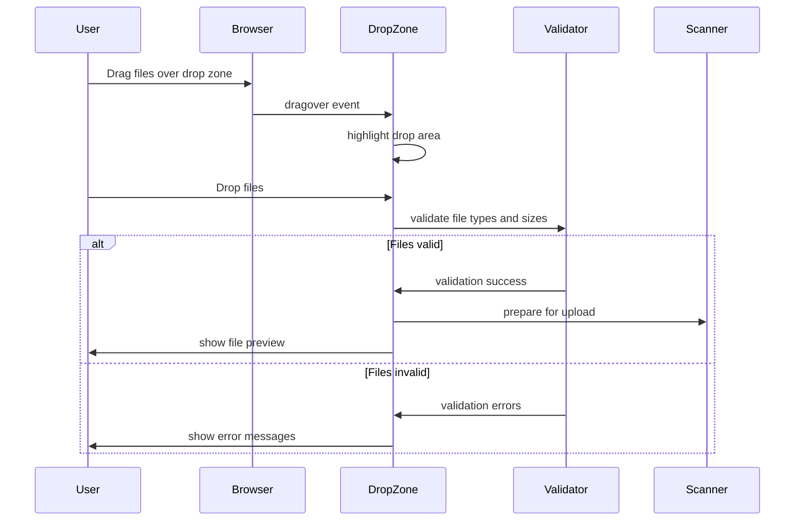
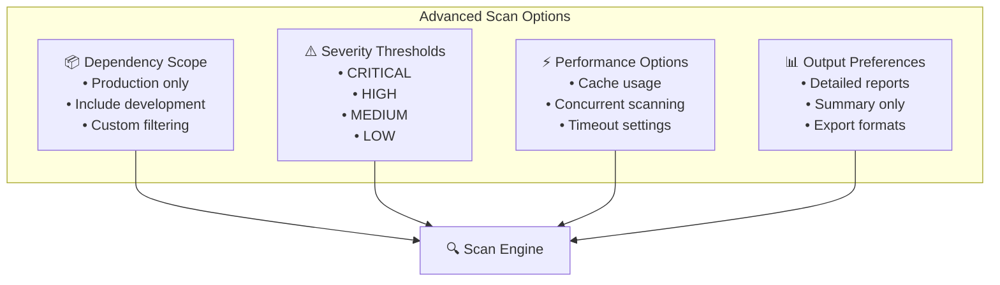
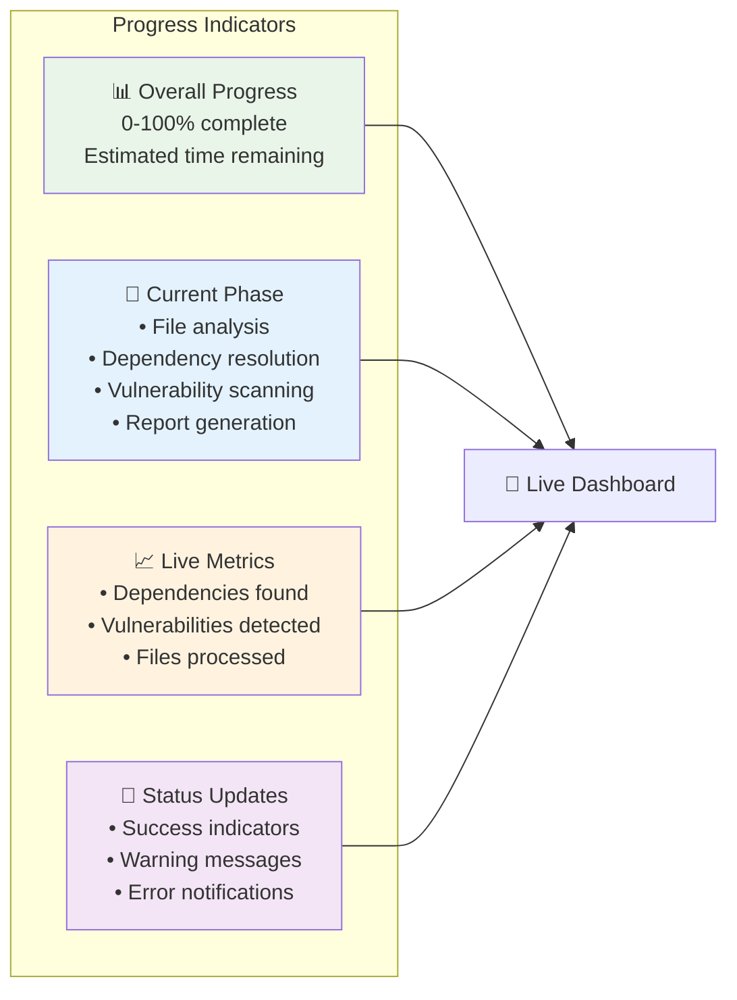
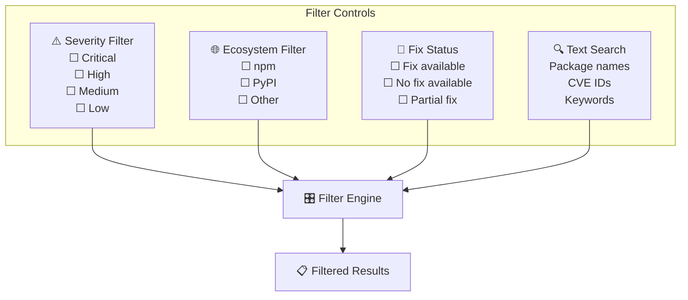
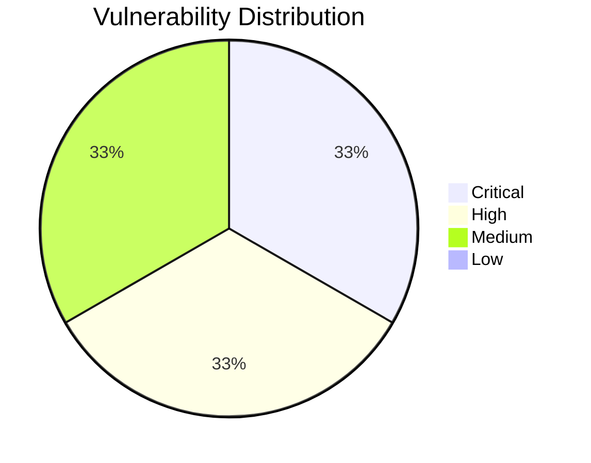
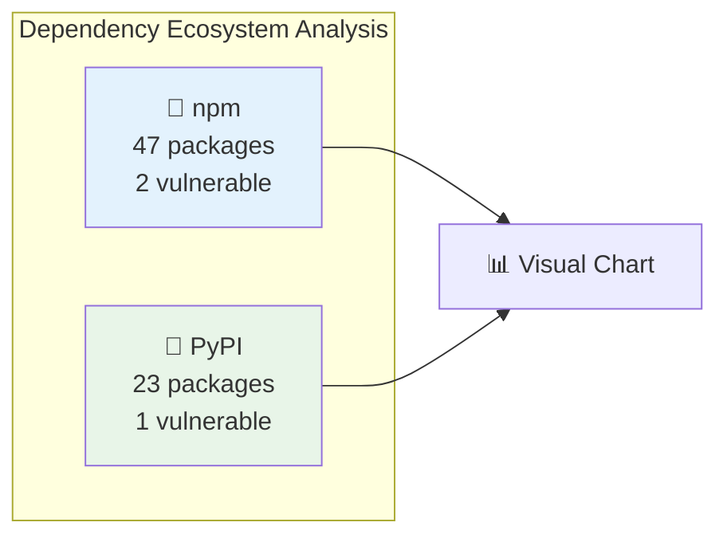
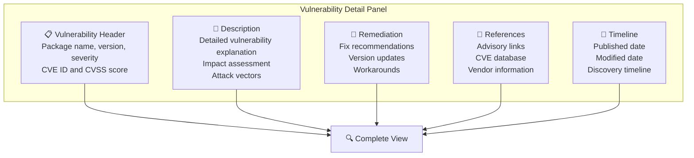
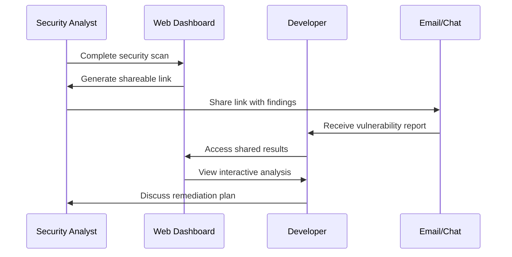

# Web Interface Guide

This comprehensive guide covers all aspects of using DepScan's web interface, from basic file uploads to advanced vulnerability analysis and team collaboration features.

## Getting Started

### Accessing the Web Interface

#### **Development Environment**
```bash
# Start development environment
make start-docker-dev

# Access interfaces:
# Frontend: http://localhost:3000
# Backend API: http://localhost:8000/docs
```

#### **Production Deployment**
```bash
# Start production environment
make start-staging

# Access: http://localhost:8000
```

### First-Time User Experience



## Interface Overview

### Main Dashboard



### Navigation Structure

#### **Primary Navigation**
- **🏠 Home** - Landing page and file upload
- **🔍 Scan** - Active scanning page with progress
- **📊 Report** - Results dashboard and analysis
- **📚 Help** - Documentation and guides

#### **Secondary Features**
- **⚙️ Settings** - Scan configuration options
- **📤 Export** - Download and sharing options
- **❓ About** - Version and system information

## File Upload Process

### Supported File Types

The web interface accepts the same file types as the CLI:

#### **JavaScript/Node.js Files**
```
✅ package.json          (npm manifest)
✅ package-lock.json     (npm lockfile v1/v2/v3)  
✅ yarn.lock            (yarn lockfile)
```

#### **Python Files**
```
✅ requirements.txt      (pip requirements)
✅ pyproject.toml        (modern python projects)
✅ poetry.lock          (poetry lockfile)
✅ Pipfile              (pipenv manifest)
✅ Pipfile.lock         (pipenv lockfile)
```

### Upload Methods

#### **Drag & Drop**


**Step-by-step:**
1. **Drag Files**: Drag dependency files from file explorer
2. **Drop Zone Highlight**: Interface highlights valid drop area
3. **File Validation**: Automatic validation of file types and sizes
4. **Preview Display**: Shows uploaded files with metadata
5. **Ready to Scan**: Enable scan button when files are ready

#### **File Browser**
1. **Click Upload Button**: "Choose Files" or "Browse" button
2. **File Dialog**: System file picker opens
3. **Multi-select**: Select multiple dependency files
4. **Upload**: Files uploaded and validated automatically

### File Validation

#### **Client-side Validation**
```javascript
// Example validation checks
const validateFile = (file) => {
  const supportedTypes = [
    'package.json', 'package-lock.json', 'yarn.lock',
    'requirements.txt', 'pyproject.toml', 'poetry.lock', 
    'Pipfile', 'Pipfile.lock'
  ];
  
  const maxSize = 10 * 1024 * 1024; // 10MB limit
  
  return {
    typeValid: supportedTypes.includes(file.name),
    sizeValid: file.size <= maxSize,
    contentValid: true // Checked server-side
  };
};
```

**Validation Rules:**
- **File Types**: Must be recognized dependency format
- **File Size**: Maximum 10MB per file
- **File Count**: Up to 20 files per scan
- **Content Format**: Valid JSON, TOML, or text format

#### **Server-side Validation**
- **Content Parsing**: Validates file structure
- **Security Scanning**: Checks for malicious content
- **Size Limits**: Enforces upload restrictions
- **Rate Limiting**: Prevents abuse

## Scan Configuration

### Basic Options

#### **Dependency Types**
```
🔧 Include Development Dependencies
☐ Production dependencies only
☑ Include development dependencies (default)

💡 Tip: Include dev dependencies for comprehensive analysis,
       exclude for production-focused scans
```

#### **Severity Filtering**
```
⚠️ Ignore Vulnerability Severities
☐ Show all vulnerabilities (default)
☐ Ignore LOW severity
☐ Ignore MEDIUM severity  
☐ Ignore HIGH severity
☐ Ignore CRITICAL severity (not recommended)

💡 Tip: For CI/CD, consider ignoring LOW and MEDIUM
       for faster feedback on critical issues
```

### Advanced Configuration

#### **Scan Options Panel**


#### **Configuration Examples**

**Development Scan (Comprehensive):**
```
✅ Include development dependencies
✅ Show all severity levels
✅ Detailed vulnerability information
✅ Full dependency tree analysis
```

**Production Scan (Focused):**
```
❌ Exclude development dependencies
❌ Ignore LOW and MEDIUM severity
✅ Critical and HIGH vulnerabilities only
✅ Optimized for speed
```

**CI/CD Integration:**
```
❌ Exclude development dependencies
❌ Ignore LOW severity only
✅ Focus on actionable vulnerabilities
✅ JSON export enabled
```

## Real-time Progress Monitoring

### Progress Dashboard



### Progress Phases

#### **Phase 1: File Analysis (0-20%)**
```
🔍 Analyzing uploaded files...
  ✅ package.json validated
  ✅ package-lock.json detected
  ✅ requirements.txt validated
  📊 3 files ready for processing
```

#### **Phase 2: Dependency Resolution (20-60%)**
```
📦 Resolving dependencies...
  🔍 JavaScript dependencies: 47 found
  🐍 Python dependencies: 23 found
  📊 Total dependencies: 70 (15 direct, 55 transitive)
```

#### **Phase 3: Vulnerability Scanning (60-90%)**
```
🛡️ Scanning for vulnerabilities...
  🔍 Checking cache: 52 cached, 18 new queries
  🌐 Querying OSV.dev API: 18 packages
  ⚠️ Vulnerabilities found: 3
```

#### **Phase 4: Report Generation (90-100%)**
```
📋 Generating report...
  📊 Processing vulnerability data
  🎨 Creating visual charts
  ✅ Report ready for viewing
```

### Real-time Updates

#### **WebSocket Integration**
The web interface uses WebSocket connections for live updates:

```javascript
// Example WebSocket connection
const ws = new WebSocket(`ws://localhost:8000/ws/${jobId}`);

ws.onmessage = (event) => {
  const progress = JSON.parse(event.data);
  updateProgressBar(progress.progress_percent);
  updateCurrentPhase(progress.current_step);
  updateMetrics(progress);
};
```

**Update Frequency:**
- **Progress Updates**: Every 0.5 seconds during active scanning
- **Metric Updates**: Real-time as dependencies and vulnerabilities are discovered
- **Status Changes**: Immediate updates on phase transitions or errors

## Results Dashboard

### Vulnerability Overview

#### **Summary Cards**
```mermaid
graph LR
    subgraph "Summary Dashboard"
        TotalDeps[📦 Total Dependencies<br/>70 packages analyzed<br/>15 direct, 55 transitive]
        
        VulnCount[🚨 Vulnerabilities Found<br/>3 vulnerable packages<br/>4.3% of total]
        
        SeverityDist[📊 Severity Distribution<br/>1 Critical, 1 High<br/>1 Medium, 0 Low]
        
        Ecosystems[🌐 Ecosystems<br/>2 ecosystems scanned<br/>npm (47), PyPI (23)]
    end
    
    style TotalDeps fill:#e3f2fd
    style VulnCount fill:#ffebee
    style SeverityDist fill:#fff3e0
    style Ecosystems fill:#e8f5e8
```

### Interactive Vulnerability Table

#### **Table Features**
- **Sortable Columns**: Click headers to sort by any field
- **Filterable Rows**: Search and filter by package name, severity, etc.
- **Expandable Details**: Click rows to see full vulnerability information
- **Action Buttons**: Quick links to advisories, fix information

#### **Column Layout**
| Column | Description | Interactive Features |
|--------|-------------|---------------------|
| 🚨 **Severity** | Color-coded severity level | Sort by severity, filter by level |
| 📦 **Package** | Package name and version | Search by name, click for details |
| 🛡️ **CVE ID** | Vulnerability identifier | Link to external advisory |
| 📝 **Summary** | Brief vulnerability description | Expandable full description |
| 🔧 **Fix Available** | Recommended version update | Copy-paste friendly format |
| 🔗 **Advisory** | External reference link | Opens in new tab |

#### **Filtering Options**


### Visual Analytics

#### **Severity Distribution Chart**


#### **Ecosystem Breakdown**


### Detailed Vulnerability Information

#### **Vulnerability Detail Panel**
When clicking on a vulnerability, a detailed panel shows:



**Example Detail Panel:**
```
🚨 CRITICAL - Prototype Pollution in lodash

📦 Package: lodash@4.17.20 (npm)
🛡️ CVE: CVE-2020-8203 (CVSS: 7.4)
🔗 Advisory: https://github.com/advisories/GHSA-jf85-cpcp-j695

📝 Description:
A prototype pollution vulnerability exists in lodash versions prior to 
4.17.19. The vulnerability allows an attacker to modify the prototype 
of base object class 'Object' by defining properties through user-controlled
merge operations.

🔧 Remediation:
• Update lodash to version 4.17.19 or higher
• Consider using lodash-es for tree-shaking benefits
• Review code for direct object property assignments

📅 Timeline:
• Published: 2020-07-15
• Modified: 2020-07-16
• Fixed in: 4.17.19 (2020-07-16)
```

## Export and Sharing

### Export Options

#### **JSON Export**
```javascript
// Example exported JSON structure
{
  "scan_metadata": {
    "scan_id": "web-scan-1642123456",
    "timestamp": "2024-01-15T10:35:22Z",
    "scan_options": {
      "include_dev": true,
      "ignore_severities": ["LOW"]
    }
  },
  "summary": {
    "total_dependencies": 70,
    "vulnerable_count": 3,
    "severity_distribution": {
      "CRITICAL": 1,
      "HIGH": 1,
      "MEDIUM": 1,
      "LOW": 0
    }
  },
  "vulnerabilities": [...],
  "dependencies": [...]
}
```

#### **Filtered Export**
Users can export filtered results:
1. **Apply Filters**: Use table filters to narrow results
2. **Select Export**: Click "Export Filtered Results"
3. **Choose Format**: JSON or CSV
4. **Download**: File downloads with filtered data only

### Sharing Features

#### **Shareable Links**
```
🔗 Share Results
https://depscan.example.com/report/abc123def456

Features:
• Direct link to scan results
• View-only access (no editing)
• 24-hour expiration for security
• No personal information included
```

#### **Team Collaboration**


## Advanced Features

### Batch Processing

#### **Multiple Project Scanning**
While the web interface primarily handles single project scans, users can:

1. **Sequential Scans**: Upload different projects one after another
2. **Result Comparison**: Compare vulnerability reports across projects
3. **Historical Tracking**: Maintain scan history for trend analysis

### Integration Capabilities

#### **API Integration**
The web interface is built on the same API that can be integrated programmatically:

```javascript
// Example API integration
async function automatedScan(files) {
  // Upload files for scanning
  const scanResponse = await fetch('/api/scan', {
    method: 'POST',
    body: JSON.stringify({
      manifest_files: files,
      options: {
        include_dev_dependencies: false,
        ignore_severities: ['LOW']
      }
    })
  });
  
  const { job_id } = await scanResponse.json();
  
  // Poll for results
  let result;
  do {
    await new Promise(resolve => setTimeout(resolve, 2000));
    const statusResponse = await fetch(`/api/status/${job_id}`);
    result = await statusResponse.json();
  } while (result.status === 'running');
  
  // Get final report
  const reportResponse = await fetch(`/api/report/${job_id}`);
  return await reportResponse.json();
}
```

## Troubleshooting

### Common Issues

#### **Upload Problems**
```
❌ Issue: "File upload failed"
✅ Solution: 
  • Check file size (<10MB per file)
  • Verify file format is supported
  • Ensure stable internet connection
  • Try refreshing the page
```

#### **Scanning Errors**
```
❌ Issue: "Scan failed to start"  
✅ Solution:
  • Verify file content is valid JSON/TOML
  • Check that files contain dependency information
  • Try uploading one file at a time
  • Contact support if errors persist
```

#### **Performance Issues**
```
❌ Issue: "Slow loading or timeouts"
✅ Solution:
  • Check internet connection speed
  • Try scanning smaller projects first
  • Use latest browser version
  • Disable browser extensions that might interfere
```

### Browser Compatibility

#### **Supported Browsers**
- ✅ Chrome 90+ (Recommended)
- ✅ Firefox 88+
- ✅ Safari 14+
- ✅ Edge 90+

#### **Required Features**
- JavaScript enabled
- WebSocket support
- File API support
- Modern ES6+ support

## Best Practices

### Effective Usage Patterns

#### **Regular Security Reviews**
1. **Weekly Team Scans**: Upload current project dependencies
2. **Pre-release Checks**: Scan before major releases
3. **Trend Monitoring**: Track vulnerability changes over time
4. **Team Collaboration**: Share findings with development teams

#### **Workflow Integration**
1. **Development Phase**: Use for exploratory security analysis
2. **Code Review**: Include security scan results in review process
3. **Release Planning**: Factor vulnerability fixes into release cycles
4. **Incident Response**: Quick analysis of newly discovered vulnerabilities

### Performance Optimization

#### **Efficient Scanning**
- **Focused Uploads**: Only upload relevant dependency files
- **Use Filters**: Apply severity filters to focus on actionable items
- **Batch Related Files**: Upload related files together (e.g., package.json + package-lock.json)
- **Regular Cache**: Benefit from cached vulnerability data on repeated scans

This comprehensive web interface guide should help users leverage all of DepScan's web-based capabilities effectively, from basic file uploads to advanced vulnerability analysis and team collaboration.