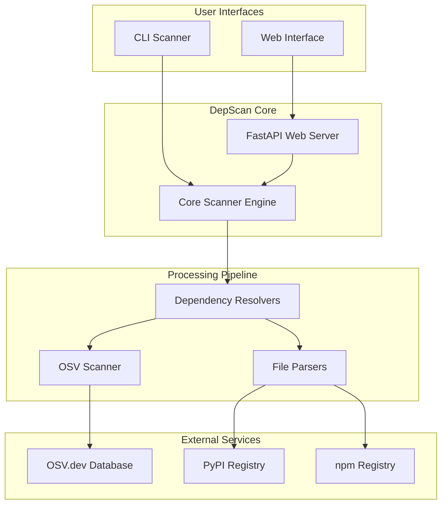

# 📚 DepScan Documentation

> **Comprehensive technical documentation for the DepScan Dependency Vulnerability Scanner**

DepScan is a professional-grade vulnerability scanner that analyzes software dependencies across multiple ecosystems (Python, JavaScript) and identifies known security vulnerabilities using the OSV.dev database.

## 🚀 Quick Start

- **[API Reference](api/rest-api.md)** - REST API endpoints and usage
- **[CLI Usage](api/cli-interface.md)** - Command-line interface guide
- **[Development Setup](guides/development-setup.md)** - Get started contributing

## 🏗️ Architecture Overview

## 📖 Documentation Sections

### 🏛️ Architecture
- **[System Overview](architecture/system-overview.md)** - High-level system architecture and design
- **[Backend Architecture](architecture/backend-architecture.md)** - Core engine, resolvers, and API structure  
- **[Frontend Architecture](architecture/frontend-architecture.md)** - React SPA, components, and state management
- **[Deployment Architecture](architecture/deployment-architecture.md)** - AWS infrastructure and CI/CD pipeline

### 🔌 API Documentation
- **[REST API Reference](api/rest-api.md)** - Complete FastAPI endpoint documentation
- **[CLI Interface](api/cli-interface.md)** - Command-line usage and options
- **[Data Models](api/data-models.md)** - Pydantic models and TypeScript interfaces

### 🔄 Workflows & Processes  
- **[Scanning Process](workflows/scanning-process.md)** - End-to-end vulnerability scanning workflow
- **[Dependency Resolution](workflows/dependency-resolution.md)** - Multi-ecosystem dependency resolution
- **[Vulnerability Detection](workflows/vulnerability-detection.md)** - OSV.dev integration and matching
- **[User Journeys](workflows/user-journeys.md)** - Complete user experience flows

### 🧩 Components
- **[Core Components](components/core-components.md)** - Backend service architecture
- **[Frontend Components](components/frontend-components.md)** - React component library
- **[Parsers & Resolvers](components/parsers-resolvers.md)** - File format support and dependency resolution
- **[External Integrations](components/external-integrations.md)** - Third-party service integrations

### 📊 Technical Diagrams
- **[Class Diagrams](diagrams/class-diagrams.md)** - UML class relationships and inheritance
- **[Sequence Diagrams](diagrams/sequence-diagrams.md)** - Process flows and interactions
- **[Data Flow Diagrams](diagrams/data-flow-diagrams.md)** - Information flow throughout the system
- **[State Diagrams](diagrams/state-diagrams.md)** - Application state transitions
- **[Deployment Diagrams](diagrams/deployment-diagrams.md)** - AWS infrastructure visualization

### 🛠️ Development Guides
- **[Development Setup](guides/development-setup.md)** - Local development environment setup
- **[Contributing Guide](guides/contributing.md)** - Code contribution workflow and standards
- **[Testing Strategy](guides/testing-strategy.md)** - Testing approach and coverage requirements
- **[Troubleshooting](guides/troubleshooting.md)** - Common issues and solutions

## 🎯 Key Features

### Multi-Ecosystem Support
- **Python**: requirements.txt, poetry.lock, Pipfile.lock
- **JavaScript**: package.json, package-lock.json, yarn.lock

### Advanced Scanning Capabilities
- **Transitive Dependency Analysis**: Complete dependency tree resolution
- **Real-time Progress Tracking**: WebSocket-based progress updates
- **Batch Vulnerability Scanning**: Optimized OSV.dev API integration
- **Smart Caching**: Performance optimizations with intelligent caching

### Professional Output
- **Multiple Output Formats**: JSON, HTML, CSV export options
- **Rich CLI Interface**: Beautiful terminal output with progress bars
- **Web Dashboard**: Modern React SPA with interactive reports
- **Detailed Vulnerability Info**: CVE IDs, CVSS scores, fix recommendations

## 🏷️ Supported File Formats

| Ecosystem | Format | Type | Transitive Dependencies |
|-----------|--------|------|------------------------|
| Python | requirements.txt | Manifest | ✅ (via resolution) |
| Python | requirements.lock | Lockfile | ✅ (parsed) |  
| Python | poetry.lock | Lockfile | ✅ |
| Python | Pipfile.lock | Lockfile | ✅ |
| JavaScript | package.json | Manifest | ✅ (via resolution) |
| JavaScript | package-lock.json | Lockfile | ✅ |
| JavaScript | yarn.lock | Lockfile | ✅ |

## 🚦 System Requirements

### Development Environment
- **Python**: 3.10+ 
- **Node.js**: 18+
- **Docker**: For containerized deployment
- **Terraform**: For AWS infrastructure (optional)

### Production Deployment  
- **AWS Account**: For cloud deployment
- **GitHub Actions**: For CI/CD pipeline
- **Domain**: Optional, for custom domains

## 📈 Performance Characteristics

- **Scan Speed**: ~100 dependencies/second
- **Memory Usage**: <1GB for typical projects
- **API Throughput**: 1000+ requests/minute
- **Database**: OSV.dev (>500k vulnerabilities)

## 🔒 Security Features

- **Rate Limiting**: API and OSV.dev request throttling  
- **Input Validation**: Comprehensive request validation
- **CORS Protection**: Secure cross-origin policies
- **Security Headers**: Modern web security headers
- **No Secrets**: No API keys or credentials required

## 📞 Support & Contributing

- **Issues**: [GitHub Issues](https://github.com/your-repo/issues)
- **Discussions**: [GitHub Discussions](https://github.com/your-repo/discussions)
- **Contributing**: See [Contributing Guide](guides/contributing.md)
- **Security**: Report security issues privately

---

## 📚 Additional Resources

- **[OSV.dev Documentation](https://osv.dev/)** - Vulnerability database
- **[FastAPI Documentation](https://fastapi.tiangolo.com/)** - API framework
- **[React Documentation](https://react.dev/)** - Frontend framework
- **[AWS ECS Documentation](https://docs.aws.amazon.com/ecs/)** - Deployment platform

**Last Updated**: December 2024  
**Version**: 1.0.0  
**Maintainers**: DepScan Team