# 🖥️ CLI Interface Reference

> **Complete command-line interface documentation for the DepScan vulnerability scanner**

The DepScan CLI provides a powerful, interactive command-line interface for vulnerability scanning with rich terminal output, progress tracking, and multiple export formats. Built with Typer and Rich for an excellent developer experience.

## 🚀 Quick Start

### Installation

```bash
# Install DepScan (when packaged)
pip install dep-scan

# Or run from source
git clone <repository>
cd dep-scan
pip install -e .
```

### Basic Usage

```bash
# Scan current directory
dep-scan

# Scan specific directory
dep-scan /path/to/project

# Scan single file
dep-scan package.json

# Export results as JSON
dep-scan --json results.json

# Generate HTML report
dep-scan --open --output report.html
```

## 📖 Command Reference

### Main Scan Command

```bash
dep-scan [PATH] [OPTIONS]
```

#### Arguments

| Argument | Type | Default | Description |
|----------|------|---------|-------------|
| `PATH` | `string` | `"."` | Path to directory or dependency file to scan |

#### Options

| Option | Short | Type | Default | Description |
|--------|-------|------|---------|-------------|
| `--json` | - | `string` | None | Export results as JSON to specified file |
| `--include-dev` | - | `flag` | `true` | Include development dependencies |
| `--no-include-dev` | - | `flag` | `false` | Exclude development dependencies |
| `--ignore-severity` | - | `string` | None | Ignore vulnerabilities of specified severity |
| `--open` | - | `flag` | `false` | Generate and open HTML report in browser |
| `--output` | `-o` | `string` | None | HTML report output file |
| `--verbose` | `-v` | `flag` | `false` | Show detailed scanning progress |
| `--help` | `-h` | `flag` | - | Show help message |

#### Severity Levels

Valid values for `--ignore-severity`:
- `CRITICAL` - Critical severity vulnerabilities
- `HIGH` - High severity vulnerabilities  
- `MEDIUM` - Medium severity vulnerabilities
- `LOW` - Low severity vulnerabilities

### Version Command

```bash
dep-scan version
```

Shows version information and configuration details.

---

## 🔄 CLI Workflow

```mermaid
flowchart TD
    START[🚀 User Runs Command] --> PARSE[📝 Parse Arguments]
    PARSE --> VALIDATE[✅ Validate Options]
    VALIDATE --> DETECT[🔍 Detect File/Directory]
    
    DETECT --> FILE_SCAN[📄 Single File Scan]
    DETECT --> DIR_SCAN[📁 Directory Scan]
    
    FILE_SCAN --> PROGRESS[📊 Progress Display]
    DIR_SCAN --> PROGRESS
    
    PROGRESS --> SCAN[🛡️ Core Scanning]
    SCAN --> RESULTS[📋 Process Results]
    
    RESULTS --> CONSOLE[🖥️ Console Output]
    RESULTS --> JSON_EXPORT[📄 JSON Export]
    RESULTS --> HTML_EXPORT[🌐 HTML Export]
    
    CONSOLE --> EXIT_SUCCESS[✅ Exit 0]
    CONSOLE --> EXIT_ERROR[❌ Exit 1]
    
    JSON_EXPORT --> CONSOLE
    HTML_EXPORT --> CONSOLE
    
    classDef process fill:#e1f5fe
    classDef output fill:#e8f5e8
    classDef exit fill:#fff3e0
    
    class START,PARSE,VALIDATE,DETECT,FILE_SCAN,DIR_SCAN,PROGRESS,SCAN,RESULTS process
    class CONSOLE,JSON_EXPORT,HTML_EXPORT output
    class EXIT_SUCCESS,EXIT_ERROR exit
```



## 📊 Console Output Examples

### Successful Scan with Vulnerabilities

```bash
$ dep-scan --verbose

📦 Resolving dependency tree...
Scanning for Python dependency files...
Processing file: requirements.txt
Found 5 Python dependencies
🛡️ Querying OSV database for 5 dependencies - this can take a while...
Scan completed!

╭─────────────────── Vulnerability Summary ────────────────────╮
│ Package    │ Version │ Severity │ CVSS │ CVE ID          │ Type       │ Link          │
├────────────┼─────────┼──────────┼──────┼─────────────────┼────────────┼───────────────┤
│ urllib3    │ 1.26.5  │ HIGH     │ 7.5  │ CVE-2021-33503  │ transitive │ nvd.nist.gov  │
│ urllib3    │ 1.26.5  │ MEDIUM   │ 5.3  │ CVE-2020-26137  │ transitive │ nvd.nist.gov  │
│ idna       │ 2.10    │ HIGH     │ 7.5  │ CVE-2022-24303  │ transitive │ github.com    │
│ requests   │ 2.25.0  │ MEDIUM   │ 6.1  │ CVE-2023-32681  │ direct     │ github.com    │
╰────────────────────────────────────────────────────────────────────────────────────╯

📊 Scan Summary:
Total dependencies: 5
  Direct: 2
  Transitive: 3
  Vulnerable: 4 (80.0%)

🔴 Critical: 0
🔴 High: 2
🟡 Medium: 2  
🟢 Low: 0

💡 Remediation Suggestions:
• Update urllib3 to >=1.26.18 to fix 2 vulnerabilities
• Update idna to >=3.7 to fix 1 vulnerability  
• Update requests to >=2.31.0 to fix 1 vulnerability

⚠️  Found vulnerabilities! Review and update dependencies.
```

### Scan with No Vulnerabilities

```bash
$ dep-scan

📦 Resolving dependency tree...
🛡️ Querying OSV database for 12 dependencies...
Scan completed!

📊 Scan Summary:
Total dependencies: 12
  Direct: 4
  Transitive: 8
  Vulnerable: 0 (0.0%)

✅ No vulnerabilities found! Your dependencies look secure.
```

### JSON Export

```bash
$ dep-scan --json results.json

# ... scan output ...

✓ JSON report saved to: results.json
```

### HTML Report Generation

```bash
$ dep-scan --open --output vulnerability-report.html

# ... scan output ...

✓ HTML report generated: /path/to/vulnerability-report.html
Opening HTML report: /path/to/vulnerability-report.html
```

## 🎨 Progress Display

The CLI uses Rich progress bars with detailed status updates:

```bash
Scanning project dependencies... ━━━━━━━━━━━━━━━━━━━━━━━━━━━━━━━━━━━━━━━━ 75%
Current step: Analyzing vulnerabilities in JavaScript dependencies
```

### Progress Stages

| Stage | Percentage | Description |
|-------|------------|-------------|
| **Initialization** | 0-10% | Setup and validation |
| **Discovery** | 10-30% | File discovery and reading |
| **Generation** | 30-50% | Lock file generation (npm/PyPI API calls) |
| **Parsing** | 50-70% | Dependency parsing and tree building |
| **Scanning** | 70-90% | Vulnerability scanning (OSV API) |
| **Reporting** | 90-100% | Report generation and finalization |

## 📁 Supported File Types

### Automatic Detection

The CLI automatically detects and processes multiple file types:

#### JavaScript/npm
```bash
# These files will be automatically detected in directories:
package.json          # npm manifest
package-lock.json     # npm lockfile (v1, v2, v3)
yarn.lock            # Yarn lockfile

# Single file scanning:
dep-scan package.json
dep-scan package-lock.json
dep-scan yarn.lock
```

#### Python/PyPI
```bash
# These files will be automatically detected in directories:
requirements.txt      # pip requirements
requirements.lock     # pip-compile lockfile  
poetry.lock          # Poetry lockfile
Pipfile.lock         # Pipenv lockfile
pyproject.toml       # Python project file

# Single file scanning:
dep-scan requirements.txt
dep-scan poetry.lock
dep-scan pyproject.toml
```

### File Priority

When scanning directories, files are processed in this priority order:

1. **Lockfiles** (higher accuracy)
   - `requirements.lock` (Python)
   - `poetry.lock` (Python)
   - `Pipfile.lock` (Python)
   - `package-lock.json` (JavaScript)
   - `yarn.lock` (JavaScript)

2. **Manifest files** (converted to lockfiles when possible)
   - `requirements.txt` (Python)
   - `pyproject.toml` (Python)
   - `Pipfile` (Python)
   - `package.json` (JavaScript)

## ⚙️ Configuration

### Environment Variables

```bash
# API endpoints (usually not needed)
export OSV_API_URL=https://api.osv.dev
export PYPI_API_URL=https://pypi.org/pypi
export NPM_REGISTRY_URL=https://registry.npmjs.org

# Logging configuration
export LOG_LEVEL=INFO
export DEBUG=false

# Output configuration
export NO_COLOR=1                    # Disable colored output
export FORCE_COLOR=1                 # Force colored output
```

### Exit Codes

| Code | Description |
|------|-------------|
| `0` | Success (no vulnerabilities found) |
| `1` | Vulnerabilities found OR scan error |

This follows standard UNIX conventions where exit code `1` indicates either findings or errors.

## 🔧 Advanced Usage Examples

### Complex Scanning Scenarios

```bash
# Scan Python project, ignore low severity, export results
dep-scan /path/to/python-project \
  --ignore-severity LOW \
  --json security-report.json \
  --output vulnerability-report.html

# Scan single requirements file with verbose output
dep-scan requirements.txt --verbose

# Scan excluding dev dependencies
dep-scan --no-include-dev

# Generate HTML report and open in browser
dep-scan --open

# Scan and export to custom JSON file
dep-scan /path/to/project --json ~/Desktop/scan-results.json
```

### CI/CD Integration

```bash
#!/bin/bash
# CI/CD script example

set -e  # Exit on any error

echo "🔍 Running vulnerability scan..."

# Run scan and capture exit code
if dep-scan --json vulnerability-report.json; then
    echo "✅ No vulnerabilities found"
    exit 0
else
    echo "❌ Vulnerabilities detected"
    
    # Upload report to artifact storage
    echo "📤 Uploading vulnerability report..."
    # ... upload logic ...
    
    # Fail the build
    exit 1
fi
```

### GitHub Actions Example

```yaml
name: Security Scan
on: [push, pull_request]

jobs:
  security-scan:
    runs-on: ubuntu-latest
    steps:
      - uses: actions/checkout@v3
      
      - name: Set up Python
        uses: actions/setup-python@v4
        with:
          python-version: '3.10'
      
      - name: Install DepScan
        run: pip install dep-scan
      
      - name: Run vulnerability scan
        run: |
          dep-scan \
            --json vulnerability-report.json \
            --output vulnerability-report.html
      
      - name: Upload vulnerability report
        if: failure()
        uses: actions/upload-artifact@v3
        with:
          name: vulnerability-report
          path: |
            vulnerability-report.json
            vulnerability-report.html
```

## 🎯 Output Formats

### Console Output

Rich terminal output with:
- **Colored severity levels** (RED for Critical/High, YELLOW for Medium, GREEN for Low)
- **Interactive links** (clickable URLs in supported terminals)
- **Progress bars** with real-time updates
- **Summary statistics** with clear metrics
- **Remediation suggestions** with actionable advice

### JSON Export

Structured JSON format compatible with security tools:

```json
{
  "job_id": "scan-12345",
  "status": "completed",
  "total_dependencies": 127,
  "vulnerable_count": 5,
  "vulnerable_packages": [
    {
      "package": "lodash",
      "version": "4.17.15",
      "ecosystem": "npm",
      "vulnerability_id": "GHSA-jf85-cpcp-j695",
      "severity": "CRITICAL",
      "cvss_score": 9.1,
      "cve_ids": ["CVE-2020-8203"],
      "summary": "Prototype Pollution in lodash",
      "fixed_range": ">=4.17.19"
    }
  ],
  "dependencies": [
    {
      "name": "lodash",
      "version": "4.17.15",
      "ecosystem": "npm",
      "path": ["my-app", "lodash"],
      "is_direct": true,
      "is_dev": false
    }
  ],
  "meta": {
    "generated_at": "2024-01-15T10:35:22.123456Z",
    "ecosystems": ["npm"],
    "scan_options": {
      "include_dev_dependencies": true,
      "ignore_severities": []
    }
  }
}
```

### HTML Report

Modern, responsive HTML report with:
- **Executive summary** with key metrics
- **Interactive vulnerability table** with filtering and sorting
- **Dependency tree visualization** 
- **Remediation recommendations** with priority levels
- **Export capabilities** (PDF, CSV)
- **Dark/light theme** support

## 🔍 Troubleshooting

### Common Issues

#### File Not Found
```bash
Error: Path not found: /path/to/project

# Solution: Check the path exists and is accessible
ls -la /path/to/project
```

#### No Supported Files
```bash
Error: No supported dependency files found

# Solution: Ensure you have dependency files in the directory
ls -la | grep -E "(package\.json|requirements\.txt|poetry\.lock)"
```

#### Permission Issues
```bash
Error: Permission denied reading file

# Solution: Check file permissions
chmod 644 package.json
```

#### Network Issues
```bash
Warning: Could not resolve dependencies: network error

# Solution: Check internet connection and API access
curl -s https://api.osv.dev/v1/query > /dev/null && echo "OSV API accessible"
```

### Debug Mode

```bash
# Enable verbose output for debugging
dep-scan --verbose

# Set environment variable for debug logging
export DEBUG=true
export LOG_LEVEL=DEBUG
dep-scan
```

### Performance Tuning

```bash
# For large projects, consider excluding dev dependencies
dep-scan --no-include-dev

# Ignore low-impact vulnerabilities to focus on critical issues
dep-scan --ignore-severity LOW --ignore-severity MEDIUM
```

## 🔗 Integration Examples

### Pre-commit Hook

```bash
#!/bin/bash
# .git/hooks/pre-commit

echo "🔍 Running security scan..."
if ! dep-scan --no-include-dev; then
    echo "❌ Security vulnerabilities detected. Commit blocked."
    echo "Run 'dep-scan' for details and fix vulnerabilities before committing."
    exit 1
fi
```

### Docker Integration

```dockerfile
FROM python:3.10-slim

# Install DepScan
RUN pip install dep-scan

# Copy project files
COPY requirements.txt .
COPY package.json .

# Run security scan
RUN dep-scan --json /tmp/security-report.json

# Continue with your application build...
```

### Makefile Integration

```makefile
.PHONY: security-scan
security-scan:
	@echo "🔍 Running vulnerability scan..."
	@dep-scan --json security-report.json || (echo "❌ Vulnerabilities found. Check security-report.json" && exit 1)
	@echo "✅ No vulnerabilities detected"

.PHONY: security-report  
security-report:
	@dep-scan --output security-report.html --open
	@echo "📊 Security report generated and opened in browser"

.PHONY: ci-security-check
ci-security-check:
	@dep-scan --no-include-dev --ignore-severity LOW
```

---

## 🔗 Related Documentation

- **[REST API Reference](rest-api.md)** - Web API for programmatic access
- **[Backend Architecture](../architecture/backend-architecture.md)** - Core scanning implementation
- **[Workflow Documentation](../workflows/scanning-process.md)** - End-to-end scanning process
- **[Development Setup](../guides/development-setup.md)** - Setting up the development environment

The DepScan CLI provides a comprehensive, user-friendly interface for vulnerability scanning with rich output formatting and flexible export options suitable for both interactive use and automated pipelines.