# 🌐 REST API Reference

> **Complete REST API documentation for the DepScan vulnerability scanner service**

The DepScan REST API is built with FastAPI and provides comprehensive vulnerability scanning capabilities for software dependencies. The API supports both file upload and repository-based scanning with real-time progress tracking.

## 🔗 Base Information

- **Base URL**: `https://your-domain.com/api` (Production) / `http://localhost:8000` (Development)
- **API Version**: `v1.0.0`
- **Content Type**: `application/json`
- **Authentication**: Not required (public API)
- **Rate Limiting**: 60 requests per minute per IP
- **Interactive Docs**: Available at `/docs` (Swagger UI) and `/redoc` (ReDoc)

## 📊 API Overview

```mermaid
graph LR
    subgraph Endpoints ["API Endpoints"]
        SCAN["🔍 POST /scan<br/>Start Vulnerability Scan"]
        STATUS["📈 GET /status/[job_id]<br/>Get Scan Progress"]
        REPORT["📋 GET /report/[job_id]<br/>Get Scan Results"]
        VALIDATE["✅ POST /validate-consistency<br/>Validate File Consistency"]
        HEALTH["❤️ GET /health<br/>Health Check"]
        ROOT["🏠 GET /<br/>React SPA / API Info"]
    end
    
    subgraph Workflow ["User Workflow"]
        START["📤 Upload Files"]
        MONITOR["👁️ Monitor Progress"]
        RESULTS["📊 View Results"]
    end
    
    START --> SCAN
    SCAN --> STATUS
    STATUS --> REPORT
    RESULTS --> REPORT
    
    SCAN -.-> VALIDATE
    
    classDef endpoint fill:#e1f5fe
    classDef workflow fill:#e8f5e8
    
    class SCAN,STATUS,REPORT,VALIDATE,HEALTH,ROOT endpoint
    class START,MONITOR,RESULTS workflow
```



## 🔍 Scanning Endpoints

### Start Vulnerability Scan

Start a comprehensive vulnerability scan of uploaded dependency files.

```http
POST /scan
Content-Type: application/json
```

#### Request Body

```json
{
  "repo_path": null,
  "manifest_files": {
    "package.json": "{\"name\": \"my-app\", \"dependencies\": {...}}",
    "requirements.txt": "django==3.2.0\nnumpy>=1.20.0"
  },
  "options": {
    "include_dev_dependencies": true,
    "ignore_severities": ["LOW"],
    "ignore_rules": []
  }
}
```

#### Request Schema

| Field | Type | Required | Description |
|-------|------|----------|-------------|
| `repo_path` | `string` | No | Path to local repository (CLI only) |
| `manifest_files` | `object` | No | Dictionary of filename → file content |
| `options` | `object` | Yes | Scan configuration options |
| `options.include_dev_dependencies` | `boolean` | No | Include development dependencies (default: true) |
| `options.ignore_severities` | `array` | No | Severity levels to ignore |
| `options.ignore_rules` | `array` | No | Custom ignore rules (reserved) |

#### Supported File Formats

| Ecosystem | File Type | Description |
|-----------|-----------|-------------|
| **JavaScript** | `package.json` | npm manifest with dependencies |
| **JavaScript** | `package-lock.json` | npm lockfile (v1, v2, v3) |
| **JavaScript** | `yarn.lock` | Yarn lockfile |
| **Python** | `requirements.txt` | pip requirements format |
| **Python** | `requirements.lock` | pip-compile lockfile |
| **Python** | `poetry.lock` | Poetry lockfile |
| **Python** | `Pipfile.lock` | Pipenv lockfile |
| **Python** | `pyproject.toml` | Python project file |

#### Response

```json
{
  "job_id": "a1b2c3d4-e5f6-7890-abcd-ef1234567890"
}
```

#### Response Codes

| Code | Description |
|------|-------------|
| `200` | Scan started successfully |
| `400` | Invalid request (missing files, invalid format) |
| `429` | Rate limit exceeded |
| `500` | Internal server error |

#### Example cURL Request

```bash
curl -X POST "http://localhost:8000/scan" \
  -H "Content-Type: application/json" \
  -d '{
    "manifest_files": {
      "package.json": "{\"name\":\"test\",\"dependencies\":{\"lodash\":\"^4.17.15\"}}",
      "requirements.txt": "django==3.2.0\nrequests>=2.25.0"
    },
    "options": {
      "include_dev_dependencies": true,
      "ignore_severities": []
    }
  }'
```

---

### Get Scan Status

Monitor the progress and status of a running vulnerability scan.

```http
GET /status/{job_id}
```

#### Path Parameters

| Parameter | Type | Description |
|-----------|------|-------------|
| `job_id` | `string` | Unique scan job identifier |

#### Response

```json
{
  "job_id": "a1b2c3d4-e5f6-7890-abcd-ef1234567890",
  "status": "running",
  "progress_percent": 75.0,
  "current_step": "Analyzing vulnerabilities in JavaScript dependencies",
  "total_dependencies": 127,
  "scanned_dependencies": 95,
  "vulnerabilities_found": 3,
  "started_at": "2024-01-15T10:30:00.123456Z",
  "completed_at": null,
  "error_message": null
}
```

#### Status Values

| Status | Description |
|--------|-------------|
| `pending` | Scan queued but not yet started |
| `running` | Actively scanning dependencies |
| `completed` | Scan finished successfully |
| `failed` | Scan encountered an error |

#### Response Codes

| Code | Description |
|------|-------------|
| `200` | Status retrieved successfully |
| `404` | Job not found or expired |
| `429` | Rate limit exceeded |

#### Example cURL Request

```bash
curl -X GET "http://localhost:8000/status/a1b2c3d4-e5f6-7890-abcd-ef1234567890"
```

---

### Get Scan Report

Retrieve the complete vulnerability scan report with detailed results.

```http
GET /report/{job_id}
```

#### Path Parameters

| Parameter | Type | Description |
|-----------|------|-------------|
| `job_id` | `string` | Unique scan job identifier |

#### Response

```json
{
  "job_id": "a1b2c3d4-e5f6-7890-abcd-ef1234567890",
  "status": "completed",
  "total_dependencies": 127,
  "vulnerable_count": 5,
  "vulnerable_packages": [
    {
      "package": "lodash",
      "version": "4.17.15",
      "ecosystem": "npm",
      "vulnerability_id": "GHSA-jf85-cpcp-j695",
      "severity": "CRITICAL",
      "cvss_score": 9.1,
      "cve_ids": ["CVE-2020-8203"],
      "summary": "Prototype Pollution in lodash",
      "details": "lodash versions prior to 4.17.19 are vulnerable to prototype pollution.",
      "advisory_url": "https://github.com/advisories/GHSA-jf85-cpcp-j695",
      "fixed_range": ">=4.17.19",
      "published": "2020-04-27T18:39:41Z",
      "modified": "2020-06-10T20:54:29Z",
      "aliases": ["CVE-2020-8203"]
    }
  ],
  "dependencies": [
    {
      "name": "lodash",
      "version": "4.17.15",
      "ecosystem": "npm",
      "path": ["my-app", "lodash"],
      "is_direct": true,
      "is_dev": false
    }
  ],
  "suppressed_count": 0,
  "meta": {
    "generated_at": "2024-01-15T10:35:22.123456Z",
    "ecosystems": ["npm", "PyPI"],
    "scan_options": {
      "include_dev_dependencies": true,
      "ignore_severities": []
    }
  }
}
```

#### Report Schema

| Field | Type | Description |
|-------|------|-------------|
| `job_id` | `string` | Scan job identifier |
| `status` | `string` | Final scan status |
| `total_dependencies` | `integer` | Total packages analyzed |
| `vulnerable_count` | `integer` | Number of vulnerable packages |
| `vulnerable_packages` | `array` | List of vulnerability details |
| `dependencies` | `array` | Complete dependency list |
| `suppressed_count` | `integer` | Number of filtered vulnerabilities |
| `meta` | `object` | Scan metadata and options |

#### Vulnerability Object

| Field | Type | Description |
|-------|------|-------------|
| `package` | `string` | Package name |
| `version` | `string` | Installed version |
| `ecosystem` | `string` | Package ecosystem (npm, PyPI) |
| `vulnerability_id` | `string` | OSV ID or CVE identifier |
| `severity` | `string` | Severity level (CRITICAL, HIGH, MEDIUM, LOW) |
| `cvss_score` | `number` | CVSS score (0.0-10.0) |
| `cve_ids` | `array` | Associated CVE identifiers |
| `summary` | `string` | Vulnerability description |
| `details` | `string` | Detailed vulnerability information |
| `advisory_url` | `string` | Link to security advisory |
| `fixed_range` | `string` | Version range that fixes the issue |
| `published` | `string` | Publication date (ISO 8601) |
| `modified` | `string` | Last modification date (ISO 8601) |
| `aliases` | `array` | Alternative identifiers |

#### Dependency Object

| Field | Type | Description |
|-------|------|-------------|
| `name` | `string` | Package name |
| `version` | `string` | Installed version |
| `ecosystem` | `string` | Package ecosystem (npm, PyPI) |
| `path` | `array` | Dependency path from root |
| `is_direct` | `boolean` | Direct vs transitive dependency |
| `is_dev` | `boolean` | Development dependency flag |

#### Response Codes

| Code | Description |
|------|-------------|
| `200` | Report retrieved successfully |
| `404` | Report not found or scan not completed |

#### Example cURL Request

```bash
curl -X GET "http://localhost:8000/report/a1b2c3d4-e5f6-7890-abcd-ef1234567890" \
  -H "Accept: application/json"
```

---

## ✅ Validation Endpoints

### Validate Package Consistency

Validate consistency between manifest and lockfile for more reliable vulnerability detection.

```http
POST /validate-consistency
Content-Type: application/json
```

#### Request Body

```json
{
  "manifest_files": {
    "package.json": "{\"name\": \"my-app\", \"dependencies\": {...}}",
    "package-lock.json": "{ \"name\": \"my-app\", \"lockfileVersion\": 2, ... }"
  },
  "options": {
    "include_dev_dependencies": true,
    "ignore_severities": []
  }
}
```

#### Response

```json
{
  "is_consistent": true,
  "analysis": {
    "metrics": {
      "package_json": {
        "vulnerabilities": 2,
        "dependencies": 45
      },
      "package_lock": {
        "vulnerabilities": 3,
        "dependencies": 127
      }
    }
  },
  "recommendations": [
    "Consider updating to package-lock.json v3 format",
    "Run 'npm audit fix' to address vulnerabilities"
  ],
  "warnings": [
    "Version mismatch detected in lodash dependency"
  ]
}
```

#### Response Codes

| Code | Description |
|------|-------------|
| `200` | Consistency check completed |
| `400` | Invalid request or missing files |

---

## ❤️ System Endpoints

### Health Check

Check the health and availability of the API service.

```http
GET /health
```

#### Response

```json
{
  "status": "healthy",
  "timestamp": "2024-01-15T10:30:00.123456"
}
```

#### Response Codes

| Code | Description |
|------|-------------|
| `200` | Service is healthy |
| `503` | Service unavailable |

---

### Root Endpoint

Serves the React SPA in production or API information in development.

```http
GET /
```

#### Response (Development)

```json
{
  "message": "DepScan API Server",
  "version": "1.0.0",
  "docs_url": "/docs",
  "frontend_available": false
}
```

#### Response (Production)

Returns the React SPA `index.html` file.

---

## 🔧 Request/Response Patterns

### Error Response Format

All API endpoints return errors in a consistent format:

```json
{
  "detail": "Human-readable error message"
}
```

### Common HTTP Status Codes

| Code | Description | Usage |
|------|-------------|-------|
| `200` | Success | Successful operation |
| `400` | Bad Request | Invalid input or missing parameters |
| `404` | Not Found | Resource not found |
| `429` | Too Many Requests | Rate limit exceeded |
| `500` | Internal Server Error | Server-side error |
| `503` | Service Unavailable | Service temporarily unavailable |

### Rate Limiting Headers

Rate limit information is included in response headers:

```http
X-RateLimit-Remaining: 58
X-RateLimit-Reset: 1642248600
```

---

## 🔄 Workflow Examples

### Basic Scanning Workflow


### File Upload with Validation

```javascript
// Example JavaScript client
async function scanFiles(files, options) {
  // Start scan
  const scanResponse = await fetch('/api/scan', {
    method: 'POST',
    headers: { 'Content-Type': 'application/json' },
    body: JSON.stringify({
      manifest_files: files,
      options: options
    })
  });
  
  const { job_id } = await scanResponse.json();
  
  // Poll for progress
  let status = 'pending';
  while (status !== 'completed' && status !== 'failed') {
    await new Promise(resolve => setTimeout(resolve, 2000));
    
    const statusResponse = await fetch(`/api/status/${job_id}`);
    const progress = await statusResponse.json();
    status = progress.status;
    
    console.log(`Progress: ${progress.progress_percent}% - ${progress.current_step}`);
  }
  
  // Get final results
  if (status === 'completed') {
    const reportResponse = await fetch(`/api/report/${job_id}`);
    return await reportResponse.json();
  } else {
    throw new Error('Scan failed');
  }
}
```

### Python Client Example

```python
import requests
import time
import json

def scan_dependencies(manifest_files, options=None):
    """Scan dependencies using the DepScan API"""
    
    if options is None:
        options = {
            'include_dev_dependencies': True,
            'ignore_severities': []
        }
    
    # Start scan
    response = requests.post('http://localhost:8000/scan', json={
        'manifest_files': manifest_files,
        'options': options
    })
    response.raise_for_status()
    
    job_id = response.json()['job_id']
    print(f"Started scan with job ID: {job_id}")
    
    # Poll for completion
    while True:
        response = requests.get(f'http://localhost:8000/status/{job_id}')
        response.raise_for_status()
        
        progress = response.json()
        status = progress['status']
        
        print(f"Status: {status} ({progress['progress_percent']:.1f}%) - {progress['current_step']}")
        
        if status == 'completed':
            break
        elif status == 'failed':
            raise Exception(f"Scan failed: {progress.get('error_message')}")
        
        time.sleep(2)
    
    # Get results
    response = requests.get(f'http://localhost:8000/report/{job_id}')
    response.raise_for_status()
    
    return response.json()

# Usage example
if __name__ == '__main__':
    files = {
        'requirements.txt': open('requirements.txt').read(),
        'package.json': open('package.json').read()
    }
    
    report = scan_dependencies(files)
    print(f"Found {report['vulnerable_count']} vulnerabilities in {report['total_dependencies']} dependencies")
```

---

## 🔒 Security Considerations

### Input Validation
- File size limits: 10MB per file
- File type validation: Only supported manifest formats accepted
- Content validation: JSON parsing for applicable files
- Rate limiting: 60 requests per minute per IP address

### CORS Configuration
- Configurable allowed origins
- Credentials support enabled
- Limited HTTP methods (GET, POST, OPTIONS)
- Secure headers exposed

### Security Headers
- `X-Content-Type-Options: nosniff`
- `X-Frame-Options: DENY`
- `X-XSS-Protection: 1; mode=block`
- `Referrer-Policy: strict-origin-when-cross-origin`
- Content Security Policy configured

---

## 📊 Performance Characteristics

### Typical Response Times
- **Scan Start**: < 500ms (file validation + job creation)
- **Status Check**: < 100ms (in-memory status lookup)
- **Report Retrieval**: < 200ms (JSON serialization)

### Scalability
- **Concurrent Scans**: Support for multiple simultaneous scans
- **Memory Usage**: ~100MB per active scan
- **External API Limits**: Respects OSV.dev rate limits

### Caching
- **Dependency Resolution**: Intelligent caching for repeated packages
- **OSV Queries**: Response caching for duplicate vulnerability queries
- **HTTP Connections**: Connection pooling for external APIs

---

## 🔗 Related Documentation

- **[CLI Interface](cli-interface.md)** - Command-line usage and options
- **[Data Models](data-models.md)** - Pydantic models and TypeScript interfaces
- **[Backend Architecture](../architecture/backend-architecture.md)** - Internal API implementation
- **[Workflow Documentation](../workflows/scanning-process.md)** - End-to-end process flows

This REST API provides a comprehensive, well-documented interface for vulnerability scanning with real-time progress tracking and detailed result reporting.