# 🏗️ Backend Architecture

> **Detailed backend architecture and component design for the DepScan vulnerability scanner**

The DepScan backend is built on a modular, async-first architecture using Python 3.10+ and FastAPI. It follows a clean layered architecture with clear separation between presentation, business logic, and data access layers.

## 🎯 Architecture Principles

- **Async-First**: Built with async/await throughout for optimal performance
- **Modular Design**: Clear separation of concerns with pluggable components
- **Type Safety**: Full Pydantic models and Python type hints
- **Stateless**: No persistent storage, fully stateless for horizontal scaling
- **Error Resilience**: Comprehensive error handling and graceful degradation
- **Performance Optimized**: Connection pooling, batching, and intelligent caching

## 🏗️ Backend Component Architecture

```mermaid
graph TB
    subgraph "Presentation Layer"
        API[🌐 FastAPI Server<br/>REST API + WebSocket]
        CLI[🖥️ CLI Interface<br/>Rich Terminal Output]
    end
    
    subgraph "Business Logic Layer"
        SCANNER[🔍 Core Scanner<br/>Orchestration Logic]
        SCAN_SVC[📊 Scan Service<br/>Web API Wrapper]
        CLI_SVC[⚡ CLI Service<br/>Command Processing]
    end
    
    subgraph "Domain Services"
        PY_RESOLVER[🐍 Python Resolver<br/>Dependency Resolution]
        JS_RESOLVER[📦 JS Resolver<br/>Dependency Resolution]
        OSV_SCANNER[🛡️ OSV Scanner<br/>Vulnerability Detection]
        LOCK_GEN[🔒 Lock Generators<br/>NPM + Python]
    end
    
    subgraph "Data Access Layer"
        PY_PARSERS[📄 Python Parsers<br/>requirements.txt, poetry.lock]
        JS_PARSERS[📄 JS Parsers<br/>package.json, yarn.lock]
        OSV_CLIENT[🌐 OSV API Client<br/>HTTP + Retry Logic]
        REGISTRY_CLIENTS[📦 Registry Clients<br/>PyPI + npm APIs]
    end
    
    subgraph "Cross-Cutting Concerns"
        MODELS[📋 Pydantic Models<br/>Type Safety]
        CONFIG[⚙️ Configuration<br/>Environment + Settings]
        LOGGING[📊 Logging<br/>Structured Logs]
        RATE_LIMIT[⏱️ Rate Limiting<br/>Request Throttling]
    end
    
    %% Presentation Layer Connections
    API --> SCAN_SVC
    CLI --> CLI_SVC
    
    %% Business Logic Connections
    SCAN_SVC --> SCANNER
    CLI_SVC --> SCANNER
    
    %% Domain Service Connections
    SCANNER --> PY_RESOLVER
    SCANNER --> JS_RESOLVER
    SCANNER --> OSV_SCANNER
    SCANNER --> LOCK_GEN
    
    %% Data Access Connections
    PY_RESOLVER --> PY_PARSERS
    JS_RESOLVER --> JS_PARSERS
    OSV_SCANNER --> OSV_CLIENT
    LOCK_GEN --> REGISTRY_CLIENTS
    
    %% Cross-Cutting Dependencies
    SCANNER -.-> MODELS
    PY_RESOLVER -.-> MODELS
    JS_RESOLVER -.-> MODELS
    OSV_SCANNER -.-> MODELS
    API -.-> CONFIG
    API -.-> RATE_LIMIT
    CLI -.-> CONFIG
    OSV_CLIENT -.-> LOGGING
    
    %% Styling
    classDef presentation fill:#e1f5fe
    classDef business fill:#f3e5f5
    classDef domain fill:#e8f5e8
    classDef data fill:#fff3e0
    classDef crosscutting fill:#fce4ec
    
    class API,CLI presentation
    class SCANNER,SCAN_SVC,CLI_SVC business
    class PY_RESOLVER,JS_RESOLVER,OSV_SCANNER,LOCK_GEN domain
    class PY_PARSERS,JS_PARSERS,OSV_CLIENT,REGISTRY_CLIENTS data
    class MODELS,CONFIG,LOGGING,RATE_LIMIT crosscutting
```



## 📊 Core Data Flow

```mermaid
flowchart LR
    subgraph "Input Sources"
        REPO[📁 Repository<br/>Local Files]
        UPLOAD[📤 File Upload<br/>Web Interface]
    end
    
    subgraph "Processing Pipeline"
        DETECT[🔍 Format Detection<br/>File Type Analysis]
        PARSE[📄 Content Parsing<br/>Dependency Extraction]
        RESOLVE[🧩 Dependency Resolution<br/>Transitive Dependencies]
        SCAN[🛡️ Vulnerability Scanning<br/>OSV.dev Query]
        ENRICH[⭐ Result Enrichment<br/>Metadata + Filtering]
    end
    
    subgraph "Output Formats"
        CLI_OUT[🖥️ CLI Output<br/>Rich Terminal]
        JSON_OUT[📋 JSON Report<br/>Structured Data]
        WEB_OUT[🌐 Web Response<br/>API Payload]
    end
    
    %% Input Flow
    REPO --> DETECT
    UPLOAD --> DETECT
    
    %% Processing Flow
    DETECT --> PARSE
    PARSE --> RESOLVE
    RESOLVE --> SCAN
    SCAN --> ENRICH
    
    %% Output Flow
    ENRICH --> CLI_OUT
    ENRICH --> JSON_OUT
    ENRICH --> WEB_OUT
    
    %% External Dependencies
    RESOLVE -.-> PYPI[(PyPI API)]
    RESOLVE -.-> NPM[(npm Registry)]
    SCAN -.-> OSV[(OSV.dev API)]
```



## 🧩 Domain Model Architecture

```mermaid
classDiagram
    class Dep {
        +string name
        +string version
        +Ecosystem ecosystem
        +list[string] path
        +bool is_direct
        +bool is_dev
        +get_path_string() string
        +is_vulnerable() bool
    }
    
    class Vuln {
        +string package
        +string version
        +Ecosystem ecosystem
        +string vulnerability_id
        +SeverityLevel severity
        +float cvss_score
        +list[string] cve_ids
        +string summary
        +string details
        +string advisory_url
        +string fixed_range
        +datetime published
        +datetime modified
        +list[string] aliases
        +is_high_severity() bool
    }
    
    class Report {
        +string job_id
        +JobStatus status
        +int total_dependencies
        +int vulnerable_count
        +list[Vuln] vulnerable_packages
        +list[Dep] dependencies
        +int suppressed_count
        +dict meta
        +get_summary() dict
        +filter_by_severity() Report
    }
    
    class ScanOptions {
        +bool include_dev_dependencies
        +list[SeverityLevel] ignore_severities
        +validate() bool
    }
    
    class ScanRequest {
        +string repo_path
        +dict[string, string] manifest_files
        +ScanOptions options
        +validate_files() bool
    }
    
    class ScanProgress {
        +string job_id
        +JobStatus status
        +float progress_percent
        +string current_step
        +int total_dependencies
        +int scanned_dependencies
        +int vulnerabilities_found
        +datetime started_at
        +datetime completed_at
        +string error_message
        +is_completed() bool
    }
    
    class SeverityLevel {
        <<enumeration>>
        CRITICAL
        HIGH
        MEDIUM
        LOW
        UNKNOWN
    }
    
    class JobStatus {
        <<enumeration>>
        PENDING
        RUNNING
        COMPLETED
        FAILED
    }
    
    class Ecosystem {
        <<literal>>
        npm
        PyPI
    }
    
    %% Relationships
    Report ||--o{ Dep : contains
    Report ||--o{ Vuln : contains
    Report ||--|| ScanOptions : configured_with
    Dep ||--|| Ecosystem : belongs_to
    Vuln ||--|| Ecosystem : belongs_to
    Vuln ||--|| SeverityLevel : has_severity
    ScanRequest ||--|| ScanOptions : includes
    ScanProgress ||--|| JobStatus : has_status
    Report ||--|| JobStatus : has_status
```

## 🔍 Core Scanner Architecture


## 🐍 Python Resolver Architecture

```mermaid
graph TB
    subgraph "Python Resolver Stack"
        RESOLVER[🐍 Python Resolver<br/>Orchestration]
        FACTORY[🏭 Parser Factory<br/>Format Detection]
        LOCK_GEN[🔒 Lock Generator<br/>Pip Integration]
    end
    
    subgraph "Parser Implementations"
        REQ_PARSER[📄 Requirements Parser<br/>pip-compile format]
        POETRY_PARSER[📄 Poetry Parser<br/>poetry.lock]
        PIPENV_PARSER[📄 Pipenv Parser<br/>Pipfile.lock]
        PYPROJECT_PARSER[📄 PyProject Parser<br/>pyproject.toml]
    end
    
    subgraph "File Formats"
        LOCKFILES[📋 Lockfiles<br/>requirements.lock<br/>poetry.lock<br/>Pipfile.lock]
        MANIFESTS[📋 Manifests<br/>requirements.txt<br/>pyproject.toml<br/>Pipfile]
    end
    
    subgraph "External Services"
        PYPI[🐍 PyPI API<br/>Package Resolution]
        PIP[⚙️ pip-tools<br/>Dependency Resolution]
    end
    
    %% Main Flow
    RESOLVER --> FACTORY
    FACTORY --> REQ_PARSER
    FACTORY --> POETRY_PARSER
    FACTORY --> PIPENV_PARSER
    FACTORY --> PYPROJECT_PARSER
    
    %% File Processing
    REQ_PARSER --> LOCKFILES
    POETRY_PARSER --> LOCKFILES
    PIPENV_PARSER --> LOCKFILES
    PYPROJECT_PARSER --> MANIFESTS
    
    %% Lock Generation
    RESOLVER --> LOCK_GEN
    LOCK_GEN --> PIP
    LOCK_GEN --> PYPI
    
    %% External Dependencies
    REQ_PARSER -.-> PYPI
    LOCK_GEN -.-> PYPI
    
    classDef resolver fill:#e8f5e8
    classDef parser fill:#fff3e0
    classDef files fill:#e1f5fe
    classDef external fill:#fce4ec
    
    class RESOLVER,FACTORY,LOCK_GEN resolver
    class REQ_PARSER,POETRY_PARSER,PIPENV_PARSER,PYPROJECT_PARSER parser
    class LOCKFILES,MANIFESTS files
    class PYPI,PIP external
```



## 🛡️ OSV Scanner Architecture


## 🌐 FastAPI Application Architecture

```mermaid
graph TB
    subgraph "FastAPI Application"
        APP[🚀 FastAPI App<br/>Application Instance]
        MIDDLEWARE[🔄 Middleware Stack<br/>Security + CORS]
        ROUTES[🛣️ Route Handlers<br/>REST Endpoints]
    end
    
    subgraph "Middleware Components"
        CORS[🌐 CORS Middleware<br/>Cross-Origin Requests]
        SECURITY[🔒 Security Headers<br/>XSS, CSRF Protection]
        TRUSTED_HOST[🏠 Trusted Host<br/>Host Validation]
        RATE_LIMIT_MW[⏱️ Rate Limiting<br/>Request Throttling]
    end
    
    subgraph "Dependency Injection"
        APP_STATE[🗂️ App State<br/>Scan Jobs + Reports]
        SCAN_SERVICE[📊 Scan Service<br/>Business Logic]
        CLI_SERVICE[⚡ CLI Service<br/>CLI Integration]
        RATE_LIMIT_CHECK[✅ Rate Limit Check<br/>Validation Logic]
    end
    
    subgraph "Route Groups"
        SCAN_ROUTES[🔍 Scan Routes<br/>/scan, /status/{job_id}]
        REPORT_ROUTES[📊 Report Routes<br/>/report/{job_id}]
        HEALTH_ROUTES[❤️ Health Routes<br/>/health]
        STATIC_ROUTES[📁 Static Routes<br/>React SPA Serving]
    end
    
    subgraph "Background Processing"
        ASYNC_TASKS[⚡ Async Tasks<br/>Background Scans]
        TASK_MANAGER[📋 Task Manager<br/>Task Lifecycle]
        CLEANUP[🧹 Cleanup Handler<br/>Resource Management]
    end
    
    %% Application Structure
    APP --> MIDDLEWARE
    MIDDLEWARE --> ROUTES
    
    %% Middleware Stack
    MIDDLEWARE --> CORS
    MIDDLEWARE --> SECURITY
    MIDDLEWARE --> TRUSTED_HOST
    MIDDLEWARE --> RATE_LIMIT_MW
    
    %% Dependency Injection
    ROUTES --> APP_STATE
    ROUTES --> SCAN_SERVICE
    ROUTES --> CLI_SERVICE
    ROUTES --> RATE_LIMIT_CHECK
    
    %% Route Organization
    ROUTES --> SCAN_ROUTES
    ROUTES --> REPORT_ROUTES
    ROUTES --> HEALTH_ROUTES
    ROUTES --> STATIC_ROUTES
    
    %% Background Processing
    SCAN_SERVICE --> ASYNC_TASKS
    ASYNC_TASKS --> TASK_MANAGER
    APP_STATE --> CLEANUP
    
    classDef fastapi fill:#e1f5fe
    classDef middleware fill:#f3e5f5
    classDef injection fill:#e8f5e8
    classDef routes fill:#fff3e0
    classDef background fill:#fce4ec
    
    class APP,MIDDLEWARE,ROUTES fastapi
    class CORS,SECURITY,TRUSTED_HOST,RATE_LIMIT_MW middleware
    class APP_STATE,SCAN_SERVICE,CLI_SERVICE,RATE_LIMIT_CHECK injection
    class SCAN_ROUTES,REPORT_ROUTES,HEALTH_ROUTES,STATIC_ROUTES routes
    class ASYNC_TASKS,TASK_MANAGER,CLEANUP background
```

## 📊 State Management


## 🔧 Configuration Management

```mermaid
graph LR
    subgraph "Configuration Sources"
        ENV[🔐 Environment Variables<br/>Production Config]
        DEFAULTS[⚙️ Default Values<br/>Development Config]
        VALIDATION[✅ Pydantic Validation<br/>Type Safety]
    end
    
    subgraph "Configuration Categories"
        API_CONFIG[🌐 API Configuration<br/>Ports, CORS, Hosts]
        SECURITY_CONFIG[🔒 Security Configuration<br/>Rate Limits, Headers]
        EXTERNAL_CONFIG[🌍 External Services<br/>OSV.dev, Registries]
        PERFORMANCE_CONFIG[⚡ Performance Configuration<br/>Timeouts, Batch Sizes]
    end
    
    subgraph "Runtime Usage"
        FASTAPI_APP[🚀 FastAPI Application]
        SCANNERS[🔍 Scanner Components]
        CLIENTS[🌐 HTTP Clients]
    end
    
    %% Configuration Flow
    ENV --> VALIDATION
    DEFAULTS --> VALIDATION
    VALIDATION --> API_CONFIG
    VALIDATION --> SECURITY_CONFIG
    VALIDATION --> EXTERNAL_CONFIG
    VALIDATION --> PERFORMANCE_CONFIG
    
    %% Usage Flow
    API_CONFIG --> FASTAPI_APP
    SECURITY_CONFIG --> FASTAPI_APP
    EXTERNAL_CONFIG --> SCANNERS
    EXTERNAL_CONFIG --> CLIENTS
    PERFORMANCE_CONFIG --> SCANNERS
    PERFORMANCE_CONFIG --> CLIENTS
    
    classDef source fill:#e1f5fe
    classDef config fill:#e8f5e8
    classDef runtime fill:#fff3e0
    
    class ENV,DEFAULTS,VALIDATION source
    class API_CONFIG,SECURITY_CONFIG,EXTERNAL_CONFIG,PERFORMANCE_CONFIG config
    class FASTAPI_APP,SCANNERS,CLIENTS runtime
```



## 📈 Performance Optimizations

### **Async Processing**
- **Full async/await**: All I/O operations use async patterns
- **Concurrent scanning**: Parallel processing of different ecosystems
- **Background tasks**: Non-blocking scan execution

### **HTTP Client Optimization**
- **Connection pooling**: Reuse HTTP connections for OSV.dev and registry APIs
- **Request batching**: Batch OSV.dev queries (100 packages per request)
- **Retry logic**: Exponential backoff with jitter for failed requests

### **Memory Management**
- **Streaming parsing**: Process large lockfiles without loading entirely into memory
- **Garbage collection**: Explicit cleanup of completed scan data
- **Dependency deduplication**: Remove duplicate packages before scanning

### **Rate Limiting & Caching**
- **Intelligent rate limiting**: Respect external API limits
- **Request throttling**: Prevent overwhelming external services
- **Connection reuse**: Minimize connection overhead

## 🔒 Security Architecture

### **Input Validation**
- **Pydantic models**: Strict type validation on all inputs
- **File size limits**: Prevent memory exhaustion attacks
- **Content sanitization**: Safe handling of user-provided manifest files

### **API Security**
- **Rate limiting**: Protection against abuse and DoS
- **Security headers**: XSS, CSRF, and clickjacking protection
- **CORS configuration**: Restricted cross-origin access
- **Host validation**: Trusted host middleware

### **External Service Security**
- **No credentials required**: All external APIs are public
- **Request timeout**: Prevent hanging connections
- **Error handling**: Safe failure modes without information leakage

## 🧪 Testing Strategy

### **Unit Testing**
- **Parser testing**: Comprehensive test coverage for all file formats
- **Resolver testing**: Mock external APIs for consistent test results
- **Model validation**: Test Pydantic model validation and serialization

### **Integration Testing**
- **End-to-end workflows**: Full scan pipeline testing
- **External API integration**: Live testing with OSV.dev and registries
- **Error scenario testing**: Network failures, malformed responses

### **Performance Testing**
- **Load testing**: Concurrent scan handling
- **Memory profiling**: Resource usage optimization
- **Response time monitoring**: API performance benchmarks

---

## 🔗 Related Documentation

- **[System Overview](system-overview.md)** - High-level architecture and design principles
- **[API Reference](../api/rest-api.md)** - Complete API documentation
- **[Data Models](../api/data-models.md)** - Pydantic models and schemas
- **[Deployment Architecture](deployment-architecture.md)** - AWS infrastructure and CI/CD

This backend architecture provides a robust, scalable, and maintainable foundation for the DepScan vulnerability scanner, with clear separation of concerns and comprehensive error handling throughout the system.