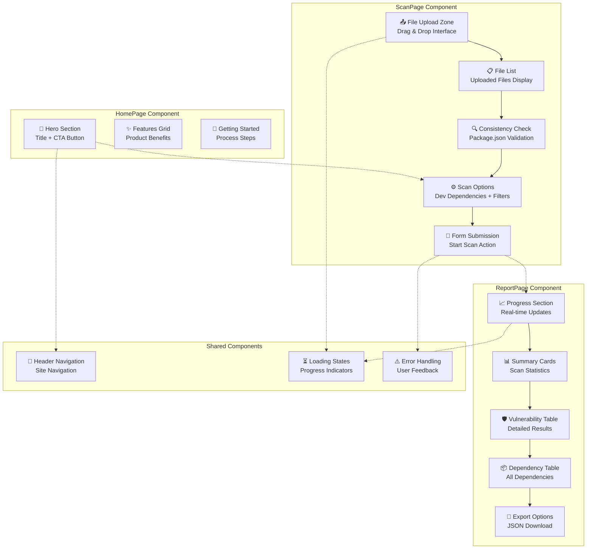
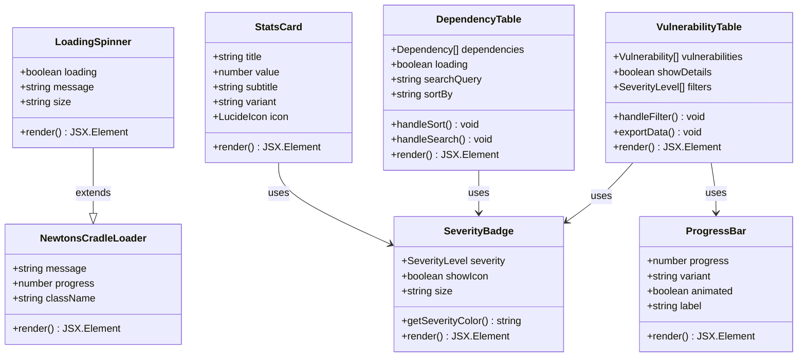
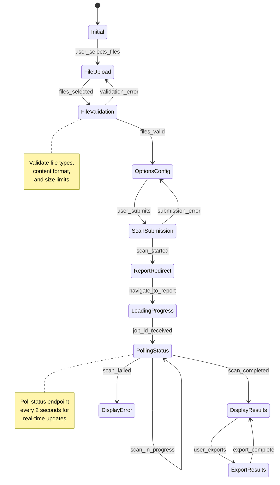
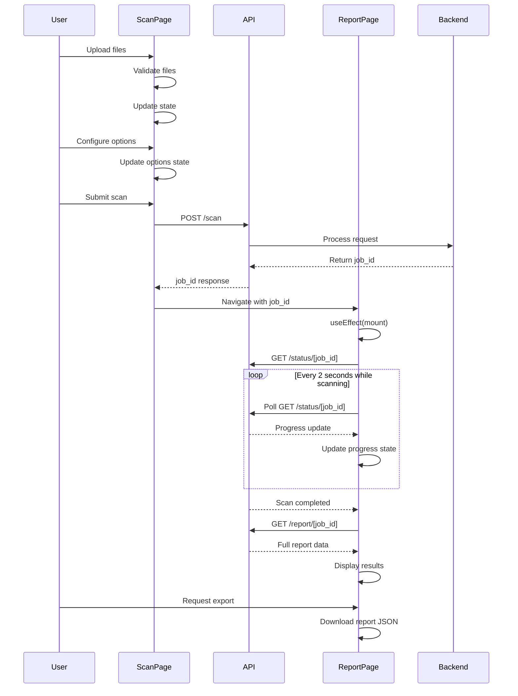
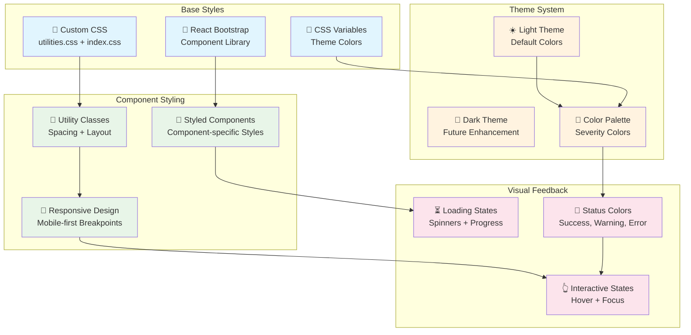
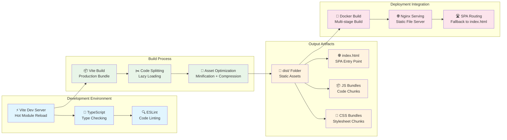

# 🎨 Frontend Architecture

> **Detailed frontend architecture and component design for the DepScan web interface**

The DepScan frontend is a modern React Single Page Application (SPA) built with TypeScript, React Bootstrap, and Vite. It provides an intuitive web interface for vulnerability scanning with real-time progress tracking and comprehensive result visualization.

## 🎯 Frontend Architecture Principles

- **Component-Based**: Modular, reusable components with clear boundaries
- **Type Safety**: Full TypeScript coverage for compile-time error prevention
- **Responsive Design**: Mobile-first approach with React Bootstrap components
- **Performance Optimized**: Code splitting, lazy loading, and efficient re-rendering
- **User Experience**: Intuitive workflows with clear feedback and loading states
- **Accessibility**: WCAG compliant with proper ARIA labels and semantic HTML

## 🏗️ Component Architecture Overview

```mermaid
graph TB
    subgraph "Application Shell"
        APP[📱 App Component<br/>Router + Layout]
        HEADER[🧭 Header<br/>Navigation]
        ROUTER[🛣️ React Router<br/>Route Management]
    end
    
    subgraph "Page Components"
        HOME[🏠 HomePage<br/>Landing + Features]
        SCAN[🔍 ScanPage<br/>File Upload + Options]
        REPORT[📊 ReportPage<br/>Results Display]
    end
    
    subgraph "UI Components"
        LOADER[⏳ NewtonsCradleLoader<br/>Progress Animation]
        PROGRESS[📈 ProgressBar<br/>Scan Progress]
        TABLE[📋 DependencyTable<br/>Data Display]
        BADGE[🏷️ SeverityBadge<br/>Vulnerability Levels]
        STATS[📊 StatsCard<br/>Summary Metrics]
    end
    
    subgraph "Service Layer"
        API[🌐 API Client<br/>Axios Configuration]
        UTILS[🔧 Utility Functions<br/>Formatters + Helpers]
        TYPES[📋 Type Definitions<br/>TypeScript Interfaces]
    end
    
    subgraph "State Management"
        LOCAL_STATE[📦 Local Component State<br/>useState + useEffect]
        FORM_STATE[📝 Form State<br/>Controlled Components]
        API_STATE[🔄 API State<br/>Loading + Error States]
    end
    
    %% Application Structure
    APP --> HEADER
    APP --> ROUTER
    ROUTER --> HOME
    ROUTER --> SCAN
    ROUTER --> REPORT
    
    %% UI Component Usage
    SCAN --> LOADER
    REPORT --> PROGRESS
    REPORT --> TABLE
    REPORT --> BADGE
    REPORT --> STATS
    
    %% Service Dependencies
    HOME -.-> TYPES
    SCAN -.-> API
    SCAN -.-> TYPES
    REPORT -.-> API
    REPORT -.-> TYPES
    REPORT -.-> UTILS
    
    %% State Management
    SCAN --> LOCAL_STATE
    SCAN --> FORM_STATE
    SCAN --> API_STATE
    REPORT --> LOCAL_STATE
    REPORT --> API_STATE
    
    classDef shell fill:#e1f5fe
    classDef page fill:#f3e5f5
    classDef ui fill:#e8f5e8
    classDef service fill:#fff3e0
    classDef state fill:#fce4ec
    
    class APP,HEADER,ROUTER shell
    class HOME,SCAN,REPORT page
    class LOADER,PROGRESS,TABLE,BADGE,STATS ui
    class API,UTILS,TYPES service
    class LOCAL_STATE,FORM_STATE,API_STATE state
```



## 🔄 Application Data Flow

```mermaid
flowchart TD
    subgraph "User Interactions"
        USER_HOME[👤 User Visits Homepage]
        USER_UPLOAD[📤 User Uploads Files]
        USER_SCAN[🚀 User Starts Scan]
        USER_VIEW[👁️ User Views Results]
    end
    
    subgraph "Component State Flow"
        HOME_STATE[🏠 HomePage State<br/>Static Content]
        SCAN_STATE[📝 ScanPage State<br/>Files + Options]
        REPORT_STATE[📊 ReportPage State<br/>Progress + Results]
    end
    
    subgraph "API Communication"
        START_SCAN[🔍 POST /scan<br/>Initiate Scan]
        POLL_STATUS[📈 GET /status/{id}<br/>Track Progress]
        GET_REPORT[📋 GET /report/{id}<br/>Fetch Results]
    end
    
    subgraph "Backend Processing"
        BACKEND[🔧 Backend Processing<br/>Dependency Analysis]
    end
    
    %% User Flow
    USER_HOME --> HOME_STATE
    USER_UPLOAD --> SCAN_STATE
    USER_SCAN --> START_SCAN
    USER_VIEW --> GET_REPORT
    
    %% API Flow
    SCAN_STATE --> START_SCAN
    START_SCAN --> BACKEND
    START_SCAN --> REPORT_STATE
    REPORT_STATE --> POLL_STATUS
    POLL_STATUS --> REPORT_STATE
    REPORT_STATE --> GET_REPORT
    GET_REPORT --> REPORT_STATE
    
    %% Navigation Flow
    HOME_STATE -.-> SCAN_STATE
    START_SCAN -.-> REPORT_STATE
```

## 📱 Page Component Architecture



## 🧩 UI Component Library



## 🔧 Service Layer Architecture

```mermaid
graph LR
    subgraph "API Layer"
        AXIOS[📡 Axios Client<br/>HTTP Configuration]
        INTERCEPTORS[🔄 Request/Response<br/>Interceptors]
        ERROR_HANDLER[⚠️ Error Handler<br/>Global Error Processing]
    end
    
    subgraph "API Services"
        SCAN_API[🔍 Scan API<br/>startScan(), getStatus()]
        REPORT_API[📊 Report API<br/>getReport(), exportReport()]
        HEALTH_API[❤️ Health API<br/>checkHealth()]
    end
    
    subgraph "Utility Services"
        FORMATTERS[🎨 Data Formatters<br/>Date, Size, Duration]
        VALIDATORS[✅ Input Validators<br/>File, Form Validation]
        SEVERITY_UTILS[🏷️ Severity Utils<br/>Color, Icon Mapping]
    end
    
    subgraph "Type System"
        API_TYPES[📋 API Types<br/>Request/Response Models]
        COMMON_TYPES[🔗 Common Types<br/>Enums + Interfaces]
        COMPONENT_TYPES[🎭 Component Types<br/>Props + State Types]
    end
    
    %% API Configuration
    AXIOS --> INTERCEPTORS
    INTERCEPTORS --> ERROR_HANDLER
    
    %% Service Implementation
    AXIOS --> SCAN_API
    AXIOS --> REPORT_API
    AXIOS --> HEALTH_API
    
    %% Utility Usage
    SCAN_API -.-> VALIDATORS
    REPORT_API -.-> FORMATTERS
    SEVERITY_UTILS -.-> FORMATTERS
    
    %% Type Dependencies
    SCAN_API -.-> API_TYPES
    REPORT_API -.-> API_TYPES
    API_TYPES -.-> COMMON_TYPES
    COMMON_TYPES -.-> COMPONENT_TYPES
    
    classDef api fill:#e1f5fe
    classDef service fill:#e8f5e8
    classDef utility fill:#fff3e0
    classDef types fill:#fce4ec
    
    class AXIOS,INTERCEPTORS,ERROR_HANDLER api
    class SCAN_API,REPORT_API,HEALTH_API service
    class FORMATTERS,VALIDATORS,SEVERITY_UTILS utility
    class API_TYPES,COMMON_TYPES,COMPONENT_TYPES types
```

## 🎨 TypeScript Type System

```mermaid
graph TB
    subgraph "Core Enums"
        SEVERITY[🏷️ SeverityLevel<br/>CRITICAL, HIGH, MEDIUM, LOW]
        STATUS[📊 JobStatus<br/>PENDING, RUNNING, COMPLETED]
        ECOSYSTEM[🌍 EcosystemType<br/>NPM, PyPI]
    end
    
    subgraph "API Data Models"
        DEPENDENCY[📦 Dependency<br/>name, version, ecosystem, path]
        VULNERABILITY[🛡️ Vulnerability<br/>id, severity, cve_ids, summary]
        SCAN_REPORT[📋 ScanReport<br/>dependencies[], vulnerabilities[]]
        SCAN_PROGRESS[📈 ScanProgress<br/>status, progress_percent, current_step]
    end
    
    subgraph "Request/Response Types"
        SCAN_REQUEST[📝 ScanRequest<br/>manifest_files, options]
        SCAN_OPTIONS[⚙️ ScanOptions<br/>include_dev, ignore_severities]
        API_RESPONSE[📡 ApiResponse<T><br/>success, data, error]
    end
    
    subgraph "Component Props"
        TABLE_PROPS[📋 TableProps<br/>data[], loading, onSort]
        BADGE_PROPS[🏷️ BadgeProps<br/>severity, size, showIcon]
        LOADER_PROPS[⏳ LoaderProps<br/>message, progress, className]
    end
    
    %% Type Relationships
    DEPENDENCY --> ECOSYSTEM
    VULNERABILITY --> SEVERITY
    VULNERABILITY --> ECOSYSTEM
    SCAN_REPORT --> DEPENDENCY
    SCAN_REPORT --> VULNERABILITY
    SCAN_PROGRESS --> STATUS
    SCAN_REQUEST --> SCAN_OPTIONS
    SCAN_OPTIONS --> SEVERITY
    
    %% Component Usage
    TABLE_PROPS -.-> DEPENDENCY
    TABLE_PROPS -.-> VULNERABILITY
    BADGE_PROPS -.-> SEVERITY
    API_RESPONSE -.-> SCAN_REPORT
    API_RESPONSE -.-> SCAN_PROGRESS
    
    classDef enum fill:#e1f5fe
    classDef model fill:#e8f5e8
    classDef request fill:#fff3e0
    classDef props fill:#fce4ec
    
    class SEVERITY,STATUS,ECOSYSTEM enum
    class DEPENDENCY,VULNERABILITY,SCAN_REPORT,SCAN_PROGRESS model
    class SCAN_REQUEST,SCAN_OPTIONS,API_RESPONSE request
    class TABLE_PROPS,BADGE_PROPS,LOADER_PROPS props
```

## 🔄 State Management Pattern



## 📊 Component Lifecycle & Effects



## 🎨 Styling & Theme Architecture



## 🚀 Build & Development Architecture



## 📱 Responsive Design Strategy

### **Breakpoint System**
- **Mobile (xs)**: < 576px - Single column layout
- **Small (sm)**: ≥ 576px - Two column cards  
- **Medium (md)**: ≥ 768px - Full feature layout
- **Large (lg)**: ≥ 992px - Optimal desktop experience
- **Extra Large (xl)**: ≥ 1200px - Wide screen optimization

### **Component Responsiveness**
- **Navigation**: Collapsible hamburger menu on mobile
- **Tables**: Horizontal scroll with sticky headers
- **Cards**: Stack vertically on small screens
- **Upload Zone**: Adjust size and text for mobile
- **Progress Indicators**: Scale appropriately across devices

## 🔒 Security Considerations

### **Input Validation**
- **File Upload**: Client-side file type and size validation
- **XSS Prevention**: Sanitize all user inputs and display content
- **Content Security Policy**: Implemented via backend headers

### **API Communication**
- **CSRF Protection**: Axios CSRF token handling
- **Request Validation**: Type-safe API calls with TypeScript
- **Error Handling**: Safe error message display without sensitive data

### **Data Privacy**
- **No Persistent Storage**: All scan data stored temporarily
- **Client-side Only**: No user data stored in browser storage
- **Secure Transmission**: HTTPS for all API communication

## 🧪 Testing Strategy

### **Component Testing**
- **Unit Tests**: Individual component behavior
- **Integration Tests**: Component interaction testing
- **Snapshot Tests**: UI regression prevention

### **User Experience Testing**
- **Accessibility Testing**: Screen reader and keyboard navigation
- **Cross-browser Testing**: Modern browser compatibility
- **Mobile Testing**: Touch interaction and viewport scaling

## 📈 Performance Optimizations

### **Code Splitting**
- **Route-based Splitting**: Lazy load page components
- **Component Splitting**: Split large feature components
- **Library Splitting**: Separate vendor bundles

### **Asset Optimization**
- **Image Optimization**: WebP format with fallbacks
- **Bundle Analysis**: Monitor and optimize bundle sizes
- **Caching Strategy**: Proper cache headers for static assets

### **Runtime Performance**
- **React Optimization**: Proper key props and memo usage
- **API Optimization**: Request debouncing and caching
- **Memory Management**: Cleanup effects and event listeners

---

## 🔗 Related Documentation

- **[System Overview](system-overview.md)** - High-level architecture overview
- **[Backend Architecture](backend-architecture.md)** - API and service layer details
- **[Component Documentation](../components/frontend-components.md)** - Detailed component specs
- **[API Reference](../api/rest-api.md)** - Backend API integration guide

This frontend architecture provides a modern, maintainable, and user-friendly interface for the DepScan vulnerability scanner, with comprehensive type safety and excellent user experience across all devices.