# 🏛️ System Architecture Overview

> **High-level architecture of the DepScan Dependency Vulnerability Scanner**

DepScan is designed as a modular, scalable vulnerability scanning system that supports both CLI and web interfaces while maintaining a clean separation of concerns between user interfaces, core processing logic, and external integrations.

## 🎯 Design Principles

- **Modularity**: Separate concerns for parsing, resolution, scanning, and reporting
- **Extensibility**: Easy to add new ecosystems, file formats, and vulnerability sources
- **Performance**: Async processing, intelligent caching, and batch operations
- **Reliability**: Comprehensive error handling and graceful degradation
- **Security**: No stored credentials, rate limiting, input validation

## 🏗️ High-Level System Architecture

```mermaid
graph TB
    subgraph "Client Layer"
        CLI[🖥️ CLI Scanner<br/>Rich Terminal Interface]
        WEB[🌐 Web Interface<br/>React SPA]
        API_CLIENTS[📱 API Clients<br/>Third-party Integrations]
    end
    
    subgraph "Application Layer"
        API[⚡ FastAPI Server<br/>REST API + WebSocket]
        SCANNER[🔍 Core Scanner Engine<br/>Shared Business Logic]
    end
    
    subgraph "Service Layer"
        RESOLVERS[🧩 Dependency Resolvers<br/>Python + JavaScript]
        PARSERS[📄 File Parsers<br/>Multi-format Support]
        OSV_CLIENT[🔒 OSV Scanner<br/>Vulnerability Detection]
        GENERATORS[⚙️ Lock Generators<br/>Dependency Resolution]
    end
    
    subgraph "External Services"
        OSV_DB[(🗃️ OSV.dev<br/>Vulnerability Database)]
        PYPI_API[(🐍 PyPI Registry<br/>Python Packages)]
        NPM_API[(📦 npm Registry<br/>JavaScript Packages)]
    end
    
    subgraph "Infrastructure"
        AWS_ECS[☁️ AWS ECS Fargate<br/>Container Orchestration]
        AWS_ALB[🔄 Application Load Balancer<br/>Traffic Distribution]
        GITHUB[🔄 GitHub Actions<br/>CI/CD Pipeline]
    end
    
    %% User Interface Connections
    CLI --> SCANNER
    WEB --> API
    API_CLIENTS --> API
    
    %% Application Layer Connections  
    API --> SCANNER
    SCANNER --> RESOLVERS
    SCANNER --> OSV_CLIENT
    
    %% Service Layer Connections
    RESOLVERS --> PARSERS
    RESOLVERS --> GENERATORS
    GENERATORS --> PYPI_API
    GENERATORS --> NPM_API
    OSV_CLIENT --> OSV_DB
    
    %% Infrastructure Connections
    API -.-> AWS_ECS
    WEB -.-> AWS_ALB
    GITHUB -.-> AWS_ECS
    
    %% Styling
    classDef client fill:#e1f5fe
    classDef app fill:#f3e5f5  
    classDef service fill:#e8f5e8
    classDef external fill:#fff3e0
    classDef infra fill:#fce4ec
    
    class CLI,WEB,API_CLIENTS client
    class API,SCANNER app
    class RESOLVERS,PARSERS,OSV_CLIENT,GENERATORS service
    class OSV_DB,PYPI_API,NPM_API external
    class AWS_ECS,AWS_ALB,GITHUB infra
```



## 🔄 Data Flow Architecture

```mermaid
flowchart LR
    subgraph "Input"
        FILES[📁 Dependency Files<br/>requirements.txt<br/>package.json<br/>lockfiles]
    end
    
    subgraph "Processing Pipeline"
        PARSE[📄 Parse Files<br/>Extract Dependencies]
        RESOLVE[🧩 Resolve Tree<br/>Generate Lockfiles]
        SCAN[🔍 Vulnerability Scan<br/>Query OSV.dev]
        ENRICH[⭐ Enrich Results<br/>Add Metadata]
    end
    
    subgraph "Output"
        CLI_OUT[🖥️ CLI Output<br/>Rich Terminal Display]
        WEB_OUT[🌐 Web Dashboard<br/>Interactive Reports]
        EXPORT[📤 Export Formats<br/>JSON, HTML, CSV]
    end
    
    FILES --> PARSE
    PARSE --> RESOLVE
    RESOLVE --> SCAN
    SCAN --> ENRICH
    
    ENRICH --> CLI_OUT
    ENRICH --> WEB_OUT
    ENRICH --> EXPORT
    
    %% External Data Sources
    RESOLVE -.-> PYPI[(PyPI API)]
    RESOLVE -.-> NPM[(npm API)]
    SCAN -.-> OSV[(OSV.dev)]
```



## 🧩 Component Layers

### **Presentation Layer**
- **CLI Interface**: Rich terminal-based scanner with progress bars and colored output
- **Web Interface**: Modern React SPA with real-time progress tracking
- **REST API**: FastAPI-based JSON API with OpenAPI documentation

### **Business Logic Layer**  
- **Core Scanner**: Orchestrates the entire scanning workflow
- **Dependency Resolvers**: Language-specific dependency resolution logic
- **Vulnerability Scanner**: OSV.dev integration and vulnerability matching
- **Report Generators**: Multi-format output generation

### **Data Access Layer**
- **File Parsers**: Support for multiple manifest and lockfile formats
- **API Clients**: Integration with package registries and vulnerability databases  
- **Lock Generators**: Dependency tree resolution and lockfile creation
- **Cache Management**: Intelligent caching for performance optimization

## 🌐 Deployment Architecture


## 📊 Technology Stack

### **Backend Technologies**
- **Language**: Python 3.10+
- **Framework**: FastAPI (async web framework)
- **Dependencies**: Pydantic, httpx, typer, rich
- **Containerization**: Docker multi-stage builds
- **Deployment**: AWS ECS Fargate

### **Frontend Technologies** 
- **Language**: TypeScript
- **Framework**: React 18 with Vite
- **UI Library**: React Bootstrap + Lucide Icons
- **State Management**: React hooks + Context API
- **Build Tool**: Vite with TypeScript

### **Infrastructure Technologies**
- **Cloud Platform**: AWS (ECS, ALB, ECR, Route 53)
- **Infrastructure as Code**: Terraform
- **CI/CD**: GitHub Actions with OIDC
- **Monitoring**: CloudWatch Logs & Metrics
- **Security**: AWS Secrets Manager, IAM roles

### **External Integrations**
- **Vulnerability Database**: OSV.dev REST API
- **Package Registries**: PyPI API, npm Registry API
- **No Authentication**: All external APIs are public

## 🔒 Security Architecture

```mermaid
graph TD
    subgraph "Security Layers"
        INPUT[🛡️ Input Validation<br/>Request Sanitization]
        AUTH[🔐 Authentication<br/>Rate Limiting]
        NETWORK[🌐 Network Security<br/>CORS + Headers]
        DATA[💾 Data Protection<br/>No Sensitive Storage]
    end
    
    subgraph "AWS Security"
        WAF[🛡️ AWS WAF<br/>Web Application Firewall]
        SG[🔒 Security Groups<br/>Network ACLs]
        IAM_ROLES[👤 IAM Roles<br/>Least Privilege]
        SECRETS_MGR[🔐 Secrets Manager<br/>Secure Configuration]
    end
    
    INPUT --> AUTH
    AUTH --> NETWORK
    NETWORK --> DATA
    
    WAF --> SG
    SG --> IAM_ROLES
    IAM_ROLES --> SECRETS_MGR
```



## 📈 Scalability & Performance

### **Horizontal Scaling**
- **ECS Auto Scaling**: Automatic container scaling based on CPU/memory
- **Load Balancing**: ALB distributes traffic across multiple containers
- **Stateless Design**: No server-side sessions, fully stateless architecture

### **Performance Optimizations**
- **Async Processing**: FastAPI async/await throughout the stack
- **Batch Operations**: OSV.dev queries batched for optimal throughput  
- **Intelligent Caching**: Dependency and vulnerability result caching
- **Connection Pooling**: HTTP client connection reuse

### **Resource Efficiency**
- **Fargate**: Pay-per-use serverless containers
- **Multi-stage Builds**: Optimized Docker images
- **Memory Management**: Efficient Python and Node.js memory usage

## 🔧 Configuration Management

### **Environment Variables**
```bash
# Application Configuration
ENVIRONMENT=production
API_PORT=8000
FRONTEND_PORT=3000

# External Service URLs  
OSV_API_URL=https://api.osv.dev
PYPI_API_URL=https://pypi.org/pypi
NPM_REGISTRY_URL=https://registry.npmjs.org

# Security Configuration
CORS_ORIGINS=https://yourdomain.com
ALLOWED_HOSTS=yourdomain.com
RATE_LIMIT_REQUESTS=60
RATE_LIMIT_WINDOW=60

# AWS Configuration (managed by ECS)
AWS_REGION=us-east-1
AWS_ACCOUNT_ID=123456789012
```

### **Secrets Management**
- **AWS Secrets Manager**: Secure storage of sensitive configuration
- **Environment Injection**: Secrets injected as environment variables
- **No Hardcoded Secrets**: All secrets externalized from code

## 📊 Monitoring & Observability

### **Application Metrics**
- **Request Latency**: API response times
- **Scan Performance**: Dependencies scanned per second  
- **Error Rates**: Failed scans and API errors
- **Resource Utilization**: CPU, memory, network usage

### **Business Metrics**
- **Scan Volume**: Daily/monthly scan counts
- **Vulnerability Detection**: Vulnerabilities found over time
- **Ecosystem Usage**: Python vs JavaScript scan distribution
- **User Engagement**: CLI vs Web interface usage

### **Alerting Strategy**
- **High Error Rates**: >5% API error rate
- **Performance Degradation**: >2s average response time
- **Resource Exhaustion**: >80% CPU or memory utilization
- **External Service Failures**: OSV.dev or registry API failures

---

## 🎯 Key Architectural Decisions

### **Why FastAPI?**
- **High Performance**: Async-first design with excellent throughput
- **Developer Experience**: Automatic API documentation and type safety
- **Modern Python**: Full type hints and Pydantic integration
- **WebSocket Support**: Real-time progress updates for web interface

### **Why React SPA?**
- **Rich Interactivity**: Complex vulnerability report visualization
- **Real-time Updates**: WebSocket integration for scan progress
- **Component Reusability**: Shared UI components across pages
- **Modern Tooling**: TypeScript, Vite, and modern React patterns

### **Why AWS ECS Fargate?**
- **Serverless Containers**: No infrastructure management overhead  
- **Auto Scaling**: Automatic scaling based on demand
- **Cost Efficiency**: Pay-per-use pricing model
- **Integration**: Seamless integration with ALB, ECR, CloudWatch

### **Why No Database?**
- **Simplicity**: Reduced operational complexity
- **Stateless**: Fully stateless architecture enables easy scaling  
- **Cost**: No database hosting or management costs
- **Privacy**: No user data storage or retention

This architecture provides a solid foundation for a scalable, maintainable, and secure vulnerability scanning service that can handle both individual developer workflows and enterprise-scale operations.