# 🚀 DepScan Deployment Diagrams

> **Visual architecture and infrastructure diagrams for DepScan deployment strategies**

This document provides comprehensive visual documentation of DepScan's deployment architecture across different environments and platforms.

## 📋 Table of Contents
- [AWS Production Deployment](#aws-production-deployment)
- [Local Development Setup](#local-development-setup)
- [CI/CD Pipeline Flow](#cicd-pipeline-flow)
- [Network Architecture](#network-architecture)
- [Container Architecture](#container-architecture)

---

## 🏗️ AWS Production Deployment

### Current AWS ECS Infrastructure

```mermaid
graph TB
    subgraph "🌐 External Access"
        USER[👤 Users]
        GITHUB[🐙 GitHub Actions]
        OSV[🛡️ OSV.dev Database]
    end
    
    subgraph "☁️ AWS Cloud Infrastructure"
        subgraph "🏪 ECR - Container Registry"
            ECR_BE[Backend Images]
            ECR_FE[Frontend Images]
        end
        
        subgraph "🚢 ECS Fargate Cluster"
            subgraph "🔧 Backend Service"
                TASK_BE1[Backend Task 1<br/>Python FastAPI<br/>Port 8000]
                TASK_BE2[Backend Task 2<br/>Python FastAPI<br/>Port 8000]
            end
            
            subgraph "🎨 Frontend Service"  
                TASK_FE1[Frontend Task 1<br/>React + Nginx<br/>Port 8080]
                TASK_FE2[Frontend Task 2<br/>React + Nginx<br/>Port 8080]
            end
        end
        
        subgraph "🔒 Security & Config"
            SECRETS[🔐 Secrets Manager<br/>App Configuration]
            IAM_EXEC[👥 ECS Execution Role]
            IAM_TASK[👥 ECS Task Role]
            IAM_GHA[👥 GitHub Actions Role]
        end
        
        subgraph "📊 Monitoring & Logging"
            LOGS[📋 CloudWatch Logs<br/>/ecs/depscan-prod]
            METRICS[📈 CloudWatch Metrics]
        end
        
        subgraph "🌍 Networking"
            VPC[🏛️ Default VPC]
            SUBNET1[🌐 Public Subnet 1]
            SUBNET2[🌐 Public Subnet 2]
            SG[🛡️ Security Groups<br/>Ports 8000, 8080]
        end
    end
    
    %% External Connections
    USER -->|HTTP Traffic| TASK_FE1
    USER -->|HTTP Traffic| TASK_FE2
    USER -->|API Calls| TASK_BE1
    USER -->|API Calls| TASK_BE2
    
    GITHUB -->|Push Images| ECR_BE
    GITHUB -->|Push Images| ECR_FE
    GITHUB -->|Deploy Services| TASK_BE1
    GITHUB -->|Deploy Services| TASK_FE1
    
    TASK_BE1 -->|Vulnerability Queries| OSV
    TASK_BE2 -->|Vulnerability Queries| OSV
    
    %% Internal AWS Connections
    TASK_BE1 -->|Pull Images| ECR_BE
    TASK_BE2 -->|Pull Images| ECR_BE
    TASK_FE1 -->|Pull Images| ECR_FE
    TASK_FE2 -->|Pull Images| ECR_FE
    
    TASK_BE1 -->|Read Config| SECRETS
    TASK_BE2 -->|Read Config| SECRETS
    
    TASK_BE1 -->|Write Logs| LOGS
    TASK_BE2 -->|Write Logs| LOGS
    TASK_FE1 -->|Write Logs| LOGS
    TASK_FE2 -->|Write Logs| LOGS
    
    TASK_BE1 -.->|Metrics| METRICS
    TASK_BE2 -.->|Metrics| METRICS
    TASK_FE1 -.->|Metrics| METRICS
    TASK_FE2 -.->|Metrics| METRICS
    
    %% Network Configuration
    TASK_BE1 -.->|Deployed in| SUBNET1
    TASK_BE2 -.->|Deployed in| SUBNET2
    TASK_FE1 -.->|Deployed in| SUBNET1
    TASK_FE2 -.->|Deployed in| SUBNET2
    
    SUBNET1 -.->|Part of| VPC
    SUBNET2 -.->|Part of| VPC
    
    SG -.->|Protects| TASK_BE1
    SG -.->|Protects| TASK_BE2
    SG -.->|Protects| TASK_FE1
    SG -.->|Protects| TASK_FE2
    
    %% IAM Relationships
    IAM_EXEC -.->|Used by| TASK_BE1
    IAM_EXEC -.->|Used by| TASK_BE2
    IAM_EXEC -.->|Used by| TASK_FE1
    IAM_EXEC -.->|Used by| TASK_FE2
    
    IAM_GHA -.->|Assume Role| GITHUB
    
    %% Styling
    classDef userClass fill:#e1f5fe,stroke:#0277bd,stroke-width:2px
    classDef awsClass fill:#fff3e0,stroke:#f57c00,stroke-width:2px
    classDef serviceClass fill:#e8f5e8,stroke:#388e3c,stroke-width:2px
    classDef securityClass fill:#fce4ec,stroke:#c2185b,stroke-width:2px
    classDef storageClass fill:#f3e5f5,stroke:#7b1fa2,stroke-width:2px
    
    class USER,GITHUB,OSV userClass
    class VPC,SUBNET1,SUBNET2,SG awsClass
    class TASK_BE1,TASK_BE2,TASK_FE1,TASK_FE2 serviceClass
    class SECRETS,IAM_EXEC,IAM_TASK,IAM_GHA securityClass
    class ECR_BE,ECR_FE,LOGS,METRICS storageClass
```

### Infrastructure Specifications

| Component | Configuration | Purpose |
|-----------|---------------|---------|
| **ECS Cluster** | Fargate serverless | Container orchestration |
| **Backend Tasks** | 512 CPU, 1024 MB RAM | Python FastAPI services |
| **Frontend Tasks** | 256 CPU, 512 MB RAM | React + Nginx static serving |
| **ECR Repositories** | 2 repositories | Container image storage |
| **Security Groups** | Ports 8000, 8080 | Network access control |
| **IAM Roles** | 3 roles | Service permissions |
| **Secrets Manager** | 1 secret | Configuration storage |
| **CloudWatch** | Logs + Metrics | Monitoring and debugging |

---

## 💻 Local Development Setup

```mermaid
graph TB
    subgraph "👨‍💻 Developer Machine"
        subgraph "🐍 Backend Development"
            PYTHON[Python 3.10+<br/>Virtual Environment]
            FASTAPI[FastAPI Dev Server<br/>localhost:8000]
            PYTEST[Pytest Test Suite]
        end
        
        subgraph "⚛️ Frontend Development"
            NODE[Node.js 18+<br/>npm/yarn]
            REACT[React Dev Server<br/>localhost:3000]
            VITE[Vite Build Tool]
        end
        
        subgraph "🐳 Optional Docker"
            DOCKER[Docker Compose<br/>Full Stack]
        end
        
        subgraph "📁 Development Files"
            CODE[Source Code]
            CONFIG[Configuration<br/>.env files]
            DEPS[Dependencies<br/>requirements.txt<br/>package.json]
        end
    end
    
    subgraph "🌐 External Services"
        OSV_DEV[OSV.dev API<br/>Vulnerability Data]
        PYPI[PyPI Registry<br/>Python Packages]
        NPM_REG[npm Registry<br/>Node Packages]
    end
    
    %% Development Flow
    PYTHON --> FASTAPI
    NODE --> REACT
    CODE --> PYTHON
    CODE --> NODE
    CONFIG --> PYTHON
    CONFIG --> NODE
    DEPS --> PYTHON
    DEPS --> NODE
    
    %% Testing
    PYTHON --> PYTEST
    REACT --> VITE
    
    %% Docker Alternative
    DOCKER --> FASTAPI
    DOCKER --> REACT
    CODE --> DOCKER
    CONFIG --> DOCKER
    
    %% External API Calls
    FASTAPI -->|Vulnerability Queries| OSV_DEV
    PYTHON -->|Package Install| PYPI
    NODE -->|Package Install| NPM_REG
    
    %% Frontend to Backend
    REACT -->|API Calls| FASTAPI
    
    %% Styling
    classDef devClass fill:#e1f5fe,stroke:#0277bd,stroke-width:2px
    classDef serverClass fill:#e8f5e8,stroke:#388e3c,stroke-width:2px
    classDef toolClass fill:#fff3e0,stroke:#f57c00,stroke-width:2px
    classDef externalClass fill:#fce4ec,stroke:#c2185b,stroke-width:2px
    
    class PYTHON,NODE,CODE,CONFIG,DEPS devClass
    class FASTAPI,REACT serverClass
    class PYTEST,VITE,DOCKER toolClass
    class OSV_DEV,PYPI,NPM_REG externalClass
```

### Development Requirements

| Technology | Version | Purpose |
|------------|---------|---------|
| **Python** | 3.10+ | Backend development |
| **Node.js** | 18+ | Frontend development |
| **Docker** | Latest (optional) | Containerized development |
| **Git** | Latest | Version control |

---

## 🔄 CI/CD Pipeline Flow

### Pipeline Stages

| Stage | Duration | Actions |
|-------|----------|---------|
| **Testing** | ~2-3 minutes | Lint, unit tests, security scans |
| **Building** | ~3-5 minutes | Docker image builds and tagging |
| **Deployment** | ~5-8 minutes | ECR push and ECS service updates |
| **Total** | ~10-15 minutes | End-to-end deployment time |

---

## 🌐 Network Architecture

```mermaid
graph TB
    subgraph "🌍 Internet"
        USERS[👥 End Users]
        BOTS[🤖 Scanners/Crawlers]
    end
    
    subgraph "☁️ AWS VPC (Default)"
        subgraph "🌐 Public Subnets"
            subgraph "AZ-1a"
                SUBNET_1A[Public Subnet 1a<br/>10.0.1.0/24]
                TASK_BE_1A[Backend Task<br/>Public IP]
                TASK_FE_1A[Frontend Task<br/>Public IP]
            end
            
            subgraph "AZ-1b" 
                SUBNET_1B[Public Subnet 1b<br/>10.0.2.0/24]
                TASK_BE_1B[Backend Task<br/>Public IP]
                TASK_FE_1B[Frontend Task<br/>Public IP]
            end
        end
        
        subgraph "🛡️ Security Groups"
            SG_BE[Backend Security Group<br/>Port 8000<br/>Source: 0.0.0.0/0]
            SG_FE[Frontend Security Group<br/>Port 8080<br/>Source: 0.0.0.0/0]
        end
        
        IGW[🌐 Internet Gateway]
    end
    
    subgraph "🌍 External APIs"
        OSV[🛡️ OSV.dev<br/>api.osv.dev:443]
        PYPI[🐍 PyPI<br/>pypi.org:443]
        NPM[📦 npm<br/>registry.npmjs.org:443]
    end
    
    %% User Traffic
    USERS -->|HTTP:8080| TASK_FE_1A
    USERS -->|HTTP:8080| TASK_FE_1B
    USERS -->|HTTP:8000| TASK_BE_1A
    USERS -->|HTTP:8000| TASK_BE_1B
    BOTS -->|HTTP Traffic| TASK_FE_1A
    BOTS -->|HTTP Traffic| TASK_FE_1B
    
    %% Frontend to Backend
    TASK_FE_1A -.->|API Calls| TASK_BE_1A
    TASK_FE_1B -.->|API Calls| TASK_BE_1B
    
    %% Backend to External APIs
    TASK_BE_1A -->|HTTPS:443| OSV
    TASK_BE_1B -->|HTTPS:443| OSV
    TASK_BE_1A -->|HTTPS:443| PYPI
    TASK_BE_1B -->|HTTPS:443| PYPI
    TASK_BE_1A -->|HTTPS:443| NPM
    TASK_BE_1B -->|HTTPS:443| NPM
    
    %% Network Infrastructure
    TASK_BE_1A -.->|Protected by| SG_BE
    TASK_BE_1B -.->|Protected by| SG_BE
    TASK_FE_1A -.->|Protected by| SG_FE
    TASK_FE_1B -.->|Protected by| SG_FE
    
    SUBNET_1A -.->|Routes through| IGW
    SUBNET_1B -.->|Routes through| IGW
    
    TASK_BE_1A -.->|Deployed in| SUBNET_1A
    TASK_FE_1A -.->|Deployed in| SUBNET_1A
    TASK_BE_1B -.->|Deployed in| SUBNET_1B
    TASK_FE_1B -.->|Deployed in| SUBNET_1B
    
    %% Styling
    classDef userClass fill:#e1f5fe,stroke:#0277bd,stroke-width:2px
    classDef networkClass fill:#f3e5f5,stroke:#7b1fa2,stroke-width:2px
    classDef serviceClass fill:#e8f5e8,stroke:#388e3c,stroke-width:2px
    classDef securityClass fill:#fce4ec,stroke:#c2185b,stroke-width:2px
    classDef externalClass fill:#fff3e0,stroke:#f57c00,stroke-width:2px
    
    class USERS,BOTS userClass
    class SUBNET_1A,SUBNET_1B,IGW networkClass
    class TASK_BE_1A,TASK_BE_1B,TASK_FE_1A,TASK_FE_1B serviceClass
    class SG_BE,SG_FE securityClass
    class OSV,PYPI,NPM externalClass
```

### Network Configuration

| Component | Configuration | Security |
|-----------|---------------|----------|
| **VPC** | Default AWS VPC | Standard AWS networking |
| **Subnets** | Public in 2 AZs | High availability |
| **Security Groups** | Ports 8000, 8080 open | Minimal required access |
| **Internet Gateway** | Default | Public internet access |
| **Load Balancer** | None (direct access) | Cost optimization |

---

## 🐳 Container Architecture

```mermaid
graph TB
    subgraph "🏗️ Build Context"
        subgraph "🔧 Backend Container"
            BE_BASE[🐍 python:3.11-slim]
            BE_DEPS[📦 Install Dependencies<br/>requirements.txt]
            BE_CODE[📄 Copy Source Code<br/>backend/]
            BE_USER[👤 Create App User<br/>Security]
            BE_CMD[🚀 CMD uvicorn<br/>Port 8000]
        end
        
        subgraph "🎨 Frontend Container"
            FE_BUILD[⚛️ Node.js Build Stage<br/>npm run build]
            FE_NGINX[🌐 nginx:alpine]
            FE_STATIC[📁 Copy Build Assets<br/>/usr/share/nginx/html]
            FE_CONFIG[⚙️ Custom nginx.conf<br/>Port 8080, API Proxy]
            FE_CMD[🚀 CMD nginx<br/>Port 8080]
        end
    end
    
    subgraph "🚢 Runtime Environment"
        subgraph "Backend Runtime"
            BE_PROC[🔄 FastAPI Process<br/>uvicorn --host 0.0.0.0<br/>--port 8000]
            BE_HEALTH[❤️ Health Check<br/>/health endpoint]
            BE_LOGS[📋 Structured Logging<br/>JSON format]
        end
        
        subgraph "Frontend Runtime"
            FE_PROC[🌐 Nginx Process<br/>Serve static files<br/>Proxy API calls]
            FE_HEALTH[❤️ Health Check<br/>curl localhost:8080]
            FE_GZIP[📦 Gzip Compression<br/>Asset optimization]
        end
    end
    
    subgraph "🌐 External Connectivity"
        OSV_API[🛡️ OSV.dev API<br/>HTTPS outbound]
        REG_APIS[📦 Package Registries<br/>PyPI, npm]
    end
    
    %% Build Flow
    BE_BASE --> BE_DEPS
    BE_DEPS --> BE_CODE
    BE_CODE --> BE_USER
    BE_USER --> BE_CMD
    
    FE_BUILD --> FE_NGINX
    FE_NGINX --> FE_STATIC
    FE_STATIC --> FE_CONFIG
    FE_CONFIG --> FE_CMD
    
    %% Runtime Flow
    BE_CMD --> BE_PROC
    BE_PROC --> BE_HEALTH
    BE_PROC --> BE_LOGS
    
    FE_CMD --> FE_PROC
    FE_PROC --> FE_HEALTH
    FE_PROC --> FE_GZIP
    
    %% External Connections
    BE_PROC --> OSV_API
    BE_PROC --> REG_APIS
    
    %% Inter-container Communication
    FE_PROC -.->|API Proxy| BE_PROC
    
    %% Styling
    classDef buildClass fill:#fff3e0,stroke:#f57c00,stroke-width:2px
    classDef runtimeClass fill:#e8f5e8,stroke:#388e3c,stroke-width:2px
    classDef externalClass fill:#e1f5fe,stroke:#0277bd,stroke-width:2px
    
    class BE_BASE,BE_DEPS,BE_CODE,BE_USER,BE_CMD,FE_BUILD,FE_NGINX,FE_STATIC,FE_CONFIG,FE_CMD buildClass
    class BE_PROC,BE_HEALTH,BE_LOGS,FE_PROC,FE_HEALTH,FE_GZIP runtimeClass
    class OSV_API,REG_APIS externalClass
```

### Container Specifications

| Container | Base Image | Size | Exposed Ports |
|-----------|------------|------|---------------|
| **Backend** | python:3.11-slim | ~200MB | 8000 |
| **Frontend** | nginx:alpine | ~50MB | 8080 |
| **Multi-stage** | Node.js → nginx | Build optimized | Static serving |

---

## 🎯 Architecture Benefits

### Scalability
- **Horizontal Scaling**: Add more ECS tasks as needed
- **Multi-AZ Deployment**: High availability across availability zones
- **Serverless**: No server management with Fargate

### Security
- **Container Isolation**: Each service in separate containers
- **IAM Roles**: Least privilege access patterns
- **Security Groups**: Network-level access control
- **Secrets Management**: Secure configuration storage

### Cost Optimization
- **No Load Balancer**: Direct public IP access reduces costs
- **Fargate**: Pay only for resources used
- **Efficient Containers**: Minimal base images and optimized builds

### Monitoring & Maintenance
- **CloudWatch Integration**: Centralized logging and metrics
- **Health Checks**: Automatic service recovery
- **CI/CD Automation**: Zero-downtime deployments

---

## 📊 Next Steps & Improvements

### Recommended Enhancements
1. **Application Load Balancer**: For production traffic routing
2. **Custom Domain**: DNS and SSL certificate management
3. **Database**: RDS PostgreSQL for scan result persistence
4. **Caching**: ElastiCache Redis for performance
5. **Monitoring**: Enhanced CloudWatch dashboards and alarms

### Migration Paths
- **Development**: Local → Docker → AWS
- **Scaling**: Single AZ → Multi-AZ → Multi-Region
- **Security**: Public → Private subnets with NAT Gateway

---

*Last Updated: December 2024*  
*Architecture Version: 1.0.0*  
*Deployment Environment: AWS ECS Fargate*