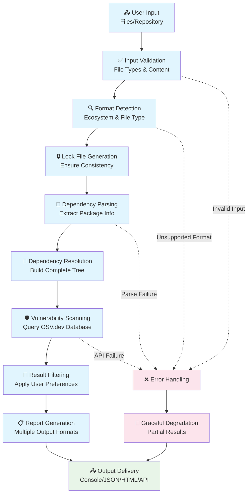
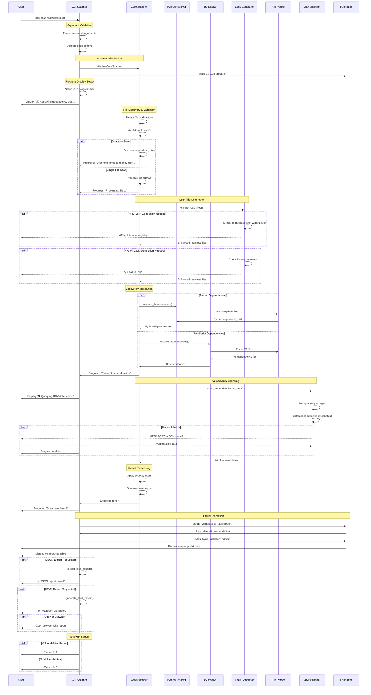
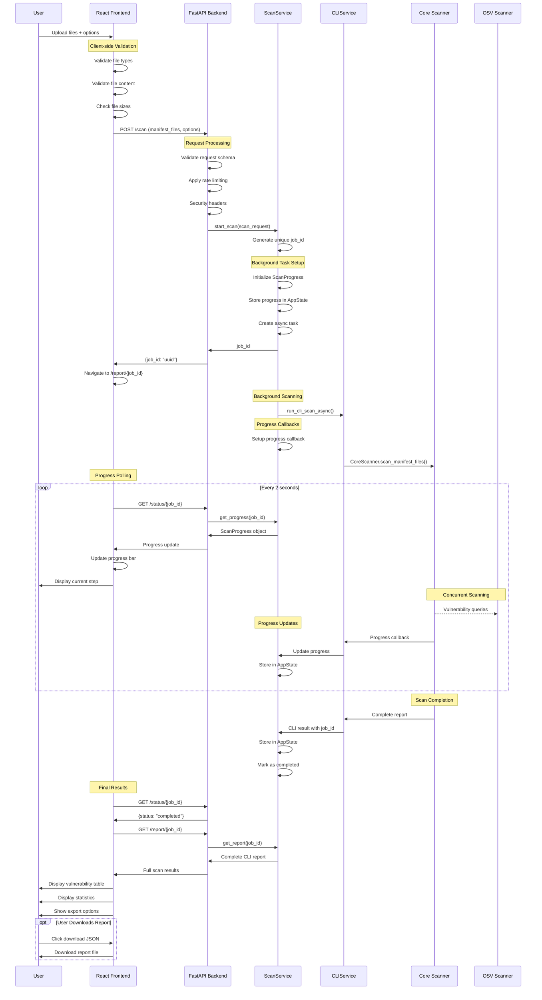
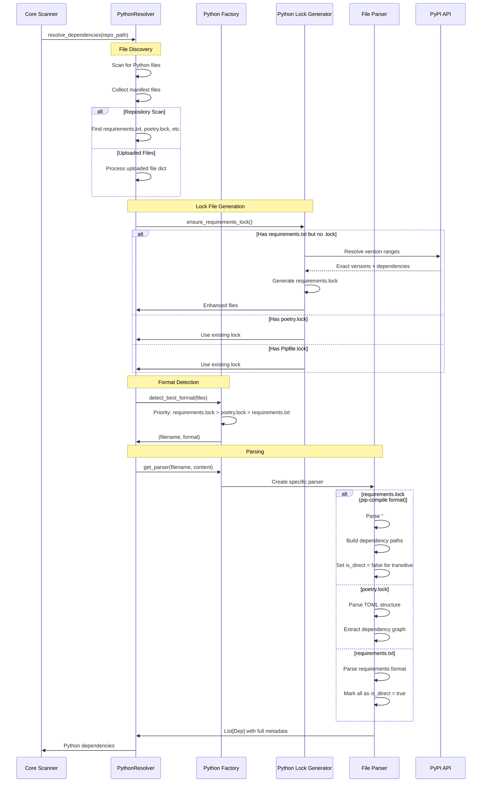
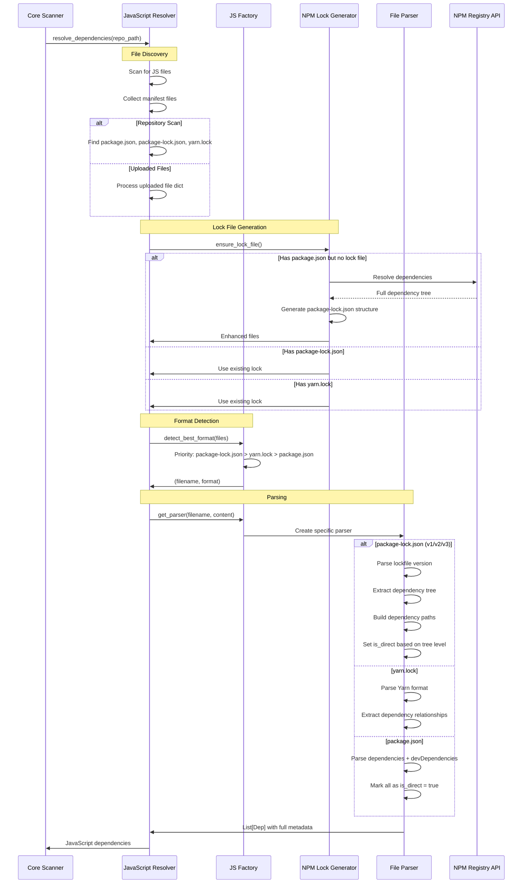
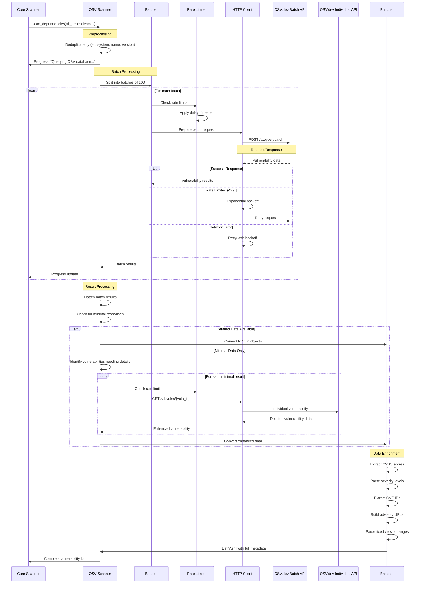
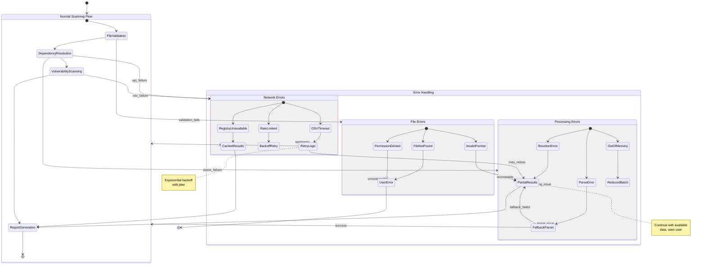
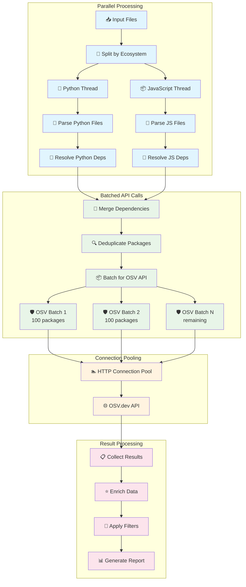
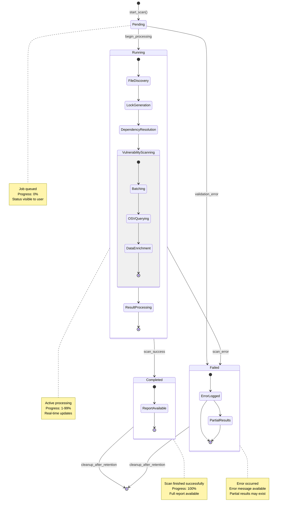
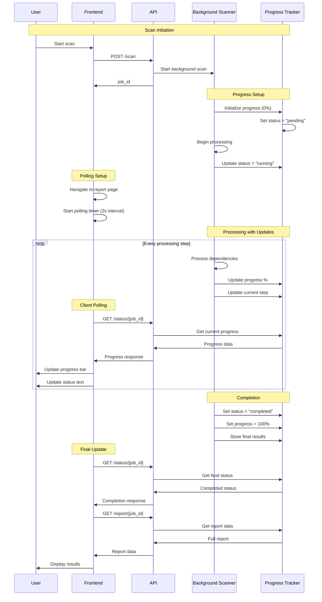

# 🔄 Scanning Process Workflows

> **Comprehensive workflow documentation with sequence diagrams for the DepScan vulnerability scanner**

This document details the end-to-end scanning processes, from initial file detection through final report generation. It covers both CLI and web interface workflows with detailed sequence diagrams and error handling scenarios.

## 🎯 Overview

The DepScan scanning process involves multiple coordinated steps across different system components, with support for various input formats and scanning modes. The workflow is designed to be robust, efficient, and user-friendly.

## 📊 High-Level Process Flow

## 🖥️ CLI Scanning Workflow

### Complete CLI Scanning Sequence

## 🌐 Web Interface Scanning Workflow

### Complete Web Scanning Sequence

## 🐍 Python Dependency Resolution Workflow

### Detailed Python Resolution Process

## 📦 JavaScript Dependency Resolution Workflow

### Detailed JavaScript Resolution Process

## 🛡️ Vulnerability Scanning Workflow

### OSV.dev Integration Process

## 🔧 Error Handling Workflows

### Graceful Error Recovery

## 📊 Performance Optimization Workflows

### Concurrent Processing Strategy

## 🔄 State Transitions

### Scan Job Lifecycle

## 📈 Progress Tracking Workflow

### Real-time Progress Updates

---

## 🔗 Related Documentation

- **[Backend Architecture](../architecture/backend-architecture.md)** - Implementation details of scanning components
- **[Frontend Architecture](../architecture/frontend-architecture.md)** - Web interface workflow implementation
- **[REST API Reference](../api/rest-api.md)** - API endpoints used in web workflows
- **[CLI Interface](../api/cli-interface.md)** - Command-line workflow usage
- **[Component Documentation](../components/core-components.md)** - Detailed component specifications

This comprehensive workflow documentation provides detailed insights into the DepScan scanning process, enabling developers to understand, maintain, and extend the system effectively.